# 配置与部署

<cite>
**本文引用的文件**
- [Dockerfile](file://Dockerfile)
- [Dockerfile.migrate](file://Dockerfile.migrate)
- [docker-compose.yml](file://docker-compose.yml)
- [deploy.sh](file://deploy.sh)
- [.env](file://.env)
- [next.config.ts](file://next.config.ts)
- [drizzle.config.ts](file://drizzle.config.ts)
- [package.json](file://package.json)
- [src/lib/database.ts](file://src/lib/database.ts)
- [src/lib/schema.ts](file://src/lib/schema.ts)
- [src/lib/redis.ts](file://src/lib/redis.ts)
- [src/lib/quota.ts](file://src/lib/quota.ts)
- [src/lib/ai-providers.ts](file://src/lib/ai-providers.ts)
- [src/auth.ts](file://src/auth.ts)
- [.github/workflows/vercel-deploy.yml](file://.github/workflows/vercel-deploy.yml)
- [vercel.json](file://vercel.json)
- [README.md](file://README.md)
</cite>

## 更新摘要
**所做更改**
- 更新 CI/CD 优化：移除了 Vercel 部署中的 --prod 参数，简化了部署流程
- 改进了环境变量管理，增加了 DATABASE_URL 和 REDIS_URL 环境变量支持
- 优化了演示模式配置，支持 NEXT_PUBLIC_DEMO_MODE 和 DEMO_MODE 双重控制
- 更新了部署脚本的交互式配置功能，增强了数据库和 Redis URL 的配置支持
- 简化了 GitHub Actions 工作流，移除了演示应用构建步骤

## 目录
1. [简介](#简介)
2. [项目结构](#项目结构)
3. [核心组件](#核心组件)
4. [架构总览](#架构总览)
5. [详细组件分析](#详细组件分析)
6. [CI/CD 自动化部署](#cicd-自动化部署)
7. [依赖关系分析](#依赖关系分析)
8. [性能考虑](#性能考虑)
9. [故障排除指南](#故障排除指南)
10. [结论](#结论)
11. [附录](#附录)

## 简介
本文件面向 AIGate 的运维与开发团队，提供从本地到生产的容器化部署全栈指南。内容覆盖镜像构建、Compose 编排、网络与数据卷、环境变量配置、生产部署策略（含负载均衡与 SSL）、自动化部署脚本、健康检查、性能调优（JVM/连接池/缓存）、监控与日志、以及常见问题排查。

**更新** 新增 GitHub Actions CI/CD 工作流，支持自动化部署、版本标签触发、Vercel 集成和 GitHub Release 创建功能，提供完整的持续集成与持续部署解决方案。简化了 Vercel 部署流程，移除了演示应用构建步骤，改进了环境变量管理。移除了 Vercel 部署中的 --prod 参数，简化了部署流程。

## 项目结构
AIGate 采用 Next.js 16 应用，配合 Drizzle ORM、PostgreSQL、Redis、NextAuth，并通过 Docker 与 docker-compose 实现一键编排。关键目录与文件如下：
- 应用根目录包含 Dockerfile、docker-compose.yml、部署脚本 deploy.sh、环境变量示例 .env、Next 配置 next.config.ts、Drizzle 配置 drizzle.config.ts、包管理与依赖 package.json。
- 数据层位于 src/lib/database.ts 与 src/lib/schema.ts，负责数据库访问与表结构定义。
- 缓存与配额控制位于 src/lib/redis.ts 与 src/lib/quota.ts。
- AI 供应商适配位于 src/lib/ai-providers.ts，统一 OpenAI、Anthropic、Google、DeepSeek、Moonshot、Spark 等。
- 认证系统基于 NextAuth，配置于 src/auth.ts。
- CI/CD 配置位于 .github/workflows/vercel-deploy.yml，支持自动化部署到 Vercel 平台。

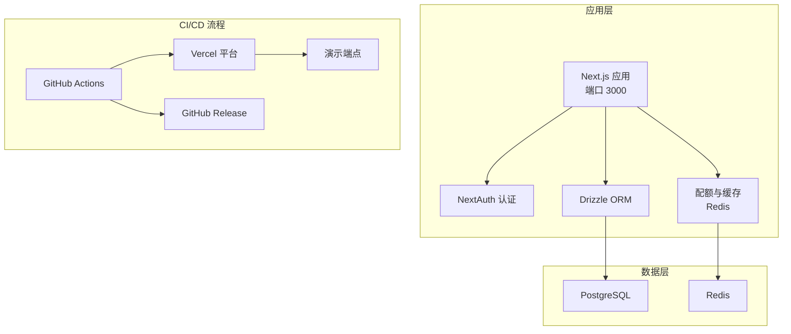

**图表来源**
- [Dockerfile:1-54](file://Dockerfile#L1-L54)
- [docker-compose.yml:1-87](file://docker-compose.yml#L1-L87)
- [src/lib/database.ts:1-524](file://src/lib/database.ts#L1-L524)
- [src/lib/redis.ts:1-49](file://src/lib/redis.ts#L1-L49)
- [src/auth.ts:1-85](file://src/auth.ts#L1-L85)
- [.github/workflows/vercel-deploy.yml:1-133](file://.github/workflows/vercel-deploy.yml#L1-L133)

**章节来源**
- [Dockerfile:1-54](file://Dockerfile#L1-L54)
- [docker-compose.yml:1-87](file://docker-compose.yml#L1-L87)
- [next.config.ts:1-9](file://next.config.ts#L1-L9)
- [drizzle.config.ts:1-11](file://drizzle.config.ts#L1-L11)
- [package.json:1-94](file://package.json#L1-L94)
- [.github/workflows/vercel-deploy.yml:1-133](file://.github/workflows/vercel-deploy.yml#L1-L133)

## 核心组件
- 容器镜像与构建
  - 使用多阶段构建，最终运行阶段基于 node:20-alpine，启用 Next.js standalone 输出，暴露端口 3000，默认 HOSTNAME 绑定 0.0.0.0，CMD 启动 server.js。
- Compose 编排
  - 提供 app、postgres、redis、migrate 四类服务；app 依赖数据库与缓存健康状态，并在迁移完成后启动；migrate 为一次性任务。
- 数据库与迁移
  - Drizzle 配置读取 DATABASE_URL，迁移脚本通过 Dockerfile.migrate 在独立容器中执行，使用简化命令 pnpm db:push。
- 缓存与配额
  - Redis 提供每日/每分钟限流与策略缓存；quota 层实现按用户/策略的令牌与请求次数统计与记录。
- 认证与会话
  - NextAuth 使用自定义凭据提供者与 JWT 回调，secret 来自 NEXTAUTH_SECRET。
- AI 供应商适配
  - 统一接口封装多家供应商，支持同步与流式响应，并进行 token 估算与缓存。
- **新增** CI/CD 自动化部署
  - GitHub Actions 工作流支持版本标签触发，自动部署到 Vercel 平台并创建 GitHub Release。

**更新** 端口配置语法更新为 ${APP_PORT:-3000} 格式，提供默认值支持；交互式配置功能简化环境变量设置流程；新增 CI/CD 自动化部署功能；简化了 Vercel 部署流程，移除了演示应用构建步骤；移除了 Vercel 部署中的 --prod 参数。

**章节来源**
- [Dockerfile:1-54](file://Dockerfile#L1-L54)
- [Dockerfile.migrate:1-14](file://Dockerfile.migrate#L1-L14)
- [docker-compose.yml:1-87](file://docker-compose.yml#L1-L87)
- [drizzle.config.ts:1-11](file://drizzle.config.ts#L1-L11)
- [src/lib/redis.ts:1-49](file://src/lib/redis.ts#L1-L49)
- [src/lib/quota.ts:1-340](file://src/lib/quota.ts#L1-L340)
- [src/auth.ts:1-85](file://src/auth.ts#L1-L85)
- [src/lib/ai-providers.ts:1-759](file://src/lib/ai-providers.ts#L1-L759)
- [.github/workflows/vercel-deploy.yml:1-133](file://.github/workflows/vercel-deploy.yml#L1-L133)

## 架构总览
下图展示 AIGate 的容器化部署架构与服务交互：

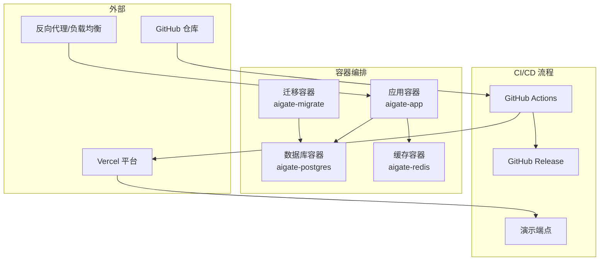

**图表来源**
- [docker-compose.yml:1-87](file://docker-compose.yml#L1-L87)
- [Dockerfile:1-54](file://Dockerfile#L1-L54)
- [Dockerfile.migrate:1-14](file://Dockerfile.migrate#L1-L14)
- [.github/workflows/vercel-deploy.yml:1-133](file://.github/workflows/vercel-deploy.yml#L1-L133)

## 详细组件分析

### Dockerfile 与镜像构建
- 多阶段构建：base -> deps -> builder -> runner。
- 运行阶段启用 standalone 输出，复制 .next/standalone 与静态资源，设置非 root 用户，暴露 3000 端口，CMD 启动 server.js。
- 环境变量：NODE_ENV=production、PORT=3000、HOSTNAME=0.0.0.0。

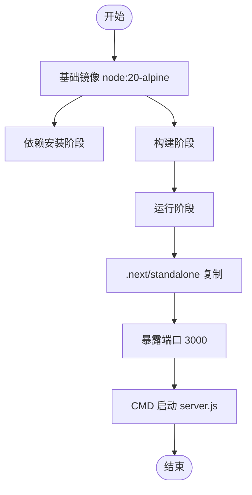

**图表来源**
- [Dockerfile:1-54](file://Dockerfile#L1-L54)

**章节来源**
- [Dockerfile:1-54](file://Dockerfile#L1-L54)

### docker-compose.yml 服务编排
- app 服务
  - 构建上下文与 Dockerfile，端口映射由 APP_PORT 控制（默认 3000），环境变量 DATABASE_URL 与 REDIS_URL。
  - 依赖 postgres/redis 健康，依赖 migrate 成功。
  - 使用自定义网络 aigate-network。
- postgres 服务
  - 镜像 postgres:15-alpine，持久化卷 postgres_data，健康检查使用 pg_isready。
- redis 服务
  - 镜像 redis:7-alpine，持久化卷 redis_data，健康检查 ping。
- migrate 服务
  - 基于 Dockerfile.migrate，环境变量 DATABASE_URL，仅运行一次（restart=no），依赖数据库健康。

**更新** 端口配置语法更新为 ${APP_PORT:-3000} 格式，提供默认值支持。

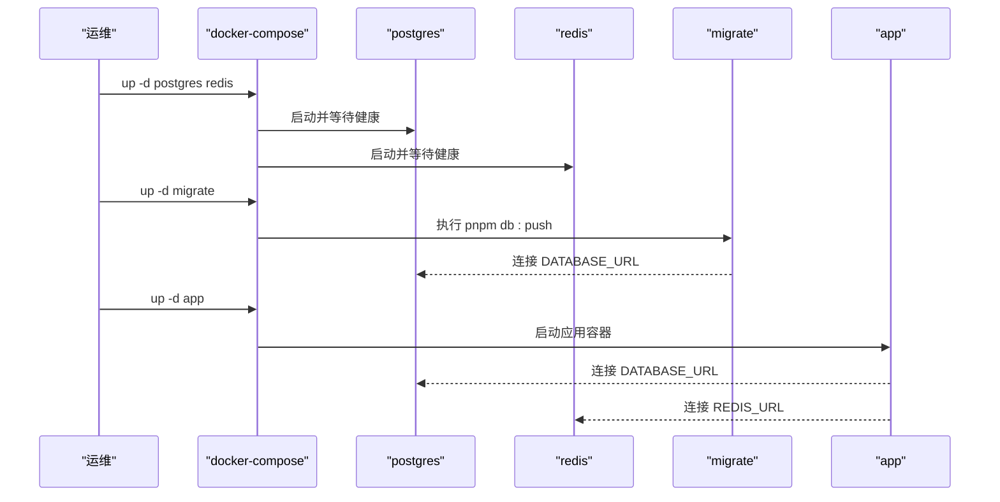

**图表来源**
- [docker-compose.yml:1-87](file://docker-compose.yml#L1-L87)
- [Dockerfile.migrate:1-14](file://Dockerfile.migrate#L1-L14)

**章节来源**
- [docker-compose.yml:1-87](file://docker-compose.yml#L1-L87)

### 环境变量与配置
- .env 示例
  - REDIS_URL、DATABASE_URL、NEXTAUTH_SECRET、NEXTAUTH_URL。
- 应用内使用
  - DATABASE_URL 由 Drizzle 读取；NEXTAUTH_SECRET 用于 NextAuth；REDIS_URL 用于 Redis 客户端。
- Compose 注入
  - app 服务注入 DATABASE_URL 与 REDIS_URL；postgres/redis 通过环境变量初始化。
- **新增** CI/CD 环境变量
  - NEXT_PUBLIC_DEMO_MODE=true 用于演示模式配置。
  - DEMO_MODE=true 用于后端演示模式控制。

**更新** 新增交互式配置功能，通过 cmd_config 命令提供图形化配置界面，支持管理员邮箱、密码、数据库连接、Redis 连接和应用端口的配置。

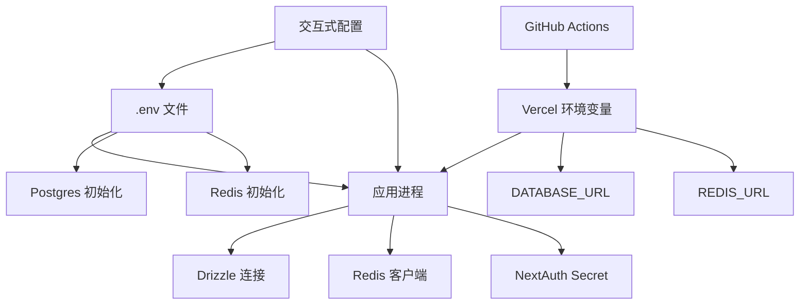

**图表来源**
- [.env:1-7](file://.env#L1-L7)
- [src/lib/database.ts:1-524](file://src/lib/database.ts#L1-L524)
- [src/lib/redis.ts:1-49](file://src/lib/redis.ts#L1-L49)
- [src/auth.ts:1-85](file://src/auth.ts#L1-L85)
- [docker-compose.yml:10-12](file://docker-compose.yml#L10-L12)
- [.github/workflows/vercel-deploy.yml:13-14](file://.github/workflows/vercel-deploy.yml#L13-L14)

**章节来源**
- [.env:1-7](file://.env#L1-L7)
- [src/lib/database.ts:1-524](file://src/lib/database.ts#L1-L524)
- [src/lib/redis.ts:1-49](file://src/lib/redis.ts#L1-L49)
- [src/auth.ts:1-85](file://src/auth.ts#L1-L85)
- [docker-compose.yml:10-12](file://docker-compose.yml#L10-L12)
- [.github/workflows/vercel-deploy.yml:13-14](file://.github/workflows/vercel-deploy.yml#L13-L14)

### 数据库与迁移
- Drizzle 配置
  - schema 路径、输出目录、方言与 DATABASE_URL。
- 迁移执行
  - Dockerfile.migrate 复制 schema 与配置，在容器内执行 pnpm db:push。
- 表结构
  - quotaPolicies、apiKeys、usageRecords、users、whitelistRules、NextAuth 相关表等。

**更新** 数据库迁移流程简化，使用 pnpm db:push 命令替代复杂的迁移步骤，提高部署效率。

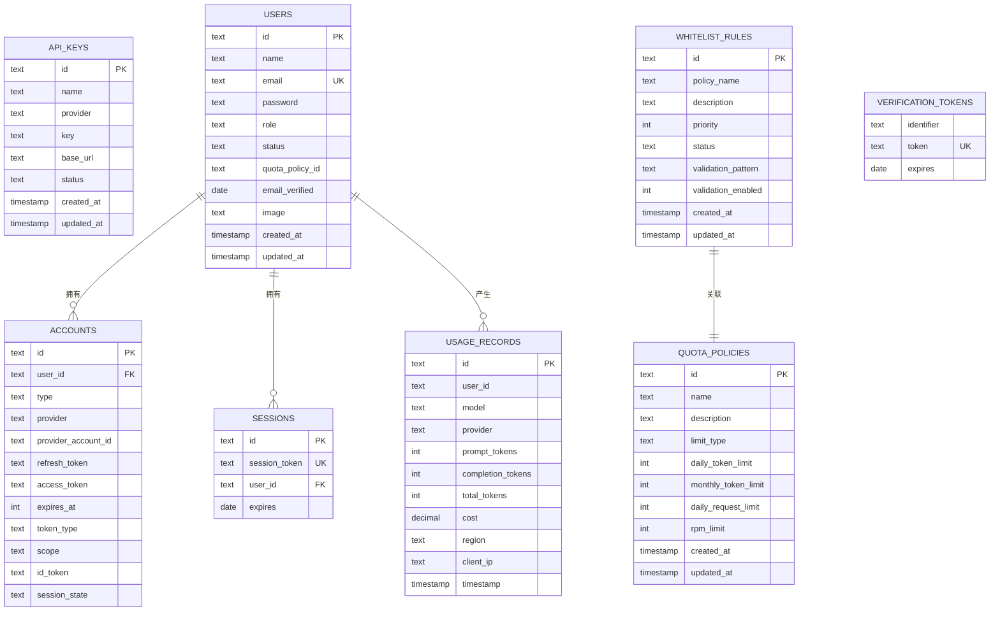

**图表来源**
- [drizzle.config.ts:1-11](file://drizzle.config.ts#L1-L11)
- [src/lib/schema.ts:1-159](file://src/lib/schema.ts#L1-L159)

**章节来源**
- [drizzle.config.ts:1-11](file://drizzle.config.ts#L1-L11)
- [Dockerfile.migrate:1-14](file://Dockerfile.migrate#L1-L14)
- [src/lib/schema.ts:1-159](file://src/lib/schema.ts#L1-L159)

### 缓存与配额控制
- Redis 键空间
  - 用户每日配额、每日请求次数、每分钟请求次数、用户策略缓存、API Key 缓存、请求日志。
- 配额策略
  - 支持按 token 或 request 两种模式；每日与每分钟限流；默认策略兜底。
- 用量记录
  - 记录 token 使用、请求次数、每分钟计数与日志，并写入数据库。

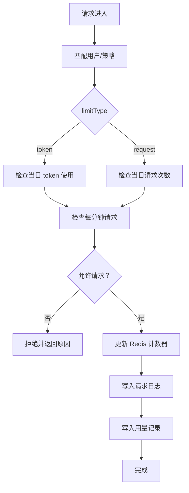

**图表来源**
- [src/lib/quota.ts:74-190](file://src/lib/quota.ts#L74-L190)
- [src/lib/redis.ts:18-49](file://src/lib/redis.ts#L18-L49)

**章节来源**
- [src/lib/quota.ts:1-340](file://src/lib/quota.ts#L1-L340)
- [src/lib/redis.ts:1-49](file://src/lib/redis.ts#L1-L49)

### 认证与会话
- NextAuth 配置
  - 凭据提供者、JWT 回调、会话回调、登录页跳转、secret 来自 NEXTAUTH_SECRET。
- 会话存储
  - 使用数据库适配器（NextAuth 与 Drizzle），表 accounts/sessions 等。

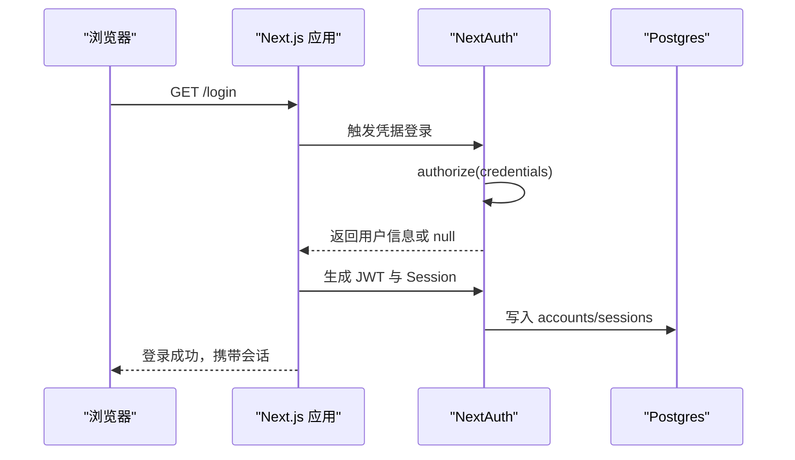

**图表来源**
- [src/auth.ts:1-85](file://src/auth.ts#L1-L85)
- [src/lib/schema.ts:97-134](file://src/lib/schema.ts#L97-L134)

**章节来源**
- [src/auth.ts:1-85](file://src/auth.ts#L1-L85)
- [src/lib/schema.ts:97-134](file://src/lib/schema.ts#L97-L134)

### AI 供应商适配
- 统一接口
  - AIProvider 抽象：makeRequest、makeStreamRequest、estimateTokens。
- 供应商实现
  - OpenAI、Anthropic、Google、DeepSeek、Moonshot、Spark，均支持同步与流式响应。
- 缓存与降级
  - API Key 与 baseUrl 缓存至 Redis，异常时回退数据库。

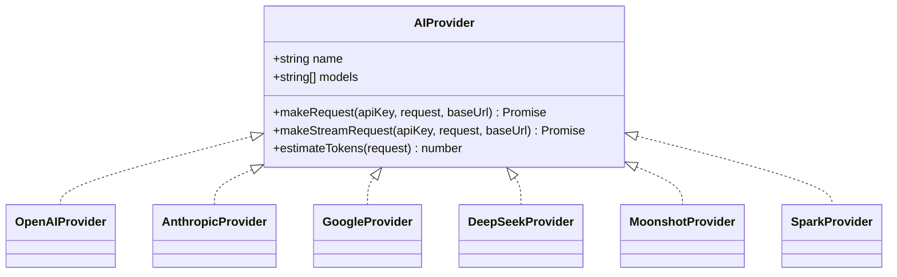

**图表来源**
- [src/lib/ai-providers.ts:12-27](file://src/lib/ai-providers.ts#L12-L27)

**章节来源**
- [src/lib/ai-providers.ts:1-759](file://src/lib/ai-providers.ts#L1-L759)

### 部署脚本 deploy.sh
- 功能概览
  - up：拉取基础镜像、构建、启动 postgres/redis、等待健康、执行迁移并启动 app。
  - update：重建 app/migrate 镜像、运行迁移、重启 app。
  - down/restart/logs/migrate/status/clean：停服、重启、查看日志、仅迁移、查看状态、清理数据。
  - **新增** config：交互式配置环境变量，提供图形化界面简化配置流程。
- 依赖检查
  - Docker 与 Docker Compose v2。

**更新** 新增交互式配置功能，cmd_config 命令提供完整的图形化配置界面，支持管理员邮箱、密码、数据库连接、Redis 连接和应用端口的配置。

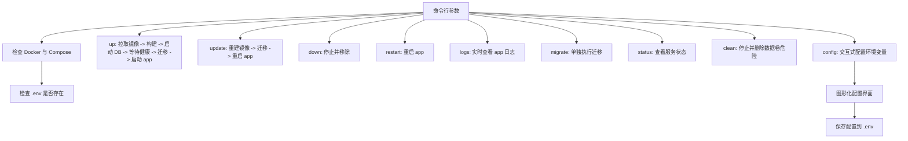

**图表来源**
- [deploy.sh:58-102](file://deploy.sh#L58-L102)
- [deploy.sh:104-145](file://deploy.sh#L104-L145)

**章节来源**
- [deploy.sh:1-382](file://deploy.sh#L1-L382)

## CI/CD 自动化部署

### GitHub Actions 工作流概述
AIGate 项目集成了完整的 GitHub Actions CI/CD 工作流，支持自动化部署到 Vercel 平台和 GitHub Release 创建。工作流通过标签触发，实现了从代码提交到生产部署的完整自动化流程。

### 触发条件
- **版本标签触发**：支持 `v*.*.*` 和 `release-*` 格式的版本标签
- **推送触发**：代码推送到主分支时自动触发
- **手动触发**：支持手动触发部署流程

### 工作流组成
工作流包含以下主要步骤：

1. **代码检出**：使用 `actions/checkout@v4` 获取最新代码
2. **环境准备**：安装 pnpm 9.x 和 Node.js 20.x
3. **依赖安装**：使用 pnpm 进行依赖安装和 Vercel CLI 安装
4. **构建应用**：执行 `pnpm run build` 构建生产版本
5. **部署到 Vercel**：使用 Vercel CLI 部署到指定域名
6. **创建 Release**：自动生成发布说明并创建 GitHub Release
7. **构建产物上传**：上传构建产物作为 GitHub Actions Artifact

### Vercel 集成配置
工作流通过 `vercel.json` 配置文件与 Vercel 平台集成：

- **构建配置**：使用 `@vercel/next` 构建器
- **文件包含**：包含 `.next/**`、`public/**`、`src/**` 文件
- **路由配置**：所有路由重定向到根路径
- **环境变量**：设置 `NEXT_PUBLIC_DEMO_MODE=true`

### 自动化部署流程

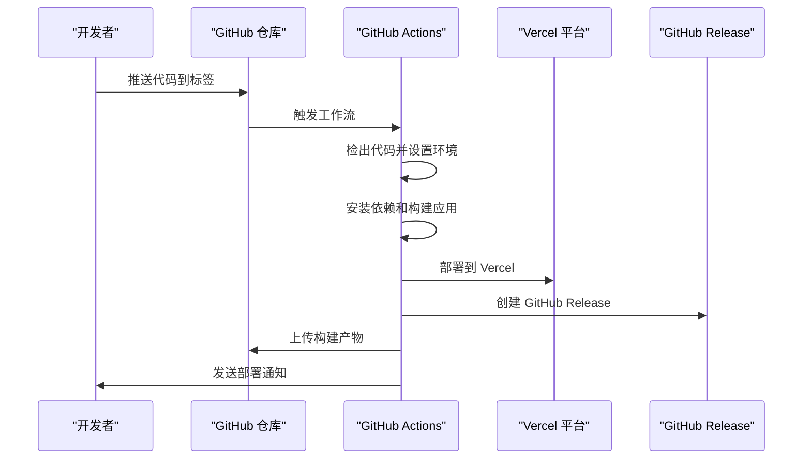

**图表来源**
- [.github/workflows/vercel-deploy.yml:1-133](file://.github/workflows/vercel-deploy.yml#L1-L133)
- [vercel.json:1-28](file://vercel.json#L1-L28)

### 部署配置详解

#### 环境变量配置
工作流设置了以下关键环境变量：
- `NEXT_PUBLIC_DEMO_MODE=true`：启用演示模式
- `DEMO_MODE=true`：启用后端演示模式
- `DATABASE_URL`：数据库连接字符串（来自 GitHub Secrets）
- `REDIS_URL`：Redis 连接字符串（来自 GitHub Secrets）

#### 构建脚本
- 使用 `pnpm run build` 构建生产版本
- 移除了演示应用构建步骤，简化了部署流程

#### Vercel 部署参数
- **名称格式**：`aigate-demo-${TAG_NAME}`
- **环境配置**：设置演示模式环境变量
- **生产部署**：移除了 `--prod` 参数，简化了部署流程

#### Release 创建
工作流自动生成详细的发布说明，包含：
- 部署信息：演示地址、部署时间、构建状态
- 更新内容：自动化部署流程优化等
- 访问方式：演示账号和密码
- 构建信息：Node.js 版本、构建工具、部署平台

**更新** 移除了 Vercel 部署中的 `--prod` 参数，简化了部署流程。改进了环境变量管理，增加了 DATABASE_URL 和 REDIS_URL 环境变量支持。

**章节来源**
- [.github/workflows/vercel-deploy.yml:1-133](file://.github/workflows/vercel-deploy.yml#L1-L133)
- [vercel.json:1-28](file://vercel.json#L1-L28)
- [package.json:6-18](file://package.json#L6-L18)

## 依赖关系分析
- 构建与运行
  - package.json 定义构建脚本与依赖；next.config.ts 启用 standalone 输出；Dockerfile 使用 pnpm。
- 数据与缓存
  - Drizzle 读取 DATABASE_URL；Redis 读取 REDIS_URL；quota 层依赖两者。
- 认证
  - NextAuth 依赖 NEXTAUTH_SECRET 与数据库适配器。
- **新增** CI/CD 依赖
  - GitHub Actions 依赖 pnpm、Node.js 20.x 和 Vercel CLI。

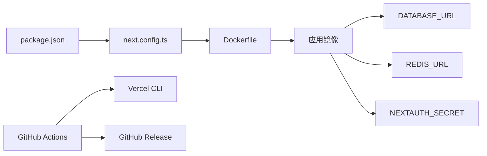

**图表来源**
- [package.json:1-94](file://package.json#L1-L94)
- [next.config.ts:1-9](file://next.config.ts#L1-L9)
- [Dockerfile:1-54](file://Dockerfile#L1-L54)
- [.env:1-7](file://.env#L1-L7)
- [.github/workflows/vercel-deploy.yml:22-50](file://.github/workflows/vercel-deploy.yml#L22-L50)

**章节来源**
- [package.json:1-94](file://package.json#L1-L94)
- [next.config.ts:1-9](file://next.config.ts#L1-L9)
- [Dockerfile:1-54](file://Dockerfile#L1-L54)
- [.env:1-7](file://.env#L1-L7)
- [.github/workflows/vercel-deploy.yml:22-50](file://.github/workflows/vercel-deploy.yml#L22-L50)

## 性能考虑
- JVM 参数（Node.js 替代方案）
  - 在容器运行时可通过环境变量传递 Node.js 启动参数（例如最大堆大小），结合 Dockerfile ENV 或 docker-compose environment 注入。
- 连接池与数据库
  - Drizzle 默认连接行为；建议在生产中为 PostgreSQL 设置连接池参数（如 max、idle_timeout、max_lifetime），并在应用侧复用连接。
- 缓存优化
  - Redis TTL 策略：每日指标 7 天、每分钟指标 2 分钟；策略缓存 1 小时；API Key 缓存 1 小时。
- 限流与并发
  - 每分钟限流（rpmLimit）与每日限额（token/request）双轨控制；合理设置默认策略与白名单优先级。
- 构建与镜像
  - 多阶段构建减少镜像体积；standalone 输出便于独立运行；pnpm 加速依赖安装。
- **新增** CI/CD 性能优化
  - 使用 pnpm store 缓存加速依赖安装；并行执行多个构建步骤；构建产物缓存。

## 故障排除指南
- 应用无法启动
  - 检查 app 服务日志：./deploy.sh logs；确认数据库与 Redis 健康状态：./deploy.sh status。
  - 确认 DATABASE_URL 与 REDIS_URL 正确，且容器间网络可达。
- 数据库迁移失败
  - 单独运行迁移：./deploy.sh migrate；检查 migrate 容器日志；确认数据库健康。
- 认证异常
  - 检查 NEXTAUTH_SECRET 是否设置；确认 accounts/sessions 表存在且可写。
- Redis 连接错误
  - 查看 Redis 错误事件日志；确认 Redis URL 与网络连通性。
- 配额检查失败
  - 查看配额模块日志；确认 Redis 可用；核对策略与白名单规则。
- **新增** 交互式配置问题
  - 确认 .env 文件权限正确；检查配置保存过程中的错误提示；验证配置值的有效性。
- **新增** CI/CD 部署失败
  - 检查 GitHub Actions 工作流日志；确认 Vercel 令牌配置正确；验证版本标签格式。
  - 确认 pnpm 缓存配置；检查依赖安装超时问题。
  - 验证 DATABASE_URL 和 REDIS_URL 密钥是否正确配置。

**章节来源**
- [deploy.sh:118-133](file://deploy.sh#L118-L133)
- [src/lib/redis.ts:7-9](file://src/lib/redis.ts#L7-L9)
- [src/auth.ts:48-49](file://src/auth.ts#L48-L49)
- [.github/workflows/vercel-deploy.yml:1-133](file://.github/workflows/vercel-deploy.yml#L1-L133)

## 结论
AIGate 提供了清晰的容器化部署路径：通过多阶段 Dockerfile 与 docker-compose 编排，结合 Drizzle 与 Redis，实现了认证、配额、用量与多供应商 AI 适配的一体化能力。运维团队可基于 deploy.sh 快速完成部署、更新与维护；生产环境建议补充反向代理、SSL 与负载均衡，并完善监控与日志体系以保障稳定性。

**更新** 新增的交互式配置功能显著提升了用户体验，简化了环境变量设置流程，配合简化的数据库迁移流程，使整体部署体验更加友好高效。同时，新增的 GitHub Actions CI/CD 工作流提供了完整的自动化部署解决方案，支持版本标签触发、Vercel 集成和 GitHub Release 创建，大大提高了开发效率和部署可靠性。简化了的 Vercel 部署流程移除了演示应用构建步骤，改进了环境变量管理，增加了 DATABASE_URL 和 REDIS_URL 环境变量支持。移除了 Vercel 部署中的 `--prod` 参数，进一步简化了部署流程。

## 附录

### 生产部署策略（建议）
- 反向代理与负载均衡
  - 使用 Nginx/HAProxy/云负载均衡，前置 HTTPS 终止与证书管理。
- SSL 证书
  - 使用 Let's Encrypt 自动签发与续期；或在云平台托管证书。
- 域名绑定
  - 将域名指向负载均衡器；确保 DNS 解析生效。
- 数据备份与高可用
  - PostgreSQL 与 Redis 做主从/集群与定期快照；迁移脚本纳入 CI/CD。
- 环境隔离
  - 开发/预发布/生产三套 docker-compose 环境，区分 .env 与网络。
- **新增** CI/CD 环境分离
  - 开发环境使用演示模式，生产环境禁用演示模式；不同环境使用不同的 Vercel 部署配置。

### 监控与日志（建议）
- 应用监控
  - Prometheus + Grafana：采集应用指标（QPS、P95/P99、错误率、Redis/DB 延迟）。
- 日志管理
  - 结合 Docker 日志驱动或集中式日志（ELK/Fluentd/Loki），按服务与容器聚合。
- 健康检查
  - 复用现有 healthcheck；在反向代理层增加主动探测与熔断。
- **新增** CI/CD 监控
  - 监控 GitHub Actions 工作流执行状态；设置部署失败告警；跟踪构建时间趋势。

### 交互式配置使用指南
- 启动交互式配置
  - 运行命令：`./deploy.sh config`
  - 系统会自动读取当前配置并显示预设值
- 配置项说明
  - 管理员邮箱：用于系统管理员登录
  - 管理员密码：系统管理员登录密码
  - 数据库 URL：PostgreSQL 连接字符串
  - Redis URL：Redis 连接字符串
  - 应用端口：HTTP 服务监听端口（默认 3000）
- 配置验证
  - 系统会显示配置预览并要求确认保存
  - 自动补全必要的 NEXTAUTH_SECRET、NEXTAUTH_URL、ADMIN_NAME 等配置项
- 配置文件位置
  - 配置保存在项目根目录的 .env 文件中
  - 支持增量更新，不存在的键值会自动添加

### CI/CD 工作流使用指南
- **版本标签格式**
  - 支持 `v1.2.3` 和 `release-beta-1` 等格式
  - 标签名称将用于 Vercel 部署命名和 GitHub Release 标题
- **环境变量配置**
  - NEXT_PUBLIC_DEMO_MODE：控制演示模式开关
  - DEMO_MODE：控制后端演示模式开关
  - DATABASE_URL：数据库连接字符串（GitHub Secrets）
  - REDIS_URL：Redis 连接字符串（GitHub Secrets）
  - VERCEL_TOKEN：Vercel 部署令牌（需在 GitHub Secrets 中配置）
- **手动触发**
  - 可在 GitHub Actions 页面手动触发工作流
  - 适用于测试和调试目的
- **构建产物**
  - 自动上传 `.next/`、`public/`、`package.json` 作为 Artifact
  - 保留 30 天，便于问题排查和回滚
- **简化部署流程**
  - 移除了演示应用构建步骤，直接构建生产版本
  - 支持 DATABASE_URL 和 REDIS_URL 环境变量注入
  - 移除了 `--prod` 参数，简化了部署流程

**章节来源**
- [deploy.sh:81-164](file://deploy.sh#L81-L164)
- [.env:1-7](file://.env#L1-L7)
- [.github/workflows/vercel-deploy.yml:1-133](file://.github/workflows/vercel-deploy.yml#L1-L133)
- [vercel.json:1-28](file://vercel.json#L1-L28)
- [README.md:19-88](file://README.md#L19-L88)