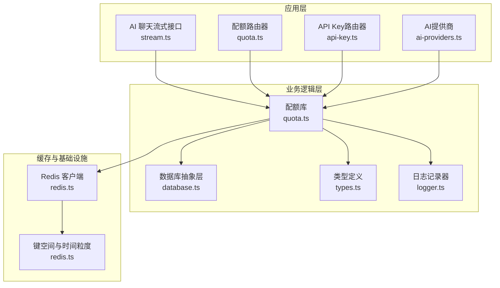
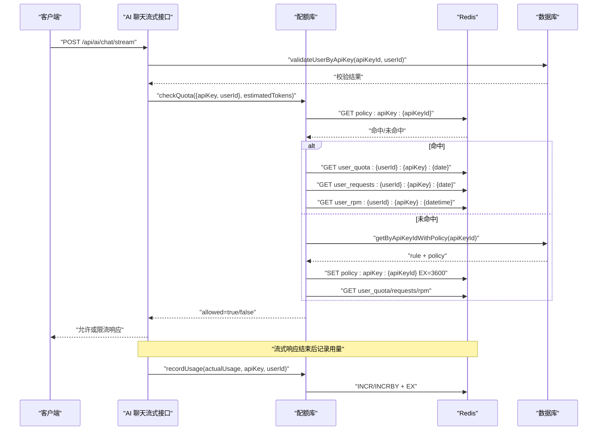
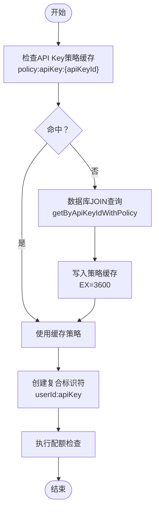
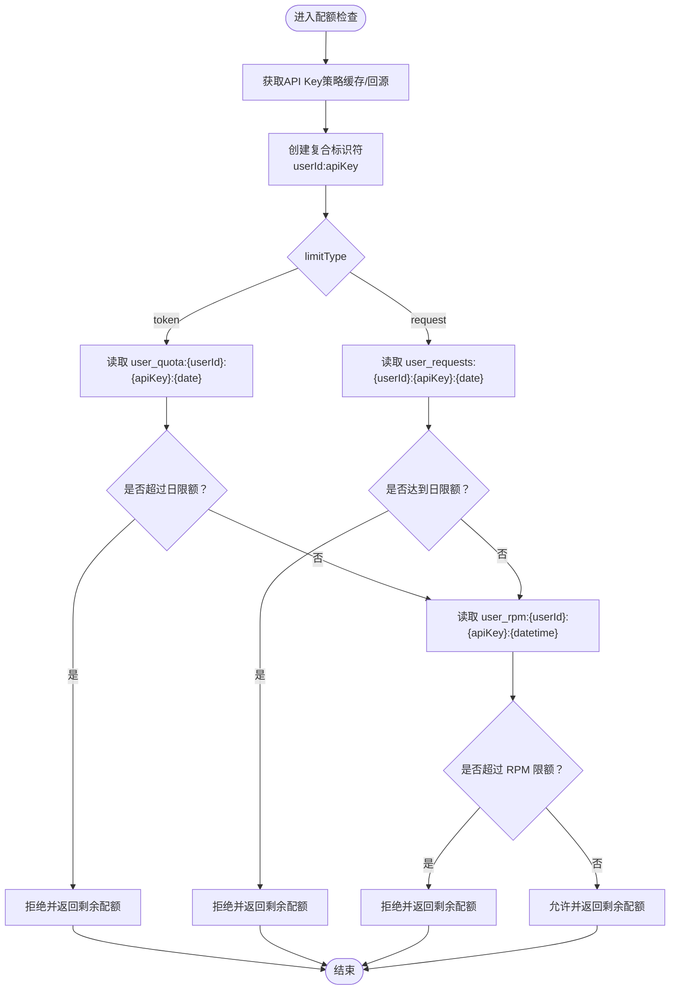
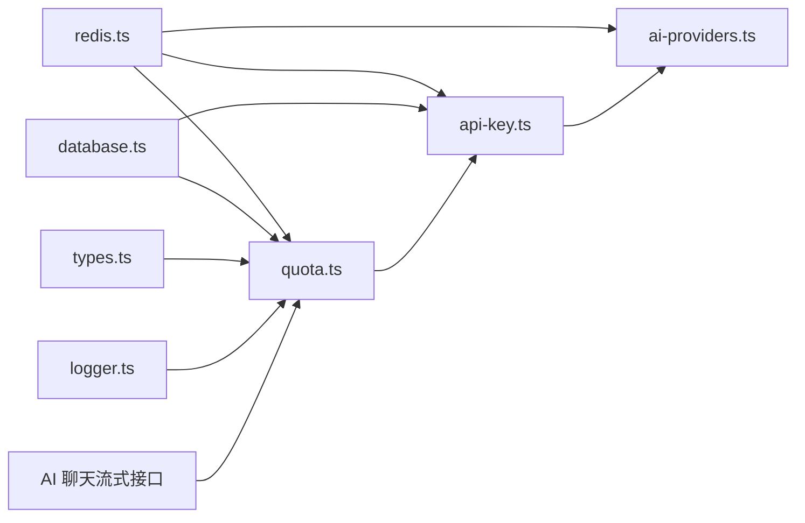

# Redis缓存机制

<cite>
**本文引用的文件**
- [redis.ts](file://src/lib/redis.ts)
- [quota.ts](file://src/lib/quota.ts)
- [quota路由器](file://src/server/api/routers/quota.ts)
- [API密钥路由器](file://src/server/api/routers/api-key.ts)
- [AI提供商](file://src/lib/ai-providers.ts)
- [数据库抽象层](file://src/lib/database.ts)
- [AI聊天流式接口](file://src/pages/api/ai/chat/stream.ts)
- [类型定义](file://src/lib/types.ts)
- [日志记录器](file://src/lib/logger.ts)
- [Docker Compose](file://docker-compose.yml)
- [包依赖](file://package.json)
</cite>

## 更新摘要
**变更内容**
- 新增API Key配额策略缓存：引入 `policy:apiKey:{apiKeyId}` 键格式，支持基于API Key ID的直接策略查找
- 优化API Key缓存策略：使用 `api_keys:{provider}` 键格式，提供按提供商的API Key缓存
- 实现复合标识符缓存：在配额检查中使用 `userId:apiKey` 组合作为标识符，确保不同API Key的配额隔离
- 完善API Key生命周期管理：在创建、更新、删除、状态切换时自动维护Redis缓存一致性
- 增强缓存失效时间：API Key缓存设置1小时过期，配额策略缓存设置1小时过期
- 优化配额检查流程：直接通过API Key ID获取策略，避免中间查询步骤

## 目录
1. [简介](#简介)
2. [项目结构](#项目结构)
3. [核心组件](#核心组件)
4. [架构总览](#架构总览)
5. [组件详解](#组件详解)
6. [依赖关系分析](#依赖关系分析)
7. [性能考量](#性能考量)
8. [故障排查指南](#故障排查指南)
9. [结论](#结论)
10. [附录](#附录)

## 简介
本文件系统化梳理 Redis 在配额管理中的关键作用，覆盖策略缓存、用量缓存与请求频率缓存的设计原理与实现细节；明确 Redis 键值命名规范与数据结构设计；阐述缓存失效时间、更新与一致性保障；总结热数据与冷数据优化策略；给出错误处理与重试机制建议；并提供性能监控与调优、以及集群部署与高可用最佳实践。

**更新** 本次更新重点反映了API Key缓存优化，包括新的 `policy:apiKey` 键格式和复合标识符的缓存策略，显著提升了基于API Key的配额管理效率和准确性。配额检查流程已重构为直接通过API Key ID获取策略，避免了中间查询步骤。

## 项目结构
围绕 Redis 的配额管理涉及以下模块：
- Redis 客户端与键空间：集中于 Redis 客户端初始化、键名生成器与时间粒度工具
- 配额策略与用量：策略缓存、每日用量与每分钟用量的读写、配额检查与记录
- API Key管理：API Key缓存、生命周期管理与提供商映射
- TRPC 路由器：提供策略 CRUD、用量查询、配额检查、缓存清理等接口
- 数据库抽象层：白名单规则匹配、策略与用量持久化
- AI 流式接口：在请求链路中进行配额检查与用量记录

**图表来源**
- [redis.ts](file://src/lib/redis.ts#L1-L43)
- [quota.ts](file://src/lib/quota.ts#L1-L327)
- [quota路由器](file://src/server/api/routers/quota.ts#L1-L220)
- [API密钥路由器](file://src/server/api/routers/api-key.ts#L166-L349)
- [AI提供商](file://src/lib/ai-providers.ts#L710-L758)
- [数据库抽象层](file://src/lib/database.ts#L1-L578)
- [AI聊天流式接口](file://src/pages/api/ai/chat/stream.ts#L1-L184)
- [日志记录器](file://src/lib/logger.ts#L1-L184)

**章节来源**
- [redis.ts](file://src/lib/redis.ts#L1-L43)
- [quota.ts](file://src/lib/quota.ts#L1-L327)
- [quota路由器](file://src/server/api/routers/quota.ts#L1-L220)
- [API密钥路由器](file://src/server/api/routers/api-key.ts#L166-L349)
- [AI提供商](file://src/lib/ai-providers.ts#L710-L758)
- [数据库抽象层](file://src/lib/database.ts#L1-L578)
- [AI聊天流式接口](file://src/pages/api/ai/chat/stream.ts#L1-L184)
- [日志记录器](file://src/lib/logger.ts#L1-L184)

## 核心组件
- Redis 客户端与键空间
  - 客户端初始化与错误事件监听
  - 键空间命名规范：策略缓存、每日用量、每分钟用量、API Key 缓存、请求日志、API Key配额策略缓存
  - 时间粒度：按"日"和"分钟"切分键空间
- 配额库
  - 策略缓存：基于用户标识符缓存策略，避免频繁查询数据库
  - API Key配额策略缓存：基于API Key ID直接获取配额策略，支持复合标识符
  - 用量缓存：按日维度累加 token 或请求数，支持每分钟 RPM 限制
  - 配额检查：综合每日限额与 RPM 限制，返回允许状态与剩余配额
  - 用量记录：在流式响应完成后记录实际 token 使用量
- API Key管理
  - API Key缓存：按提供商缓存活跃的API Key，1小时过期
  - 生命周期管理：创建、更新、删除、状态切换时自动维护缓存一致性
  - 提供商映射：支持多种AI提供商的API Key管理
- TRPC 路由器
  - 提供策略 CRUD、用量查询、配额检查、缓存清理等接口
  - 在策略变更时主动清理相关缓存键，确保一致性
- 数据库抽象层
  - 白名单规则匹配：根据 userId 匹配策略名称
  - API Key与配额策略关联：通过JOIN查询直接获取策略信息
  - 策略与用量持久化：策略 CRUD、用量查询与聚合
- AI 流式接口
  - 在请求链路中进行白名单校验、策略匹配、配额检查与用量记录

**章节来源**
- [redis.ts](file://src/lib/redis.ts#L1-L43)
- [quota.ts](file://src/lib/quota.ts#L1-L327)
- [quota路由器](file://src/server/api/routers/quota.ts#L1-L220)
- [API密钥路由器](file://src/server/api/routers/api-key.ts#L166-L349)
- [AI提供商](file://src/lib/ai-providers.ts#L710-L758)
- [数据库抽象层](file://src/lib/database.ts#L330-L350)
- [AI聊天流式接口](file://src/pages/api/ai/chat/stream.ts#L1-L184)
- [日志记录器](file://src/lib/logger.ts#L125-L145)

## 架构总览
Redis 在配额管理中的角色：
- 策略缓存：降低策略查询成本，提升配额检查吞吐
- API Key配额策略缓存：基于API Key ID直接获取策略，避免中间查询步骤
- 用量缓存：以原子自增与过期控制实现高并发计数
- 请求频率缓存：以分钟级键空间实现 RPM 限流

**图表来源**
- [quota.ts](file://src/lib/quota.ts#L78-L200)
- [redis.ts](file://src/lib/redis.ts#L18-L43)
- [AI聊天流式接口](file://src/pages/api/ai/chat/stream.ts#L78-L86)

## 组件详解

### Redis 键空间与命名规范
- 策略缓存键：user_policy:userId
- API Key配额策略缓存键：policy:apiKey:apiKeyId
- 每日用量键：user_quota:userId:apiKey:date
- 每日请求次数键：user_requests:userId:apiKey:date
- 每分钟请求次数键：user_rpm:userId:apiKey:datetime
- API Key缓存键：api_keys:provider
- 请求日志键：request_log:apiKey:requestId

时间粒度设计：
- 日粒度：用于每日限额控制，便于跨天自动过期
- 分钟粒度：用于 RPM 限流，便于短周期内快速回收内存

**更新** 新增了API Key配额策略缓存键 `policy:apiKey:{apiKeyId}`，用于直接基于API Key ID获取配额策略，避免中间查询步骤

**章节来源**
- [redis.ts](file://src/lib/redis.ts#L18-L43)

### API Key配额策略缓存与复合标识符
- API Key策略缓存：直接通过API Key ID获取配额策略，使用 `policy:apiKey:{apiKeyId}` 键格式
- 复合标识符：在配额检查中使用 `userId:apiKey` 组合作为标识符，确保不同API Key的配额完全隔离
- 缓存策略：API Key配额策略缓存1小时过期，确保策略更新的及时性
- 错误处理：缓存未命中时通过数据库JOIN查询获取策略，然后写入缓存

**图表来源**
- [quota.ts](file://src/lib/quota.ts#L17-L57)
- [quota.ts](file://src/lib/quota.ts#L89-L92)

**章节来源**
- [quota.ts](file://src/lib/quota.ts#L17-L57)
- [quota.ts](file://src/lib/quota.ts#L89-L92)

### API Key缓存优化与生命周期管理
- API Key缓存：使用 `api_keys:{provider}` 键格式，缓存提供商的活跃API Key
- 缓存策略：API Key缓存设置1小时过期，平衡性能与新鲜度
- 生命周期管理：
  - 创建API Key：自动更新Redis缓存
  - 更新API Key：自动更新Redis缓存
  - 删除API Key：清除对应提供商的缓存
  - 状态切换：禁用API Key时清除缓存
- 错误处理：Redis缓存操作失败不影响主要功能，降级到数据库查询

**更新** 新增了完整的API Key生命周期管理，确保缓存与数据库的一致性

**章节来源**
- [API密钥路由器](file://src/server/api/routers/api-key.ts#L166-L349)
- [AI提供商](file://src/lib/ai-providers.ts#L710-L758)

### 用量缓存与配额检查
- 每日用量：按日键空间累加 token 数或请求次数，设置 7 天过期
- 每分钟用量：按分钟键空间累加请求次数，设置 2 分钟过期
- 配额检查：
  - token 模式：比较当日 token 使用量与日限额
  - 请求次数模式：比较当日请求次数与日限额
  - RPM 限制：比较当前分钟请求次数与 RPM 限额
- 返回剩余配额：计算剩余 token 或请求次数，便于前端展示

**图表来源**
- [quota.ts](file://src/lib/quota.ts#L78-L200)
- [redis.ts](file://src/lib/redis.ts#L18-L43)

**章节来源**
- [quota.ts](file://src/lib/quota.ts#L78-L200)

### 用量记录与幂等性
- 记录时机：在流式响应完成后，基于实际 token 统计进行记录
- 记录内容：token 模式下使用 INCRBY，请求次数模式下使用 INCR
- 过期策略：每日用量键设置 7 天过期，每分钟用量键设置 2 分钟过期
- 幂等性：重复记录同一请求不会导致计数翻倍，因为键空间按日/分钟区分且使用原子操作

**章节来源**
- [quota.ts](file://src/lib/quota.ts#L202-L260)

### TRPC 接口与缓存清理
- 提供策略 CRUD、用量查询、配额检查、缓存清理等接口
- 在策略变更时，扫描并删除策略缓存键，确保后续读取回源数据库，避免脏缓存

**更新** 修复了缓存键命名一致性问题：`clearTodayPolicy()` 函数现在使用 `RedisKeys.userDailyQuota()` 和 `RedisKeys.userDailyRequests()` 方法生成正确的缓存键模式，确保缓存清理操作的一致性和可靠性

**章节来源**
- [quota.ts](file://src/lib/quota.ts#L15-L36)
- [quota路由器](file://src/server/api/routers/quota.ts#L1-L220)

### 白名单规则与策略匹配
- 白名单规则支持正则校验与优先级
- 根据 userId 匹配策略名称，再从数据库加载策略
- **更新** API Key与策略的直接关联：通过 `getByApiKeyIdWithPolicy` 方法直接获取策略信息，避免中间查询步骤
- 若未匹配到规则，默认采用"默认策略"

**章节来源**
- [数据库抽象层](file://src/lib/database.ts#L454-L543)
- [数据库抽象层](file://src/lib/database.ts#L330-L350)

### AI 流式接口中的配额集成
- 在请求链路中进行白名单校验、策略匹配、配额检查与用量记录
- 使用 SSE 流式输出，完成后异步记录实际 token 使用量

**章节来源**
- [AI聊天流式接口](file://src/pages/api/ai/chat/stream.ts#L78-L168)

## 依赖关系分析
- Redis 客户端与键空间：集中于 redis.ts，被配额库、API Key路由器与AI提供商复用
- 配额库：依赖 Redis 键空间、数据库抽象层与类型定义
- API Key路由器：依赖 Redis 键空间、数据库抽象层与AI提供商
- AI提供商：依赖 Redis API Key缓存与数据库API Key管理
- TRPC 路由器：依赖配额库与数据库抽象层，负责对外暴露接口与缓存清理
- 数据库抽象层：提供白名单规则匹配、API Key与策略关联、策略与用量持久化
- AI 流式接口：依赖配额库与数据库抽象层，贯穿配额检查与用量记录

**图表来源**
- [redis.ts](file://src/lib/redis.ts#L1-L43)
- [quota.ts](file://src/lib/quota.ts#L1-L327)
- [API密钥路由器](file://src/server/api/routers/api-key.ts#L166-L349)
- [AI提供商](file://src/lib/ai-providers.ts#L710-L758)
- [数据库抽象层](file://src/lib/database.ts#L1-L578)
- [AI聊天流式接口](file://src/pages/api/ai/chat/stream.ts#L1-L184)
- [日志记录器](file://src/lib/logger.ts#L1-L184)

**章节来源**
- [redis.ts](file://src/lib/redis.ts#L1-L43)
- [quota.ts](file://src/lib/quota.ts#L1-L327)
- [API密钥路由器](file://src/server/api/routers/api-key.ts#L166-L349)
- [AI提供商](file://src/lib/ai-providers.ts#L710-L758)
- [数据库抽象层](file://src/lib/database.ts#L1-L578)
- [AI聊天流式接口](file://src/pages/api/ai/chat/stream.ts#L1-L184)
- [日志记录器](file://src/lib/logger.ts#L1-L184)

## 性能考量
- 键空间设计
  - 日粒度键：适合每日限额控制，天然过期，减少长期占用
  - 分钟粒度键：适合 RPM 限流，短 TTL，避免内存膨胀
  - **更新** API Key策略缓存：1小时过期，平衡性能与策略更新需求
- 原子操作
  - INCR/INCRBY 与 EX 结合，保证并发安全与自动过期
- 缓存命中率
  - 策略缓存设置较长 TTL，降低策略查询压力
  - API Key缓存设置1小时过期，提升API Key获取效率
  - 用量缓存按日/分钟切分，避免热点键竞争
- 内存优化
  - 合理设置过期时间，避免无限增长
  - 对高频但短期使用的键（如 RPM）使用短 TTL
  - **更新** 复合标识符设计避免不同API Key间的配额混淆
- 并发与一致性
  - 配额检查与记录使用原子操作，避免竞态
  - 策略变更时主动清理缓存，确保后续读取回源数据库
  - **更新** API Key生命周期管理确保缓存与数据库一致性

## 故障排查指南
- Redis 连接与错误
  - 客户端错误事件监听：出现连接问题时及时告警
  - 建议：增加重连与熔断策略，避免单点故障放大
- 缓存一致性
  - 策略变更后需清理缓存键，否则可能出现旧策略生效
  - 建议：在策略 CRUD 后统一触发清理流程
  - **更新** API Key状态切换后自动清理缓存，确保禁用API Key的缓存立即失效
- 配额检查失败
  - 检查 Redis 可用性与键空间是否存在
  - 检查策略缓存是否过期或被误删
  - **更新** 检查API Key策略缓存是否正确设置
- 用量记录异常
  - 确认每日用量键是否正确设置过期时间
  - 检查流式响应是否正常结束，避免遗漏记录
- 网络异常与数据恢复
  - 建议：在记录用量与配额检查前增加重试与熔断，避免瞬时故障影响用户体验
  - 建议：对关键操作（如 SET/EXPIRE）增加幂等与补偿机制
  - **更新** API Key缓存操作失败不影响主要功能，降级到数据库查询

**章节来源**
- [redis.ts](file://src/lib/redis.ts#L7-L9)
- [quota.ts](file://src/lib/quota.ts#L1-L327)
- [API密钥路由器](file://src/server/api/routers/api-key.ts#L166-L349)
- [AI提供商](file://src/lib/ai-providers.ts#L730-L735)
- [AI聊天流式接口](file://src/pages/api/ai/chat/stream.ts#L165-L168)

## 结论
Redis 在本项目配额管理中承担了"策略缓存、用量缓存、请求频率缓存、API Key缓存"的核心职责。通过合理的键空间设计、原子操作与过期策略，实现了高并发下的稳定配额控制。**更新** 新增的API Key配额策略缓存和复合标识符设计显著提升了基于API Key的配额管理效率和准确性。配合TRPC路由器的缓存清理、API Key生命周期管理和数据库抽象层的白名单匹配，整体方案具备良好的可维护性与扩展性。建议在生产环境中进一步完善重试与熔断、监控与告警体系，并结合集群部署与高可用配置，持续优化性能与稳定性。

## 附录

### Redis 键空间与数据结构设计要点
- 键空间命名：user_policy、user_quota、user_requests、user_rpm、api_keys、request_log、policy:apiKey
- 时间粒度：YYYY-MM-DD（日）、YYYY-MM-DD:HH:MM（分钟）
- 数据结构：字符串计数（INCR/INCRBY），过期时间（EX）
- **更新** 新增API Key策略键格式：`policy:apiKey:{apiKeyId}`

**章节来源**
- [redis.ts](file://src/lib/redis.ts#L18-L43)

### 缓存失效时间与更新机制
- 策略缓存：24 小时（策略变更时主动清理）
- API Key策略缓存：1 小时（API Key变更时自动清理）
- API Key缓存：1 小时（提供商活跃API Key缓存）
- 每日用量：7 天（跨日自动过期）
- 每分钟用量：2 分钟（短周期回收）

**更新** 新增了API Key策略缓存和API Key缓存的过期时间设置

**章节来源**
- [quota.ts](file://src/lib/quota.ts#L47-L48)
- [API密钥路由器](file://src/server/api/routers/api-key.ts#L168-L220)
- [AI提供商](file://src/lib/ai-providers.ts#L724-L725)

### 不同缓存场景的优化策略
- 热数据缓存：策略缓存与 RPM 缓存使用较短 TTL，保证时效性
- API Key缓存：1小时过期，平衡性能与新鲜度
- 冷数据淘汰：每日用量键设置 7 天过期，避免长期占用
- 内存使用优化：按时间粒度切分键空间，避免单一键过大
- **更新** 复合标识符设计：确保不同API Key的配额完全隔离

**章节来源**
- [quota.ts](file://src/lib/quota.ts#L78-L200)
- [quota.ts](file://src/lib/quota.ts#L202-L260)
- [quota.ts](file://src/lib/quota.ts#L89-L92)

### Redis 操作的错误处理与重试机制
- 建议：在记录用量与配额检查前增加重试与熔断，避免瞬时故障影响用户体验
- 建议：对关键操作（如 SET/EXPIRE）增加幂等与补偿机制
- **更新** API Key缓存操作失败不影响主要功能，降级到数据库查询

**章节来源**
- [redis.ts](file://src/lib/redis.ts#L7-L9)
- [API密钥路由器](file://src/server/api/routers/api-key.ts#L168-L173)
- [AI提供商](file://src/lib/ai-providers.ts#L730-L735)
- [AI聊天流式接口](file://src/pages/api/ai/chat/stream.ts#L165-L168)

### Redis 性能监控与调优指南
- 内存使用分析：关注键空间数量与大小，定期清理过期键
- 命令执行统计：监控 GET/SET/INCR/EXPIRE 等高频命令的耗时与命中率
- 连接池管理：合理设置连接池大小，避免连接抖动
- **更新** 监控API Key缓存命中率和API Key策略缓存命中率

### Redis 集群部署与高可用配置最佳实践
- 集群部署：使用 Redis 集群或哨兵模式，确保高可用
- 主从复制：开启 AOF/RDB，定期快照与日志轮转
- 网络与安全：限制访问来源，启用认证与 TLS
- 监控与告警：建立连接数、内存、延迟、过期键清理等指标监控
- **更新** 缓存键空间监控：重点关注API Key相关键空间的使用情况