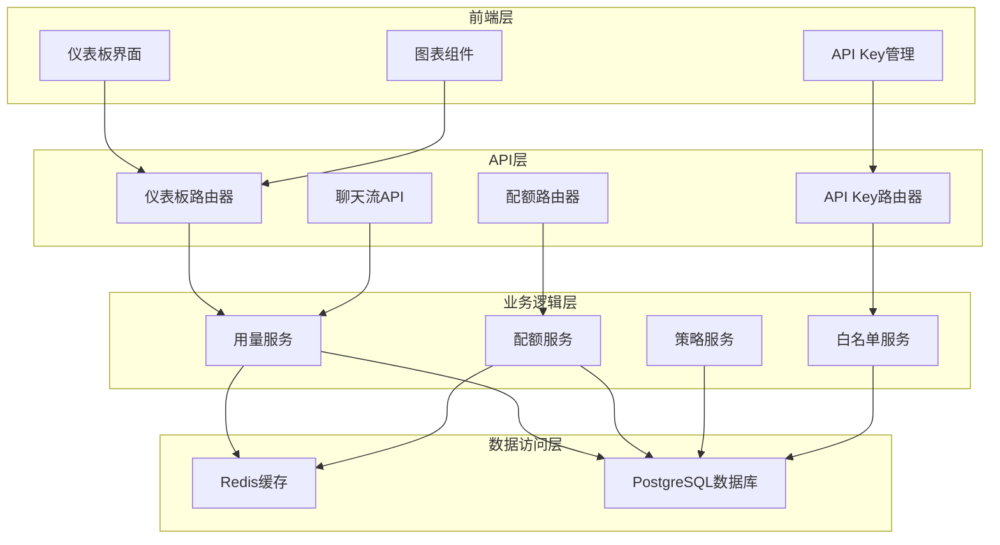
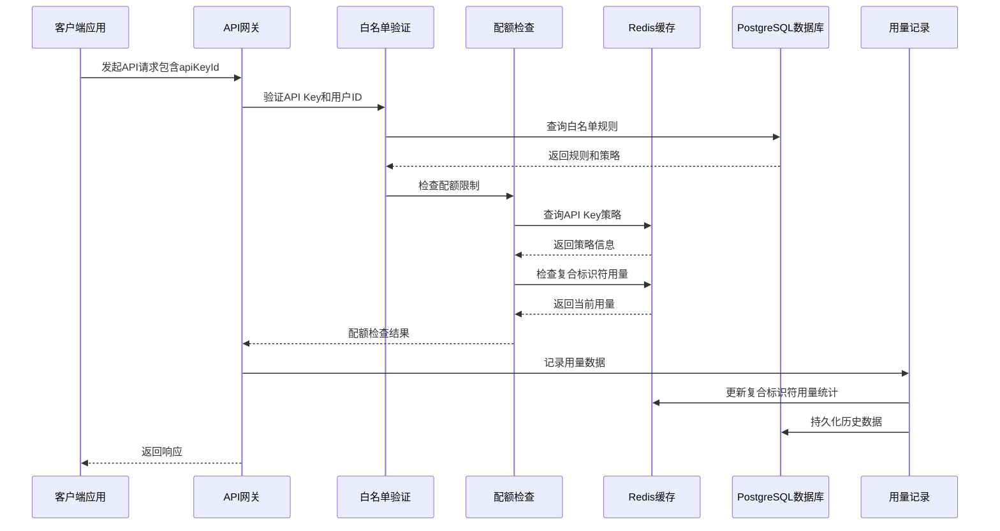
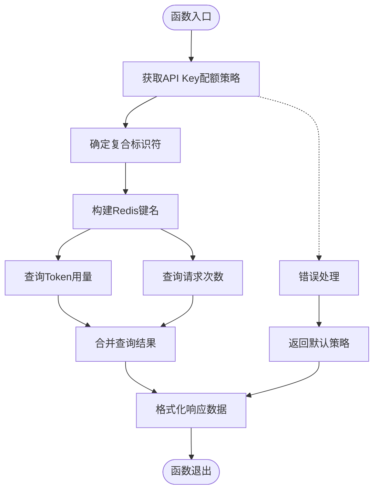
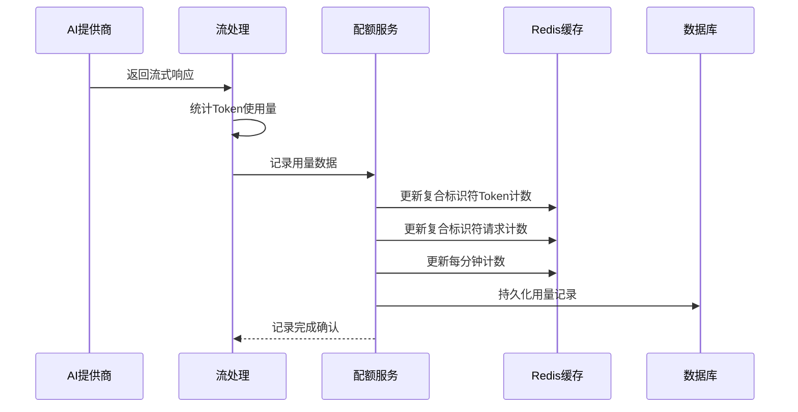
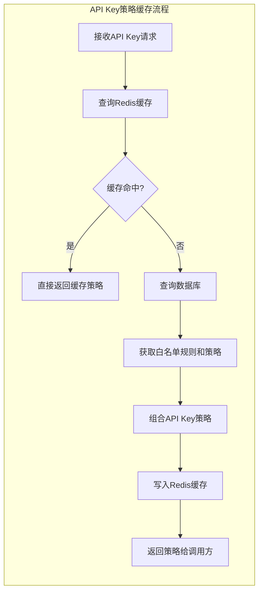
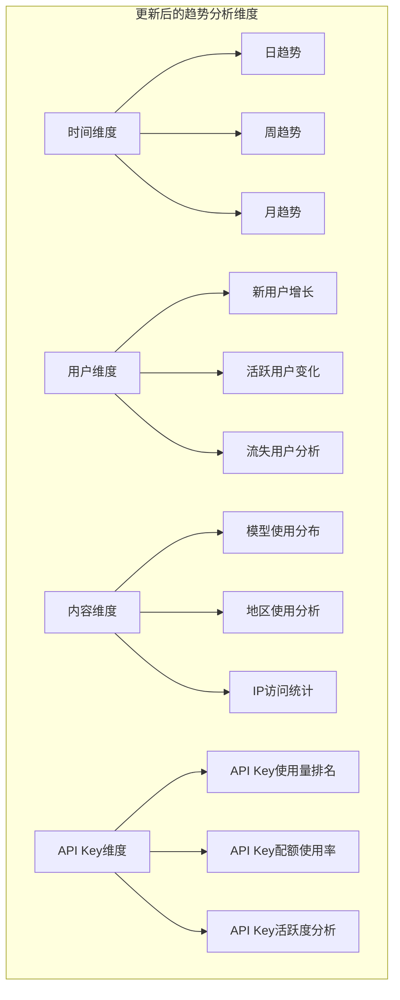
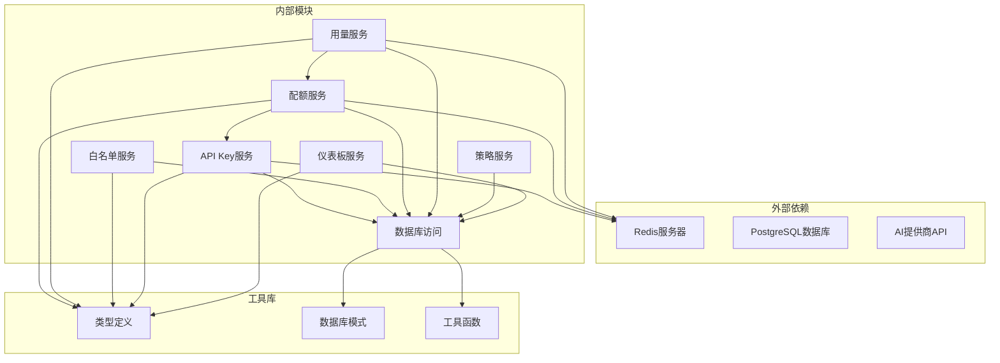
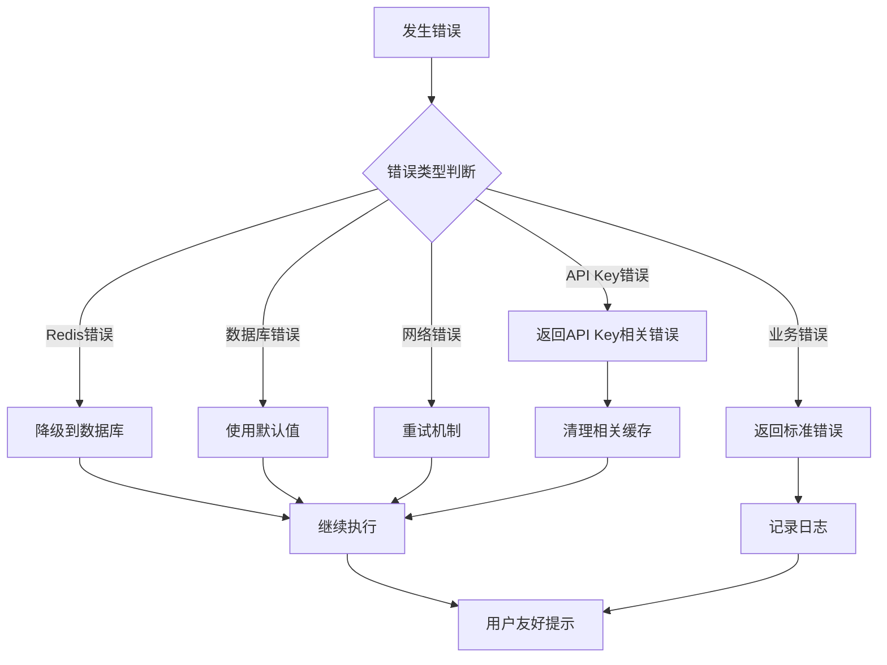

# 每日用量监控

<cite>
**本文档引用的文件**
- [src/lib/quota.ts](file://src/lib/quota.ts)
- [src/lib/database.ts](file://src/lib/database.ts)
- [src/lib/redis.ts](file://src/lib/redis.ts)
- [src/lib/types.ts](file://src/lib/types.ts)
- [src/lib/schema.ts](file://src/lib/schema.ts)
- [src/server/api/routers/dashboard.ts](file://src/server/api/routers/dashboard.ts)
- [src/server/api/routers/quota.ts](file://src/server/api/routers/quota.ts)
- [src/server/api/routers/apiKey.ts](file://src/server/api/routers/apiKey.ts)
- [src/pages/api/ai/chat/stream.ts](file://src/pages/api/ai/chat/stream.ts)
- [src/app/(dashboard)/components/usage-trend-chart.tsx](file://src/app/(dashboard)/components/usage-trend-chart.tsx)
</cite>

## 更新摘要
**变更内容**
- 更新API Key为中心的监控机制说明
- 新增复合标识符使用说明（userId:apiKeyId）
- 更新Redis键值结构以包含API Key信息
- 新增白名单规则与API Key关联机制
- 更新用量监控的API接口设计
- 新增API Key管理相关的监控功能

## 目录
1. [简介](#简介)
2. [项目结构](#项目结构)
3. [核心组件](#核心组件)
4. [架构概览](#架构概览)
5. [详细组件分析](#详细组件分析)
6. [依赖关系分析](#依赖关系分析)
7. [性能考虑](#性能考虑)
8. [故障排除指南](#故障排除指南)
9. [结论](#结论)
10. [附录](#附录)

## 简介

每日用量监控模块是AIGate系统中的核心功能之一，负责实时跟踪和管理用户的API使用情况。该模块实现了完整的用量监控生命周期，包括用量采集、策略关联、实时查询和历史统计等功能。

**更新** 系统现已采用API Key为中心的监控机制，通过API Key ID直接获取配额策略，结合复合标识符（userId:apiKeyId）实现精细化的用量控制。系统支持白名单规则与API Key的关联，提供灵活的权限管理和用量监控能力。

本模块采用Redis作为主要的用量存储引擎，结合PostgreSQL数据库进行历史数据持久化，实现了高并发场景下的高效用量监控。系统支持多种配额策略模式，包括基于Token的用量限制和基于请求次数的频率控制，并提供了灵活的白名单规则匹配机制。

## 项目结构

用量监控模块分布在多个层次中，形成了清晰的分层架构：



**图表来源**
- [src/server/api/routers/dashboard.ts](file://src/server/api/routers/dashboard.ts#L1-L305)
- [src/server/api/routers/quota.ts](file://src/server/api/routers/quota.ts#L1-L271)
- [src/server/api/routers/apiKey.ts](file://src/server/api/routers/apiKey.ts#L1-L393)
- [src/lib/quota.ts](file://src/lib/quota.ts#L1-L319)

**章节来源**
- [src/lib/quota.ts](file://src/lib/quota.ts#L1-L319)
- [src/lib/database.ts](file://src/lib/database.ts#L1-L587)
- [src/lib/redis.ts](file://src/lib/redis.ts#L1-L54)

## 核心组件

### API Key为中心的策略管理

**更新** 系统现在采用API Key为中心的配额策略管理模式：

- **API Key策略映射**：每个API Key直接关联到特定的配额策略
- **白名单规则集成**：API Key通过白名单规则与用户ID格式验证关联
- **动态策略获取**：通过API Key ID直接获取配额策略，无需中间查询

配额策略支持多种限制模式：
- **Token模式**：基于Token消耗量的限制，适用于按使用量计费的服务
- **请求次数模式**：基于API调用次数的限制，适用于按请求频次计费的服务
- **混合模式**：同时支持Token和请求次数的双重限制

每个策略包含以下关键属性：
- `limitType`：限制类型（token/request）
- `dailyTokenLimit`：每日Token上限
- `dailyRequestLimit`：每日请求次数上限
- `rpmLimit`：每分钟请求限制
- `monthlyTokenLimit`：每月Token上限

### 复合标识符的Redis键值结构

**更新** Redis键值结构已更新为支持API Key的复合标识符：

```mermaid
graph LR
subgraph "更新后的Redis键结构"
A[user_quota:{userId}:{apiKey}:{date}] --> DailyUsage[每日Token用量]
B[user_requests:{userId}:{date}:{apiKey}] --> DailyRequests[每日请求次数]
C[user_rpm:{userId}:{date}:{hour}:{minute}] --> RPM[每分钟请求]
D[policy:apiKey:{apiKeyId}] --> PolicyCache[API Key策略缓存]
E[request_log:{userId}:{requestId}] --> RequestLog[请求日志]
end
```

**图表来源**
- [src/lib/redis.ts](file://src/lib/redis.ts#L19-L42)

### 用量记录结构

用量记录包含了完整的请求信息和成本数据：

| 字段名 | 类型 | 描述 | 示例 |
|--------|------|------|------|
| id | string | 用量记录ID | "usage_123456" |
| userId | string | 用户标识符（复合标识符） | "user@example.com:key_123" |
| model | string | AI模型名称 | "gpt-4-turbo" |
| provider | string | 供应商名称 | "openai" |
| promptTokens | number | 提示Token数 | 150 |
| completionTokens | number | 补全Token数 | 250 |
| totalTokens | number | 总Token数 | 400 |
| cost | number | 成本金额 | 0.0002 |
| region | string | 请求地区 | "北京" |
| clientIp | string | 客户端IP | "192.168.1.100" |
| timestamp | Date | 请求时间 | "2024-01-15T10:30:00Z" |

**章节来源**
- [src/lib/types.ts](file://src/lib/types.ts#L64-L77)
- [src/lib/schema.ts](file://src/lib/schema.ts#L55-L67)

## 架构概览

**更新** 用量监控系统采用以API Key为中心的分层架构设计：



**图表来源**
- [src/pages/api/ai/chat/stream.ts](file://src/pages/api/ai/chat/stream.ts#L32-L86)
- [src/lib/quota.ts](file://src/lib/quota.ts#L70-L189)

系统架构的关键特点：

1. **API Key优先**：优先使用API Key ID获取配额策略
2. **复合标识符**：使用 `userId:apiKeyId` 组合作为用量标识符
3. **白名单集成**：API Key与白名单规则的双向关联
4. **异步处理**：用量记录采用异步方式，不影响主请求流程
5. **缓存优先**：策略配置和用量数据优先从Redis读取
6. **双写一致性**：同时更新缓存和数据库，确保数据一致性
7. **自动过期**：合理设置Redis键的过期时间，避免内存泄漏

## 详细组件分析

### getDailyUsage函数实现原理

**更新** `getDailyUsage`函数现已成为API Key为中心的监控核心：



**图表来源**
- [src/lib/quota.ts](file://src/lib/quota.ts#L252-L286)

#### 参数处理机制

函数接受API Key为中心的用户标识符参数：

1. **userId**：用户ID（最高优先级）
2. **apiKey**：API Key ID（新的主要参数）
3. **ip**：客户端IP地址
4. **domain**：域名信息

当多个参数同时提供时，系统会优先使用API Key ID进行策略获取。

#### 复合标识符生成策略

**更新** 系统使用复合标识符确保不同API Key的用量隔离：

- `userId:apiKeyId`：当提供userId时，使用复合标识符
- `apiKeyId`：当仅提供apiKey时，使用API Key ID
- `ip`：当提供IP地址时，使用IP作为标识符
- `anonymous`：当无法确定标识符时，使用匿名标识符

#### Redis查询策略

**更新** Redis查询现在支持API Key的复合键结构：

- `user_quota:{userId}:{apiKey}:{date}`：存储复合标识符的Token使用量
- `user_requests:{userId}:{date}:{apiKey}`：存储复合标识符的请求次数
- `policy:apiKey:{apiKeyId}`：缓存API Key的配额策略

查询过程包含以下步骤：
1. 从Redis获取API Key的配额策略（带缓存）
2. 构建今日的复合标识符Redis键名
3. 并行查询Token用量和请求次数
4. 处理缺失键的情况（返回0）
5. 格式化最终的返回结果

#### 返回数据结构

函数返回标准化的数据结构，包含以下字段：

| 字段名 | 类型 | 描述 |
|--------|------|------|
| tokensUsed | number | 当日使用的Token总数 |
| requestsToday | number | 当日的请求次数 |
| policy | QuotaPolicy | API Key关联的配额策略信息 |

**章节来源**
- [src/lib/quota.ts](file://src/lib/quota.ts#L252-L286)

### 用量监控数据收集流程

**更新** 用量数据的收集现在通过API Key中心的复合标识符进行：



**图表来源**
- [src/pages/api/ai/chat/stream.ts](file://src/pages/api/ai/chat/stream.ts#L147-L168)
- [src/lib/quota.ts](file://src/lib/quota.ts#L191-L250)

#### Redis键值查询机制

**更新** Redis键值结构已更新为支持API Key的复合标识符：

1. **Token用量键**：`user_quota:{userId}:{apiKey}:{date}`
   - 使用`INCRBY`原子操作累加Token数量
   - 设置7天过期时间，确保数据及时清理

2. **请求次数键**：`user_requests:{userId}:{date}:{apiKey}`
   - 使用`INCR`原子操作递增请求计数
   - 设置7天过期时间

3. **每分钟用量键**：`user_rpm:{userId}:{date}:{hour}:{minute}`
   - 使用`INCR`操作记录每分钟请求
   - 设置2分钟过期时间，支持短期流量控制

4. **API Key策略缓存键**：`policy:apiKey:{apiKeyId}`
   - 缓存API Key的配额策略，1小时过期
   - 减少数据库查询压力

#### 数据聚合计算

系统支持多种数据聚合方式：

1. **按日聚合**：将同一天的所有请求合并统计
2. **按周聚合**：统计最近7天的使用趋势
3. **按月聚合**：统计30天内的使用情况
4. **按API Key聚合**：按不同API Key统计使用情况
5. **按用户聚合**：按不同用户统计使用情况

#### 结果格式化

查询结果经过统一的格式化处理，确保前端组件的一致性：

```typescript
{
  totalUsers: number,
  todayRequests: number,
  todayTokens: number,
  totalRequests: number,
  activeUsers: number,
  growthRates: {
    userGrowth: number,
    requestGrowth: number,
    tokenGrowth: number,
    activeUserGrowth: number
  }
}
```

**章节来源**
- [src/lib/quota.ts](file://src/lib/quota.ts#L191-L250)
- [src/lib/database.ts](file://src/lib/database.ts#L223-L276)

### 实时性保证机制

**更新** 用量监控系统通过多层次的设计确保数据的实时性和准确性：

#### 数据更新延迟控制

1. **异步记录**：用量记录在请求完成后异步执行，不影响主请求响应时间
2. **原子操作**：Redis操作使用原子指令，避免竞态条件
3. **批量更新**：支持批量Redis操作，减少网络往返
4. **API Key缓存**：API Key策略缓存1小时，减少查询压力

#### 缓存同步策略

**更新** 系统采用"先写缓存，后写数据库"的策略：



**图表来源**
- [src/lib/quota.ts](file://src/lib/quota.ts#L14-L48)

#### 查询准确性保障

1. **时间窗口控制**：严格的时间范围查询，避免数据污染
2. **数据完整性检查**：对缺失的Redis键进行降级处理
3. **事务性操作**：数据库操作使用事务保证一致性
4. **复合标识符验证**：确保不同API Key的用量完全隔离

**章节来源**
- [src/lib/redis.ts](file://src/lib/redis.ts#L1-L54)
- [src/lib/database.ts](file://src/lib/database.ts#L331-L351)

### API接口设计

**更新** 用量监控模块提供了完整的API接口体系，现在以API Key为中心：

#### 仪表板统计接口

| 接口 | 方法 | 路径 | 功能描述 |
|------|------|------|----------|
| getStats | GET | `/api/dashboard/stats` | 获取仪表板统计数据 |
| getUsageTrend | GET | `/api/dashboard/trend` | 获取使用趋势数据 |
| getRegionDistribution | GET | `/api/dashboard/region` | 获取地区分布数据 |
| getRecentActivity | GET | `/api/dashboard/activity` | 获取最近活动记录 |

#### 配额管理接口

**更新** 新增API Key为中心的配额管理接口：

| 接口 | 方法 | 路径 | 功能描述 |
|------|------|------|----------|
| getQuotaInfo | GET | `/api/quota/info` | 获取API Key配额信息 |
| getUserUsage | GET | `/api/quota/usage` | 获取用户今日用量 |
| checkQuota | GET | `/api/quota/check` | 检查API Key配额状态 |
| resetQuota | POST | `/api/quota/reset` | 重置API Key配额 |

#### API Key管理接口

**更新** 新增API Key相关的监控接口：

| 接口 | 方法 | 路径 | 功能描述 |
|------|------|------|----------|
| getQuotaInfo | GET | `/api/apiKey/usageStats` | 获取API Key使用统计 |
| getQuotaInfo | GET | `/api/apiKey/validate` | 验证API Key有效性 |

#### 查询参数规范

所有查询接口都支持以下通用参数：

| 参数名 | 类型 | 必填 | 默认值 | 描述 |
|--------|------|------|--------|------|
| startDate | string | 否 | 7天前 | 查询开始日期 |
| endDate | string | 否 | 当前时间 | 查询结束日期 |
| limit | number | 否 | 50 | 返回记录数量限制 |
| offset | number | 否 | 0 | 分页偏移量 |
| apiKeyId | string | 是 | - | API Key ID（新增） |

#### 返回数据结构

系统采用统一的响应格式：

```typescript
interface ApiResponse<T> {
  success: boolean;
  data: T;
  message?: string;
  error?: {
    code: string;
    details: any;
  };
}
```

**章节来源**
- [src/server/api/routers/dashboard.ts](file://src/server/api/routers/dashboard.ts#L1-L305)
- [src/server/api/routers/quota.ts](file://src/server/api/routers/quota.ts#L1-L271)
- [src/server/api/routers/apiKey.ts](file://src/server/api/routers/apiKey.ts#L340-L391)

### 管理后台应用场景

**更新** 用量监控在管理后台中有广泛的应用场景：

#### 仪表板展示

1. **实时统计数据**：显示总用户数、今日请求量、Token消耗等关键指标
2. **趋势分析图表**：展示7天使用趋势和30天使用分布
3. **地区分布热力图**：可视化不同地区的使用情况
4. **活跃用户统计**：显示活跃用户增长趋势
5. **API Key使用分析**：展示不同API Key的使用情况

#### 趋势分析功能

系统提供多维度的趋势分析能力：



#### 告警触发机制

**更新** 系统支持基于API Key的智能告警：

1. **API Key用量预警**：当API Key用量达到预设阈值时触发告警
2. **异常检测**：检测异常的用量模式和访问行为
3. **自动通知**：通过邮件、短信等方式发送告警通知
4. **白名单规则告警**：当API Key绑定的白名单规则异常时触发告警

**章节来源**
- [src/app/(dashboard)/components/usage-trend-chart.tsx](file://src/app/(dashboard)/components/usage-trend-chart.tsx#L1-L144)
- [src/server/api/routers/dashboard.ts](file://src/server/api/routers/dashboard.ts#L164-L235)

## 依赖关系分析

**更新** 用量监控模块的依赖关系体现了以API Key为中心的分层设计：



**图表来源**
- [src/lib/quota.ts](file://src/lib/quota.ts#L1-L3)
- [src/lib/database.ts](file://src/lib/database.ts#L1-L16)
- [src/server/api/routers/quota.ts](file://src/server/api/routers/quota.ts#L1-L12)

### 组件耦合度分析

**更新** 系统设计遵循低耦合高内聚的原则：

1. **API Key服务独立**：API Key管理模块独立，职责明确
2. **白名单规则集成**：白名单规则与API Key的紧密关联
3. **策略服务抽象**：通过API Key ID获取策略，减少直接依赖
4. **数据访问抽象**：通过数据库抽象层屏蔽具体实现细节
5. **配置集中管理**：Redis连接配置和数据库连接池统一管理
6. **错误处理统一**：采用统一的错误处理和日志记录机制

### 循环依赖检测

经过分析，系统不存在循环依赖问题：

- 服务层不依赖UI层
- 数据访问层不依赖表现层
- 工具库不依赖业务逻辑层
- 所有依赖都是单向的
- API Key服务与配额服务的依赖关系清晰

**章节来源**
- [src/lib/types.ts](file://src/lib/types.ts#L1-L118)
- [src/lib/schema.ts](file://src/lib/schema.ts#L1-L161)

## 性能考虑

**更新** 用量监控系统在设计时充分考虑了API Key中心化的性能优化需求：

### 批量查询优化

**更新** 系统支持基于API Key的批量查询操作：

1. **并行查询**：使用Promise.all进行并行数据库查询
2. **批量Redis操作**：支持批量键值操作，减少网络开销
3. **API Key缓存**：API Key策略缓存1小时，减少数据库压力
4. **分页查询**：大数据集采用分页机制，避免内存溢出

### 索引优化策略

**更新** 数据库查询性能通过合理的索引设计得到保障：

```sql
-- 用量记录表索引
CREATE INDEX idx_usage_records_timestamp ON usage_records(timestamp);
CREATE INDEX idx_usage_records_user_id ON usage_records(userId);
CREATE INDEX idx_usage_records_model ON usage_records(model);
CREATE INDEX idx_usage_records_provider ON usage_records(provider);

-- API Key表索引
CREATE INDEX idx_api_keys_id ON api_keys(id);
CREATE INDEX idx_api_keys_provider ON api_keys(provider);
CREATE INDEX idx_api_keys_status ON api_keys(status);

-- 白名单规则表索引
CREATE INDEX idx_whitelist_rules_apiKeyId ON whitelist_rules(apiKeyId);
CREATE INDEX idx_whitelist_rules_status ON whitelist_rules(status);
CREATE INDEX idx_whitelist_rules_priority ON whitelist_rules(priority);

-- 组合索引优化常见查询
CREATE INDEX idx_usage_records_user_time ON usage_records(userId, timestamp);
CREATE INDEX idx_usage_records_time_model ON usage_records(timestamp, model);
CREATE INDEX idx_whitelist_rules_api_key ON whitelist_rules(apiKeyId, status);
```

### 查询缓存策略

**更新** 系统采用多层缓存机制：

1. **API Key策略缓存**：`policy:apiKey:{apiKeyId}`，1小时过期
2. **Redis缓存**：热点数据缓存，降低数据库压力
3. **进程内缓存**：短期内重复查询的数据缓存
4. **浏览器缓存**：前端静态资源和查询结果缓存

### 内存管理优化

**更新** 1. **键过期策略**：合理设置Redis键的过期时间
2. **批量清理**：定期清理过期数据，释放内存空间
3. **内存监控**：实时监控Redis内存使用情况
4. **API Key缓存清理**：当API Key状态改变时自动清理相关缓存

**章节来源**
- [src/lib/database.ts](file://src/lib/database.ts#L230-L276)
- [src/lib/redis.ts](file://src/lib/redis.ts#L19-L42)

## 故障排除指南

### 常见问题诊断

**更新** 常见问题诊断现在包含API Key相关的故障：

#### API Key相关问题

**症状**：API Key无法正常使用或配额检查失败

**诊断步骤**：
1. 检查API Key是否存在于数据库中
2. 验证API Key状态是否为ACTIVE
3. 确认API Key是否绑定了有效的白名单规则
4. 检查Redis中API Key策略缓存是否存在

**解决方案**：
```typescript
// API Key验证流程
async function validateApiKey(apiKeyId: string) {
  const apiKey = await apiKeyDb.getById(apiKeyId);
  if (!apiKey || apiKey.status !== 'ACTIVE') {
    throw new Error('API Key不存在或已禁用');
  }
  
  const whitelistRule = await whitelistRuleDb.getByApiKeyId(apiKeyId);
  if (!whitelistRule || whitelistRule.status !== 'active') {
    throw new Error('API Key未绑定有效的白名单规则');
  }
  
  return { apiKey, whitelistRule };
}
```

#### Redis连接问题

**症状**：用量查询超时或返回空数据

**诊断步骤**：
1. 检查Redis服务器状态
2. 验证连接配置参数
3. 查看Redis日志文件
4. 测试基本Redis命令

**解决方案**：
```typescript
// 重连机制
if (!redis.isOpen) {
  await redis.connect();
  console.log('Redis重新连接成功');
}
```

#### 数据不一致问题

**症状**：Redis和数据库中的数据不一致

**诊断方法**：
1. 检查异步写入操作的执行情况
2. 验证事务提交状态
3. 查看错误日志

**修复方案**：
```typescript
// 数据同步检查
async function syncData() {
  const redisData = await getRedisData();
  const dbData = await getDatabaseData();
  
  if (redisData !== dbData) {
    await reconcileData(redisData, dbData);
  }
}
```

#### 性能瓶颈识别

**症状**：查询响应时间过长

**分析工具**：
1. 使用Redis监控命令查看慢查询
2. 分析数据库执行计划
3. 监控系统资源使用情况
4. 检查API Key缓存命中率

**优化建议**：
- 添加适当的索引
- 优化查询语句
- 调整缓存策略
- 监控API Key使用情况

**章节来源**
- [src/lib/redis.ts](file://src/lib/redis.ts#L7-L14)
- [src/lib/quota.ts](file://src/lib/quota.ts#L278-L286)

### 错误处理机制

**更新** 系统采用统一的错误处理策略：



**图表来源**
- [src/lib/quota.ts](file://src/lib/quota.ts#L278-L286)

## 结论

**更新** 每日用量监控模块通过API Key为中心的架构设计和优化策略，成功实现了高并发场景下的高效用量管理。系统的主要优势包括：

1. **API Key优先设计**：采用API Key为中心的监控机制，提供更精确的用量控制
2. **复合标识符隔离**：使用 `userId:apiKeyId` 组合作为标识符，确保不同API Key的用量完全隔离
3. **白名单规则集成**：API Key与白名单规则的双向关联，提供灵活的权限管理
4. **高性能设计**：采用Redis缓存和异步处理，确保系统的高吞吐量
5. **灵活的策略管理**：支持多种配额策略模式，满足不同业务需求
6. **实时性保障**：通过多层缓存和快速查询机制，确保数据的实时性
7. **可扩展性**：模块化设计便于功能扩展和维护升级

未来可以进一步优化的方向包括：
- 增强机器学习算法进行用量预测
- 扩展更多维度的分析指标
- 优化大规模数据的查询性能
- 增加更多的告警和通知机制
- 支持更多类型的API Key认证方式

## 附录

### 扩展功能规划

#### 历史数据查询

**更新** 系统支持灵活的历史数据查询功能：

1. **时间范围查询**：支持任意时间范围的数据查询
2. **API Key维度查询**：按不同API Key维度查询使用情况
3. **用户维度查询**：按不同用户维度查询使用情况
4. **数据导出**：支持CSV格式的数据导出
5. **高级筛选**：支持按API Key、用户、模型、地区等多维度筛选

#### 跨日统计分析

**更新** 系统提供跨日统计分析能力：

1. **环比分析**：比较相邻时间段的使用情况
2. **同比分析**：比较相同时间段去年的使用情况
3. **API Key趋势分析**：分析不同API Key的使用趋势
4. **用户趋势分析**：分析不同用户的使用趋势
5. **趋势预测**：基于历史数据预测未来趋势

#### 多维度分析

**更新** 系统支持多维度的用量分析：

1. **用户维度**：按用户、用户组进行分析
2. **API Key维度**：按API Key、API Key组进行分析
3. **内容维度**：按模型、提示词、响应内容分析
4. **时间维度**：按小时、天、周、月进行分析
5. **地理维度**：按国家、地区、城市进行分析
6. **提供商维度**：按不同AI提供商进行分析

### 部署和运维建议

**更新** 部署和运维建议：

1. **Redis配置优化**：根据实际使用量调整Redis内存和连接数
2. **数据库监控**：建立完善的数据库性能监控体系
3. **日志管理**：配置合理的日志级别和轮转策略
4. **备份策略**：制定数据备份和恢复计划
5. **API Key安全**：定期轮换API Key，监控异常使用模式
6. **缓存管理**：监控Redis缓存命中率，定期清理过期数据
7. **白名单规则维护**：定期审查和更新白名单规则

### API Key管理最佳实践

**更新** API Key管理的最佳实践：

1. **最小权限原则**：为每个API Key分配最小必要的权限
2. **定期轮换**：定期更换API Key，降低泄露风险
3. **使用监控**：监控API Key的使用情况和异常行为
4. **白名单规则**：为API Key配置适当的白名单规则
5. **配额设置**：为API Key设置合理的用量配额
6. **访问控制**：限制API Key的访问来源和时间
7. **审计日志**：记录API Key的使用和修改历史