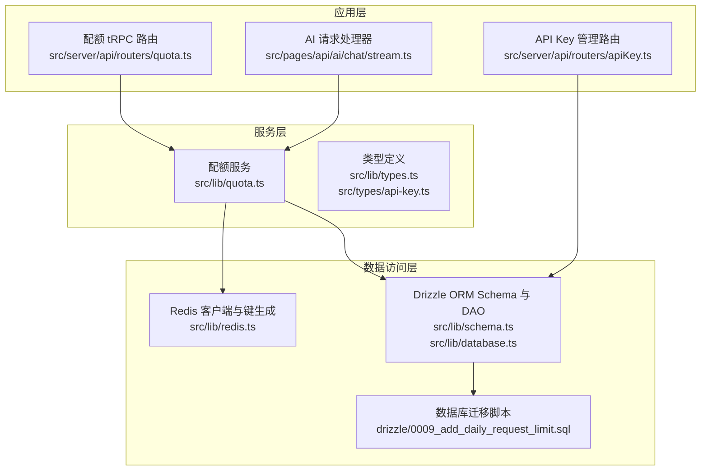
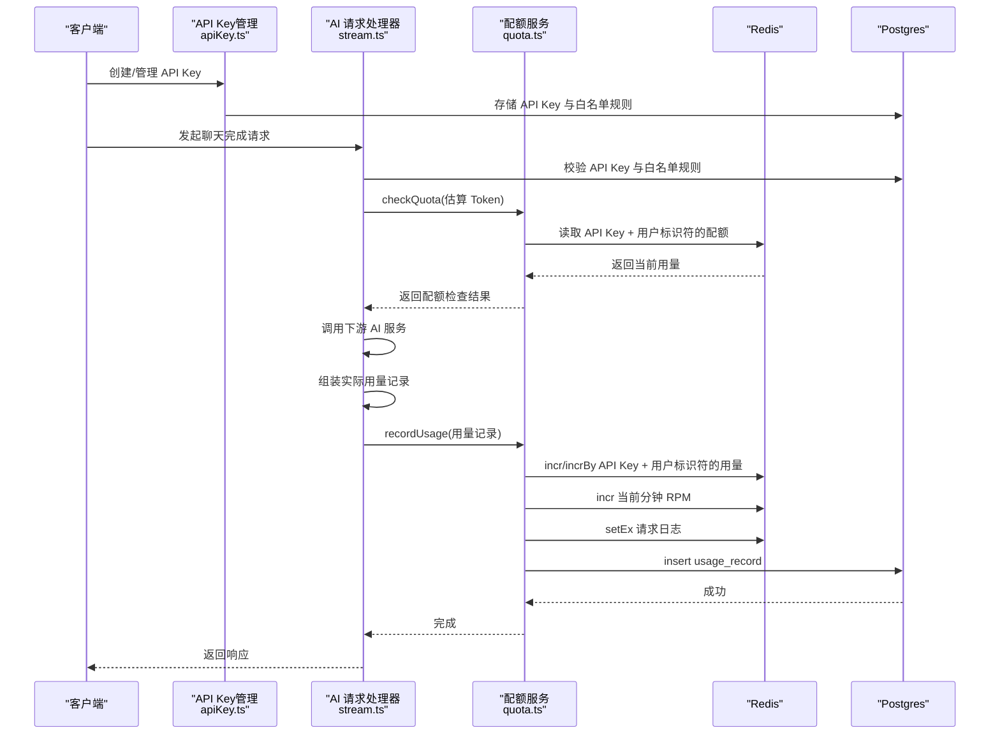
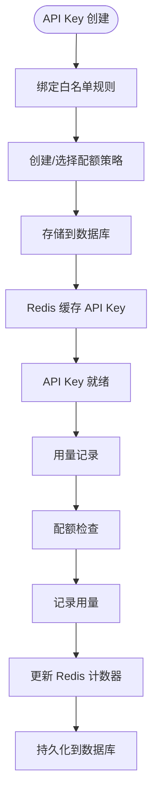
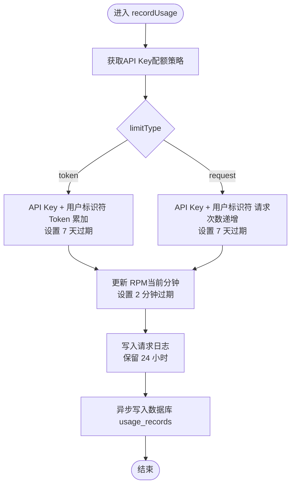
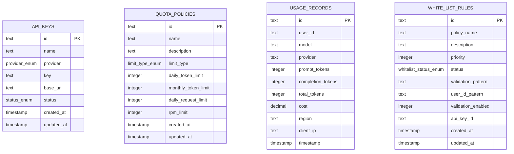
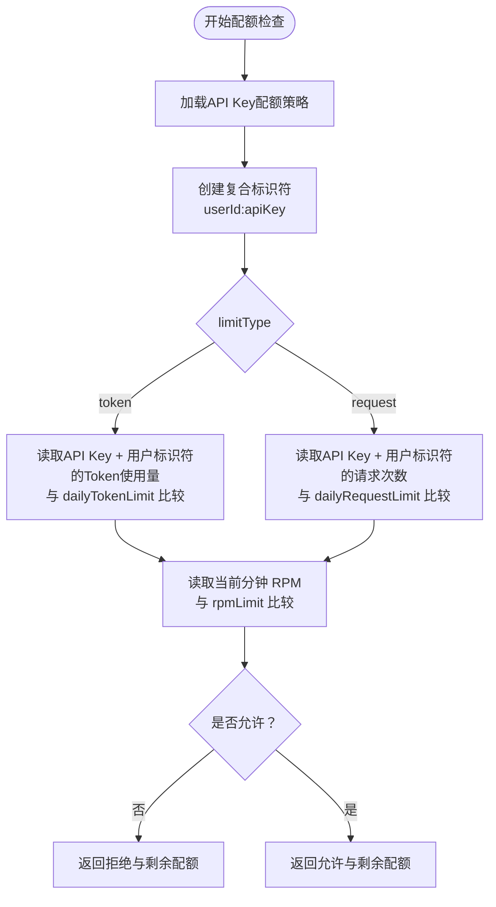
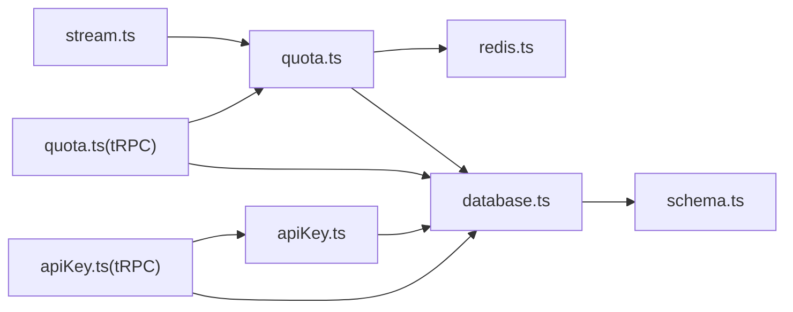

# 用量记录系统

<cite>
**本文档引用的文件**
- [src/lib/quota.ts](file://src/lib/quota.ts)
- [src/lib/redis.ts](file://src/lib/redis.ts)
- [src/lib/schema.ts](file://src/lib/schema.ts)
- [src/lib/database.ts](file://src/lib/database.ts)
- [src/lib/types.ts](file://src/lib/types.ts)
- [src/server/api/routers/quota.ts](file://src/server/api/routers/quota.ts)
- [src/server/api/routers/ai.ts](file://src/server/api/routers/ai.ts)
- [src/lib/ai-providers.ts](file://src/lib/ai-providers.ts)
- [src/pages/api/ai/chat/stream.ts](file://src/pages/api/ai/chat/stream.ts)
- [src/types/api-key.ts](file://src/types/api-key.ts)
- [drizzle/0009_add_daily_request_limit.sql](file://drizzle/0009_add_daily_request_limit.sql)
</cite>

## 更新摘要
**变更内容**
- 新增API Key为中心的用量跟踪机制
- 更新复合标识符设计：userId:apiKeyId
- 重构Redis键空间设计以支持API Key隔离
- 增强白名单规则与API Key绑定机制
- 更新用量记录的数据结构和查询接口

## 目录
1. [简介](#简介)
2. [项目结构](#项目结构)
3. [核心组件](#核心组件)
4. [架构总览](#架构总览)
5. [详细组件分析](#详细组件分析)
6. [依赖关系分析](#依赖关系分析)
7. [性能考虑](#性能考虑)
8. [故障排查指南](#故障排查指南)
9. [结论](#结论)
10. [附录](#附录)

## 简介
本文件为用量记录系统的详细技术文档，围绕 API Key 为中心的用量记录机制、recordUsage 函数的实现原理、Redis 缓存与数据库持久化的协同机制、不同配额模式下的用量统计策略（Token 模式累计与 Request 模式计数）、Redis 键值设计与命名规范、用量记录的数据结构与完整性保障、异步处理机制（Redis 原子性与数据库写入一致性）、性能优化策略（批量写入、延迟更新、内存管理）以及查询接口与历史数据分析能力进行全面阐述。

## 项目结构
用量记录系统主要由以下模块构成：
- API Key管理与白名单规则：src/server/api/routers/apiKey.ts、src/lib/database.ts
- 配额策略与用量检查：src/lib/quota.ts
- Redis 客户端与键名生成：src/lib/redis.ts
- 数据库 Schema 与 DAO 层：src/lib/schema.ts、src/lib/database.ts
- 类型定义：src/lib/types.ts、src/types/api-key.ts
- tRPC 接口：src/server/api/routers/quota.ts、src/server/api/routers/ai.ts
- AI 请求处理器：src/pages/api/ai/chat/stream.ts
- AI 提供商适配：src/lib/ai-providers.ts
- 数据库迁移脚本：drizzle/0009_add_daily_request_limit.sql

**图表来源**
- [src/server/api/routers/apiKey.ts](file://src/server/api/routers/apiKey.ts#L1-L393)
- [src/pages/api/ai/chat/stream.ts](file://src/pages/api/ai/chat/stream.ts#L1-L184)
- [src/server/api/routers/quota.ts](file://src/server/api/routers/quota.ts#L1-L301)
- [src/lib/quota.ts](file://src/lib/quota.ts#L1-L319)
- [src/lib/redis.ts](file://src/lib/redis.ts#L1-L54)
- [src/lib/schema.ts](file://src/lib/schema.ts#L1-L161)
- [src/lib/database.ts](file://src/lib/database.ts#L1-L587)
- [drizzle/0009_add_daily_request_limit.sql](file://drizzle/0009_add_daily_request_limit.sql#L1-L8)

**章节来源**
- [src/server/api/routers/apiKey.ts](file://src/server/api/routers/apiKey.ts#L1-L393)
- [src/pages/api/ai/chat/stream.ts](file://src/pages/api/ai/chat/stream.ts#L1-L184)
- [src/lib/quota.ts](file://src/lib/quota.ts#L1-L319)
- [src/lib/redis.ts](file://src/lib/redis.ts#L1-L54)
- [src/lib/schema.ts](file://src/lib/schema.ts#L1-L161)
- [src/lib/database.ts](file://src/lib/database.ts#L1-L587)
- [src/lib/types.ts](file://src/lib/types.ts#L1-L118)
- [src/types/api-key.ts](file://src/types/api-key.ts#L1-L20)
- [src/server/api/routers/quota.ts](file://src/server/api/routers/quota.ts#L1-L301)
- [src/server/api/routers/ai.ts](file://src/server/api/routers/ai.ts#L1-L223)
- [src/lib/ai-providers.ts](file://src/lib/ai-providers.ts#L1-L759)
- [drizzle/0009_add_daily_request_limit.sql](file://drizzle/0009_add_daily_request_limit.sql#L1-L8)

## 核心组件
- API Key管理：提供API Key的创建、更新、禁用、统计查询等功能，支持与白名单规则绑定。
- 配额策略与用量检查：提供策略加载、配额检查、用量记录、每日用量查询、配额重置等功能，支持API Key为中心的用量跟踪。
- Redis 客户端与键生成：封装 Redis 连接、键名生成器、日期与分钟字符串工具，支持新的键空间设计。
- 数据库层：基于 Drizzle ORM 的 Schema 定义与 DAO 方法，支持用量记录的查询与统计，包含API Key、白名单规则、配额策略等表结构。
- 类型系统：统一的 UsageRecord、QuotaPolicy、QuotaCheckResult、ApiKey等类型定义。
- tRPC 接口：对外暴露配额查询、策略管理、用量查询、API Key管理等 API。
- AI 请求链路：在AI请求完成后调用recordUsage记录用量，支持API Key验证和白名单规则检查。

**章节来源**
- [src/server/api/routers/apiKey.ts](file://src/server/api/routers/apiKey.ts#L1-L393)
- [src/lib/quota.ts](file://src/lib/quota.ts#L1-L319)
- [src/lib/redis.ts](file://src/lib/redis.ts#L1-L54)
- [src/lib/schema.ts](file://src/lib/schema.ts#L42-L97)
- [src/lib/database.ts](file://src/lib/database.ts#L19-L587)
- [src/lib/types.ts](file://src/lib/types.ts#L63-L118)
- [src/types/api-key.ts](file://src/types/api-key.ts#L1-L20)
- [src/server/api/routers/quota.ts](file://src/server/api/routers/quota.ts#L31-L301)
- [src/pages/api/ai/chat/stream.ts](file://src/pages/api/ai/chat/stream.ts#L1-L184)

## 架构总览
用量记录系统采用"API Key为中心的双层架构"：
- API Key层：每个API Key独立拥有配额策略，支持多租户隔离。
- Redis：存放每日 Token 使用量、每日请求次数、每分钟请求次数、策略缓存、请求日志等，具备高吞吐与低延迟特性。
- Postgres：存放用量记录明细与策略配置，提供强一致性的数据持久化与复杂查询统计。

**图表来源**
- [src/pages/api/ai/chat/stream.ts](file://src/pages/api/ai/chat/stream.ts#L32-L86)
- [src/lib/quota.ts](file://src/lib/quota.ts#L70-L189)
- [src/lib/quota.ts](file://src/lib/quota.ts#L192-L250)
- [src/lib/redis.ts](file://src/lib/redis.ts#L19-L42)
- [src/lib/database.ts](file://src/lib/database.ts#L315-L350)

**章节来源**
- [src/pages/api/ai/chat/stream.ts](file://src/pages/api/ai/chat/stream.ts#L32-L86)
- [src/lib/quota.ts](file://src/lib/quota.ts#L70-L250)
- [src/lib/redis.ts](file://src/lib/redis.ts#L19-L42)
- [src/lib/database.ts](file://src/lib/database.ts#L315-L350)

## 详细组件分析

### API Key为中心的用量跟踪机制
- **复合标识符设计**：使用 `${userId}:${apiKeyId}` 作为用量记录的标识符，确保不同API Key的配额完全隔离。
- **白名单规则绑定**：每个API Key必须绑定有效的白名单规则才能使用，支持用户ID格式校验和生成。
- **策略继承机制**：通过白名单规则关联配额策略，实现API Key级别的策略管理。
- **API Key状态管理**：支持API Key的启用/禁用状态，禁用时自动清除Redis缓存。

**图表来源**
- [src/server/api/routers/apiKey.ts](file://src/server/api/routers/apiKey.ts#L148-L191)
- [src/lib/database.ts](file://src/lib/database.ts#L330-L350)
- [src/lib/quota.ts](file://src/lib/quota.ts#L14-L48)

**章节来源**
- [src/server/api/routers/apiKey.ts](file://src/server/api/routers/apiKey.ts#L148-L191)
- [src/lib/database.ts](file://src/lib/database.ts#L330-L350)
- [src/lib/quota.ts](file://src/lib/quota.ts#L14-L48)

### recordUsage 函数实现原理
- **输入**：UsageRecord、apiKeyId（API Key标识符）、identifier（复合用户标识符）。
- **步骤**：
  1) 获取配额策略（按apiKeyId匹配白名单规则，策略缓存于Redis）。
  2) 根据limitType执行不同统计：
     - Token模式：对API Key + 用户标识符的当日Token使用量进行累加（incrBy），设置7天过期。
     - Request模式：对API Key + 用户标识符的当日请求次数进行递增（incr），设置7天过期。
  3) 更新每分钟请求次数（RPM），设置2分钟过期。
  4) 写入请求日志（request_log），保留24小时。
  5) 异步写入数据库usage_records表。
- **异常处理**：捕获错误并记录日志，不影响主流程。

**图表来源**
- [src/lib/quota.ts](file://src/lib/quota.ts#L192-L250)
- [src/lib/redis.ts](file://src/lib/redis.ts#L19-L42)
- [src/lib/database.ts](file://src/lib/database.ts#L232-L244)

**章节来源**
- [src/lib/quota.ts](file://src/lib/quota.ts#L192-L250)

### Redis 键值设计与命名规范
- **API Key每日配额使用量**：user_quota:{userId}:{apiKey}:{YYYY-MM-DD}
- **API Key每日请求次数**：user_requests:{userId}:{apiKey}:{YYYY-MM-DD}
- **用户每分钟请求次数**：user_rpm:{userId}:{YYYY-MM-DD:HH:MM}
- **API Key策略缓存**：policy:apiKey:{apiKeyId}
- **API Key配置缓存**：api_keys:{provider}
- **请求日志**：request_log:{userId}:{requestId}

过期策略：
- API Key级指标：7天
- RPM指标：2分钟
- 请求日志：24小时
- 策略缓存：1小时

**章节来源**
- [src/lib/redis.ts](file://src/lib/redis.ts#L19-L42)

### 用量记录的数据结构与完整性
- **UsageRecord字段**：
  - id、userId（现在是复合标识符）、requestId、model、provider、promptTokens、completionTokens、totalTokens、cost、region、clientIp、timestamp
- **ApiKey类型**：
  - id、name、provider、key、baseUrl、createdAt、lastUsed、originKey、status
- **数据完整性保障**：
  - Redis：使用原子操作（incr、incrBy、setEx、expire）保证并发安全与生命周期控制。
  - 数据库：使用Drizzle ORM插入，字段类型与精度严格定义（decimal、integer、timestamp）。
  - 异常处理：recordUsage中捕获错误并记录日志，避免阻塞主流程。

**图表来源**
- [src/lib/schema.ts](file://src/lib/schema.ts#L42-L97)

**章节来源**
- [src/lib/schema.ts](file://src/lib/schema.ts#L42-L97)
- [src/lib/types.ts](file://src/lib/types.ts#L63-L79)
- [src/types/api-key.ts](file://src/types/api-key.ts#L1-L20)
- [src/lib/quota.ts](file://src/lib/quota.ts#L232-L244)

### 不同配额模式下的用量统计策略
- **Token模式**：
  - 统计维度：API Key + 用户标识符的当日累计Token使用量。
  - 更新策略：使用incrBy对totalTokens进行累加。
  - 限额判断：比较当前累计值与dailyTokenLimit。
- **Request模式**：
  - 统计维度：API Key + 用户标识符的当日请求次数。
  - 更新策略：使用incr对请求次数进行递增。
  - 限额判断：比较当前次数与dailyRequestLimit。
- **RPM（每分钟请求次数）**：
  - 统计维度：当前分钟内的请求次数。
  - 更新策略：使用incr对user_rpm键进行递增。
  - 限额判断：RPM超限时拒绝请求。

**图表来源**
- [src/lib/quota.ts](file://src/lib/quota.ts#L70-L189)

**章节来源**
- [src/lib/quota.ts](file://src/lib/quota.ts#L70-L189)

### 异步处理机制与一致性
- **Redis原子性**：incr、incrBy、setEx、expire均为原子操作，保证并发安全。
- **数据库写入**：recordUsage中异步执行数据库插入，不阻塞主流程；若失败不影响用量统计。
- **一致性策略**：Redis作为"热数据"先行，数据库作为"冷数据"落盘，最终一致性满足业务需求。
- **API Key隔离**：通过复合标识符确保不同API Key的用量完全隔离，避免交叉影响。

**章节来源**
- [src/lib/quota.ts](file://src/lib/quota.ts#L232-L250)
- [src/lib/redis.ts](file://src/lib/redis.ts#L19-L42)

### 查询接口与历史数据分析
- **tRPC接口**：
  - 获取用户配额信息、策略、用量与剩余配额。
  - 获取/设置用户配额策略。
  - 获取用户今日使用情况。
  - 检查配额与重置配额。
  - 获取所有配额策略、创建/更新/删除策略。
- **API Key管理接口**：
  - 获取所有API Key、根据ID获取API Key。
  - 创建API Key、更新API Key、切换状态。
  - 获取API Key使用统计。
- **历史数据分析**：
  - usageRecordDb提供按用户、日期范围查询用量记录。
  - getStats统计总用户数、今日请求数、今日Token消耗、总请求数、活跃用户数（最近7天）。

**章节来源**
- [src/server/api/routers/quota.ts](file://src/server/api/routers/quota.ts#L31-L301)
- [src/server/api/routers/apiKey.ts](file://src/server/api/routers/apiKey.ts#L84-L393)
- [src/lib/database.ts](file://src/lib/database.ts#L142-L587)

## 依赖关系分析
- API Key管理依赖数据库层的API Key表和白名单规则表。
- 配额服务依赖Redis键生成器与日期工具，依赖数据库层的白名单规则与策略查询。
- AI请求处理器在成功调用下游服务后，异步调用配额服务记录用量。
- tRPC路由依赖配额服务与数据库层策略管理。
- 数据库层依赖Drizzle ORM Schema与DAO方法。

**图表来源**
- [src/pages/api/ai/chat/stream.ts](file://src/pages/api/ai/chat/stream.ts#L32-L86)
- [src/lib/quota.ts](file://src/lib/quota.ts#L1-L319)
- [src/lib/redis.ts](file://src/lib/redis.ts#L1-L54)
- [src/lib/database.ts](file://src/lib/database.ts#L1-L587)
- [src/lib/schema.ts](file://src/lib/schema.ts#L1-L161)
- [src/server/api/routers/quota.ts](file://src/server/api/routers/quota.ts#L1-L301)
- [src/server/api/routers/apiKey.ts](file://src/server/api/routers/apiKey.ts#L1-L393)

**章节来源**
- [src/pages/api/ai/chat/stream.ts](file://src/pages/api/ai/chat/stream.ts#L32-L86)
- [src/lib/quota.ts](file://src/lib/quota.ts#L1-L319)
- [src/lib/redis.ts](file://src/lib/redis.ts#L1-L54)
- [src/lib/database.ts](file://src/lib/database.ts#L1-L587)
- [src/lib/schema.ts](file://src/lib/schema.ts#L1-L161)
- [src/server/api/routers/quota.ts](file://src/server/api/routers/quota.ts#L1-L301)
- [src/server/api/routers/apiKey.ts](file://src/server/api/routers/apiKey.ts#L1-L393)

## 性能考虑
- **Redis原子操作**：使用incr、incrBy、setEx、expire实现高并发下的计数与日志写入。
- **过期策略**：API Key级指标7天、RPM2分钟、请求日志24小时，平衡内存占用与查询时效。
- **异步持久化**：用量记录写入数据库采用异步方式，降低主流程延迟。
- **缓存策略**：策略与API Key缓存减少数据库压力，API Key状态变化时自动失效。
- **批量写入建议**：可在上游聚合多个用量事件后批量写入数据库，进一步降低写放大。
- **延迟更新**：对于非关键路径的统计（如历史报表），可采用延迟聚合，减少实时写入压力。
- **内存管理**：合理设置键过期时间，定期清理过期键，避免内存膨胀。
- **API Key隔离**：通过复合标识符确保不同API Key的用量完全隔离，避免跨租户影响。

## 故障排查指南
- **Redis连接异常**：检查REDIS_URL环境变量与网络连通性。
- **API Key验证失败**：查看API Key状态、白名单规则绑定情况，确认策略键是否存在。
- **用量记录失败**：检查数据库连接与表结构，确认usage_records字段类型与精度。
- **配额检查失败**：查看配额策略加载与Redis缓存状态，确认API Key策略键是否存在。
- **tRPC错误**：关注TRPCError的错误码与消息，定位具体失败环节。
- **API Key管理异常**：检查API Key创建、更新、状态切换流程，确认数据库约束。

**章节来源**
- [src/lib/redis.ts](file://src/lib/redis.ts#L3-L14)
- [src/lib/quota.ts](file://src/lib/quota.ts#L247-L250)
- [src/server/api/routers/quota.ts](file://src/server/api/routers/quota.ts#L62-L68)
- [src/server/api/routers/apiKey.ts](file://src/server/api/routers/apiKey.ts#L184-L191)

## 结论
用量记录系统通过API Key为中心的设计，实现了多租户隔离的用量统计与配额控制。新的复合标识符设计`${userId}:${apiKeyId}`确保了不同API Key的用量完全独立，配合Redis的高并发计数与短期缓存能力，结合Postgres的持久化与统计分析能力，实现了高效、可靠、安全的用量管理。recordUsage函数在保证Redis原子性的同时，异步写入数据库，兼顾了性能与一致性。通过合理的键命名规范、过期策略与缓存策略，系统在高负载场景下仍能保持稳定与可维护性。

## 附录

### 数据库迁移与字段演进
- 新增每日请求次数限制字段与限制类型字段，支持Request模式的配额策略。
- 新增API Key表、白名单规则表、配额策略表，支持多租户用量管理。
- 新增provider枚举类型，支持多种AI服务商。

**章节来源**
- [drizzle/0009_add_daily_request_limit.sql](file://drizzle/0009_add_daily_request_limit.sql#L1-L8)
- [src/lib/schema.ts](file://src/lib/schema.ts#L42-L97)

### API Key管理最佳实践
- **安全性**：API Key创建时进行掩码处理，仅在必要时显示部分字符。
- **监控**：通过API Key使用统计接口监控用量趋势和异常使用。
- **维护**：定期清理禁用的API Key，释放Redis缓存空间。
- **隔离**：不同租户使用不同的API Key，确保用量完全隔离。

**章节来源**
- [src/server/api/routers/apiKey.ts](file://src/server/api/routers/apiKey.ts#L8-L19)
- [src/server/api/routers/apiKey.ts](file://src/server/api/routers/apiKey.ts#L340-L393)