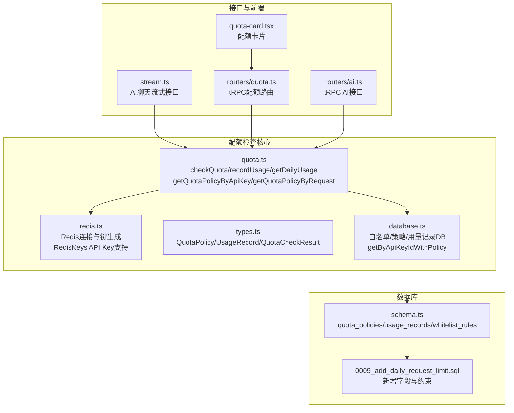
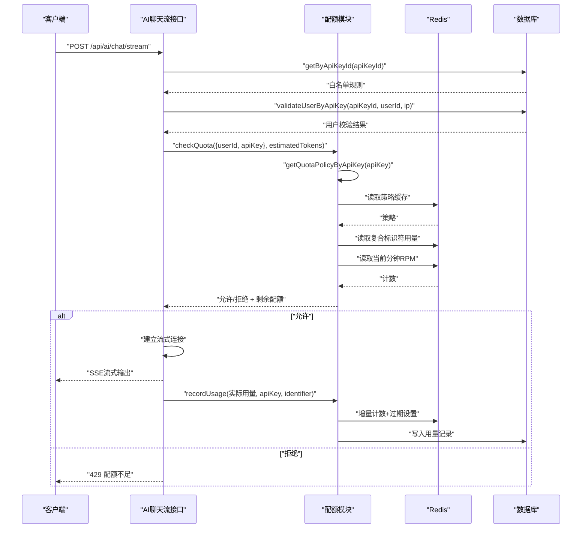
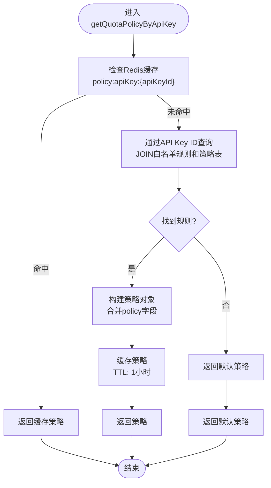
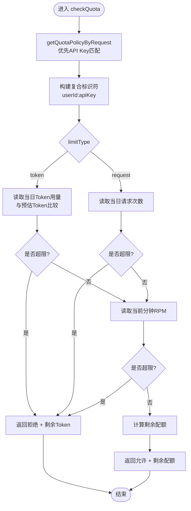
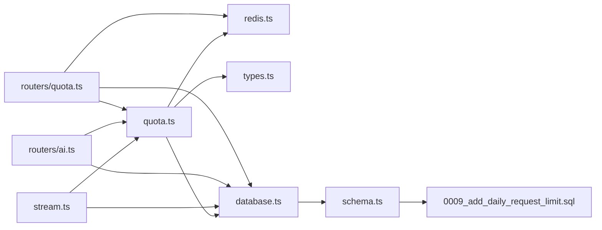
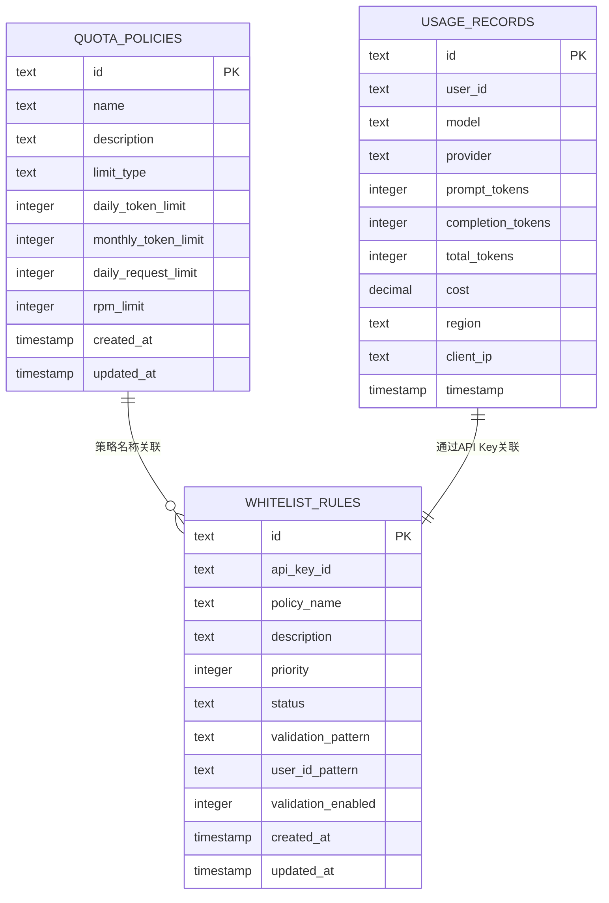
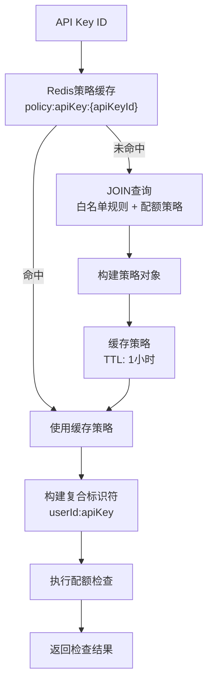

# 配额检查算法

<cite>
**本文引用的文件**
- [src/lib/quota.ts](file://src/lib/quota.ts)
- [src/lib/redis.ts](file://src/lib/redis.ts)
- [src/lib/types.ts](file://src/lib/types.ts)
- [src/lib/database.ts](file://src/lib/database.ts)
- [src/pages/api/ai/chat/stream.ts](file://src/pages/api/ai/chat/stream.ts)
- [src/server/api/routers/quota.ts](file://src/server/api/routers/quota.ts)
- [src/server/api/routers/ai.ts](file://src/server/api/routers/ai.ts)
- [src/app/(dashboard)/quotas/components/quota-card.tsx](file://src/app/(dashboard)/quotas/components/quota-card.tsx)
- [src/lib/schema.ts](file://src/lib/schema.ts)
- [drizzle/0009_add_daily_request_limit.sql](file://drizzle/0009_add_daily_request_limit.sql)
</cite>

## 更新摘要
**变更内容**
- 新增API Key中心的配额检查流程，包括 `getQuotaPolicyByApiKey` 函数
- 实现复合标识符机制：`userId:apiKey` 组合确保不同API Key的配额独立计算
- 更新Redis键命名策略，增加API Key参数支持
- 在多个接口中集成API Key中心的检查流程
- 改进白名单规则与配额策略的关联查询

## 目录
1. [简介](#简介)
2. [项目结构](#项目结构)
3. [核心组件](#核心组件)
4. [架构总览](#架构总览)
5. [详细组件分析](#详细组件分析)
6. [依赖关系分析](#依赖关系分析)
7. [性能考量](#性能考量)
8. [故障排查指南](#故障排查指南)
9. [结论](#结论)
10. [附录](#附录)

## 简介
本技术文档聚焦于配额检查算法模块，系统化阐述其核心算法实现、数据结构、控制流程与性能优化策略，并结合AI聊天流式响应场景说明实时决策过程。重点覆盖：
- API Key中心的配额检查流程与策略获取
- 复合标识符机制：`userId:apiKey` 组合确保配额隔离
- Token限制检查与请求频率检查的统一流程
- 多维度配额验证（日级Token/请求次数、RPM）
- checkQuota函数工作流：策略获取、Redis键值构建、实时用量查询与限制判断
- 不同配额模式（token/request）下的检查策略差异
- Redis缓存、过期策略与异步记录
- 错误处理与异常恢复
- 调试方法与监控指标
- 在AI聊天流式响应中的集成与实时决策

## 项目结构
配额检查相关代码主要分布在以下位置：
- 核心算法与Redis交互：src/lib/quota.ts
- Redis连接与键命名：src/lib/redis.ts
- 类型定义与数据库模型：src/lib/types.ts、src/lib/schema.ts
- 白名单与配额策略数据库访问：src/lib/database.ts
- AI聊天流式接口集成：src/pages/api/ai/chat/stream.ts
- tRPC配额管理路由：src/server/api/routers/quota.ts
- tRPC AI接口集成：src/server/api/routers/ai.ts
- 前端配额卡片展示：src/app/(dashboard)/quotas/components/quota-card.tsx
- 数据库迁移脚本（新增每日请求次数限制）：drizzle/0009_add_daily_request_limit.sql

**图表来源**
- [src/lib/quota.ts](file://src/lib/quota.ts#L1-L319)
- [src/lib/redis.ts](file://src/lib/redis.ts#L1-L54)
- [src/lib/types.ts](file://src/lib/types.ts#L1-L118)
- [src/lib/database.ts](file://src/lib/database.ts#L1-L587)
- [src/pages/api/ai/chat/stream.ts](file://src/pages/api/ai/chat/stream.ts#L1-L184)
- [src/server/api/routers/quota.ts](file://src/server/api/routers/quota.ts#L1-L301)
- [src/server/api/routers/ai.ts](file://src/server/api/routers/ai.ts#L1-L296)
- [src/app/(dashboard)/quotas/components/quota-card.tsx](file://src/app/(dashboard)/quotas/components/quota-card.tsx#L1-L109)
- [src/lib/schema.ts](file://src/lib/schema.ts#L1-L159)
- [drizzle/0009_add_daily_request_limit.sql](file://drizzle/0009_add_daily_request_limit.sql#L1-L8)

**章节来源**
- [src/lib/quota.ts](file://src/lib/quota.ts#L1-L319)
- [src/lib/redis.ts](file://src/lib/redis.ts#L1-L54)
- [src/lib/types.ts](file://src/lib/types.ts#L1-L118)
- [src/lib/database.ts](file://src/lib/database.ts#L1-L587)
- [src/pages/api/ai/chat/stream.ts](file://src/pages/api/ai/chat/stream.ts#L1-L184)
- [src/server/api/routers/quota.ts](file://src/server/api/routers/quota.ts#L1-L301)
- [src/server/api/routers/ai.ts](file://src/server/api/routers/ai.ts#L1-L296)
- [src/app/(dashboard)/quotas/components/quota-card.tsx](file://src/app/(dashboard)/quotas/components/quota-card.tsx#L1-L109)
- [src/lib/schema.ts](file://src/lib/schema.ts#L1-L159)
- [drizzle/0009_add_daily_request_limit.sql](file://drizzle/0009_add_daily_request_limit.sql#L1-L8)

## 核心组件
- 配额策略与检查结果类型：QuotaPolicy、UsageRecord、QuotaCheckResult
- 核心算法函数：
  - getQuotaPolicyByApiKey：按API Key ID直接获取配额策略（新的主要方式）
  - getQuotaPolicyByRequest：按请求特征匹配策略（优先API Key，然后邮箱）
  - checkQuota：综合Token/请求次数/RPM检查，使用复合标识符
  - recordUsage：用量记录与Redis计数器更新，支持API Key参数
  - getDailyUsage：当日用量查询，使用复合标识符
  - resetQuota：配额重置，支持API Key参数
- Redis键命名与时间粒度：按日、按分钟，支持API Key参数
- tRPC配额路由：策略查询、设置、更新、删除、用量查询、配额检查
- 流式聊天接口集成：在发起流式请求前进行配额检查，在流结束时记录用量
- 白名单规则数据库操作：getByApiKeyIdWithPolicy支持JOIN查询

**章节来源**
- [src/lib/types.ts](file://src/lib/types.ts#L1-L118)
- [src/lib/quota.ts](file://src/lib/quota.ts#L1-L319)
- [src/server/api/routers/quota.ts](file://src/server/api/routers/quota.ts#L1-L301)
- [src/pages/api/ai/chat/stream.ts](file://src/pages/api/ai/chat/stream.ts#L1-L184)
- [src/server/api/routers/ai.ts](file://src/server/api/routers/ai.ts#L1-L296)

## 架构总览
配额检查采用"API Key中心 + 策略缓存 + Redis计数 + 数据库持久化"的四层设计：
- API Key层：通过API Key ID直接获取配额策略，确保不同API Key的配额完全隔离
- 策略层：Redis缓存策略，按API Key ID缓存；白名单规则匹配策略名称，再从策略表加载完整策略
- 计数层：Redis按日/按分钟维护用量计数，设置合理过期时间，支持API Key参数
- 持久化层：用量记录写入数据库，支持统计与审计

**图表来源**
- [src/pages/api/ai/chat/stream.ts](file://src/pages/api/ai/chat/stream.ts#L1-L184)
- [src/lib/quota.ts](file://src/lib/quota.ts#L70-L189)
- [src/lib/redis.ts](file://src/lib/redis.ts#L18-L54)
- [src/lib/database.ts](file://src/lib/database.ts#L331-L351)

## 详细组件分析

### API Key中心的配额检查流程
- **getQuotaPolicyByApiKey**：这是新的主要策略获取方式，直接通过API Key ID获取配额策略
- **getQuotaPolicyByRequest**：扩展的策略获取函数，优先使用API Key匹配，然后回退到其他方式
- **复合标识符机制**：使用 `userId:apiKey` 组合确保不同API Key的配额完全隔离
- **白名单规则集成**：通过JOIN查询同时获取白名单规则和配额策略

**图表来源**
- [src/lib/quota.ts](file://src/lib/quota.ts#L14-L48)
- [src/lib/database.ts](file://src/lib/database.ts#L331-L351)

**章节来源**
- [src/lib/quota.ts](file://src/lib/quota.ts#L14-L67)
- [src/lib/database.ts](file://src/lib/database.ts#L331-L351)

### checkQuota函数工作流
- **输入**：请求信息（userId/apiKey/ip/domain）与预估Token数
- **步骤**：
  1) 获取策略：优先通过API Key获取策略，未命中则使用默认策略
  2) 构建复合标识符：使用 `userId:apiKey` 组合，确保不同API Key的配额隔离
  3) 按limitType执行检查：
     - token模式：读取当日Token用量，与预估Token比较，超过则拒绝
     - request模式：读取当日请求次数，达到上限则拒绝
  4) 检查RPM：读取当前分钟请求计数，超过rpmLimit则拒绝
  5) 计算剩余配额并返回结果
- **异常**：捕获错误并返回失败状态

**图表来源**
- [src/lib/quota.ts](file://src/lib/quota.ts#L70-L189)

**章节来源**
- [src/lib/quota.ts](file://src/lib/quota.ts#L70-L189)

### Redis键值构建与过期策略
- **键命名**：
  - user_quota:{userId}:{apiKey}:{YYYY-MM-DD}：当日Token用量
  - user_requests:{userId}:{apiKey}:{YYYY-MM-DD}：当日请求次数
  - user_rpm:{userId}:{YYYY-MM-DD}:HH:MM：每分钟请求次数
  - policy:apiKey:{apiKeyId}：API Key策略缓存
  - request_log:{userId}:{requestId}：请求日志
- **过期策略**：
  - 日级计数：7天
  - 分钟级计数：2分钟
  - API Key策略缓存：1小时
  - 请求日志：24小时

**章节来源**
- [src/lib/redis.ts](file://src/lib/redis.ts#L18-L54)
- [src/lib/quota.ts](file://src/lib/quota.ts#L191-L250)

### 不同配额模式下的检查策略
- **token模式**：
  - 依据预估Token与当日Token用量比较，决定是否允许
  - 记录时累加实际Token
  - 使用复合标识符确保API Key隔离
- **request模式**：
  - 依据当日请求次数与上限比较，决定是否允许
  - 记录时对当日请求计数+1
  - 使用复合标识符确保API Key隔离
- **RPM**：
  - 无论何种模式均需检查，防止突发流量
  - 使用API Key作为RPM计数的基础标识符

**章节来源**
- [src/lib/quota.ts](file://src/lib/quota.ts#L99-L156)
- [drizzle/0009_add_daily_request_limit.sql](file://drizzle/0009_add_daily_request_limit.sql#L1-L8)

### 用量记录与异步处理
- **recordUsage**：
  - 根据limitType更新对应计数器，使用API Key参数
  - 更新RPM计数，使用API Key作为标识符
  - 写入请求日志（24小时）
  - 异步写入数据库用量记录
- **getDailyUsage**：快速查询当日Token与请求次数，使用复合标识符
- **resetQuota**：删除当日用量键，支持API Key参数

**章节来源**
- [src/lib/quota.ts](file://src/lib/quota.ts#L191-L250)
- [src/lib/quota.ts](file://src/lib/quota.ts#L252-L286)
- [src/lib/quota.ts](file://src/lib/quota.ts#L288-L299)

### tRPC配额管理路由
- **getQuotaInfo**：查询用户配额信息，支持API Key中心的策略获取
- **getQuotaInfo**：使用API Key ID直接获取策略，支持复合标识符查询
- **策略查询、设置、更新、删除**：支持API Key中心的配额管理
- **用量查询**：支持API Key参数的用量统计

**章节来源**
- [src/server/api/routers/quota.ts](file://src/server/api/routers/quota.ts#L37-L63)
- [src/server/api/routers/ai.ts](file://src/server/api/routers/ai.ts#L240-L294)

### AI聊天流式响应中的集成
- **流式接口集成**：在发起流式请求前调用checkQuota，传入userId与预估Token
- **复合标识符使用**：使用 `finalUserId:apiKeyId` 组合作为标识符
- **用户校验**：通过白名单规则验证userId格式，支持占位符替换
- **策略获取**：优先通过API Key ID获取配额策略
- **用量记录**：流结束后统计实际Token并调用recordUsage异步记录

**章节来源**
- [src/pages/api/ai/chat/stream.ts](file://src/pages/api/ai/chat/stream.ts#L32-L86)
- [src/pages/api/ai/chat/stream.ts](file://src/pages/api/ai/chat/stream.ts#L147-L168)

### 白名单规则与API Key的集成
- **getByApiKeyIdWithPolicy**：通过JOIN查询同时获取白名单规则和配额策略
- **validateUserByApiKey**：根据API Key ID验证用户，支持正则表达式和占位符
- **规则校验流程**：首先获取白名单规则，然后进行用户格式校验
- **用户ID生成**：支持从userIdPattern中生成最终的用户标识符

**章节来源**
- [src/lib/database.ts](file://src/lib/database.ts#L331-L351)
- [src/lib/database.ts](file://src/lib/database.ts#L454-L552)

## 依赖关系分析
- **quota.ts依赖**：
  - redis.ts：Redis连接与键生成，支持API Key参数
  - types.ts：类型定义
  - database.ts：白名单规则与策略表访问，支持JOIN查询
- **stream.ts依赖**：
  - quota.ts：配额检查，使用API Key中心流程
  - database.ts：白名单校验，支持API Key ID查询
- **routers/ai.ts依赖**：
  - quota.ts：配额检查，使用API Key中心流程
  - database.ts：白名单校验和API Key管理
- **routers/quota.ts依赖**：
  - quota.ts：配额检查与用量查询，支持API Key参数
  - redis.ts：策略缓存清理，支持API Key键
  - quotaPolicyDb：策略CRUD

**图表来源**
- [src/lib/quota.ts](file://src/lib/quota.ts#L1-L319)
- [src/lib/redis.ts](file://src/lib/redis.ts#L1-L54)
- [src/lib/types.ts](file://src/lib/types.ts#L1-L118)
- [src/lib/database.ts](file://src/lib/database.ts#L1-L587)
- [src/pages/api/ai/chat/stream.ts](file://src/pages/api/ai/chat/stream.ts#L1-L184)
- [src/server/api/routers/quota.ts](file://src/server/api/routers/quota.ts#L1-L301)
- [src/server/api/routers/ai.ts](file://src/server/api/routers/ai.ts#L1-L296)
- [src/lib/schema.ts](file://src/lib/schema.ts#L1-L159)
- [drizzle/0009_add_daily_request_limit.sql](file://drizzle/0009_add_daily_request_limit.sql#L1-L8)

## 性能考量
- **API Key中心缓存**：
  - 策略缓存：1小时，降低数据库压力
  - 复合标识符：确保不同API Key的配额独立缓存
- **Redis热点键**：
  - API Key策略缓存：1小时，避免重复查询
  - 日/分钟计数：短生命周期，避免长期膨胀
- **批量与异步**：
  - recordUsage异步写入数据库，减少主链路延迟
  - JOIN查询减少数据库往返次数
- **时间粒度**：
  - 按日与按分钟双计数，兼顾宏观与微观限流
- **过期策略**：
  - 合理设置TTL，避免内存泄漏

**章节来源**
- [src/lib/quota.ts](file://src/lib/quota.ts#L14-L48)
- [src/lib/redis.ts](file://src/lib/redis.ts#L18-L54)

## 故障排查指南
- **常见错误与恢复**：
  - Redis连接失败：检查REDIS_URL环境变量与网络连通性
  - API Key策略获取失败：回退到默认策略，记录错误日志
  - 白名单规则缺失：检查API Key是否正确绑定白名单规则
  - 复合标识符问题：确认userId:apiKey组合的正确性
- **调试建议**：
  - 开启日志：观察checkQuota与recordUsage的日志输出
  - Redis键检查：确认user_quota/user_requests/user_rpm键是否存在与TTL
  - API Key缓存：检查policy:apiKey:{apiKeyId}键的缓存状态
  - tRPC路由：使用getQuotaInfo与getUserUsage验证策略与用量
- **监控指标建议**：
  - Redis命中率、慢查询
  - API Key策略缓存命中率
  - 配额检查成功率与拒绝原因分布
  - recordUsage异步写入延迟与失败率

**章节来源**
- [src/lib/quota.ts](file://src/lib/quota.ts#L182-L189)
- [src/server/api/routers/quota.ts](file://src/server/api/routers/quota.ts#L37-L63)

## 结论
该配额检查算法模块通过"API Key中心 + 策略缓存 + Redis计数 + 数据库持久化"实现了高并发下的低延迟配额控制，支持Token与请求次数两种模式，并统一了RPM限制。新的API Key中心检查流程确保了不同API Key的配额完全隔离，复合标识符机制进一步增强了配额管理的精确性。在AI聊天流式响应中，它提供了前置的实时决策能力，配合异步用量记录保证了用户体验与系统的稳定性。建议持续关注Redis键空间与过期策略，完善监控与告警，以应对业务增长带来的流量峰值。

## 附录

### 数据模型概览

**图表来源**
- [src/lib/schema.ts](file://src/lib/schema.ts#L28-L95)

### 配额模式与字段映射
- **token模式**：dailyTokenLimit、rpmLimit
- **request模式**：dailyRequestLimit、rpmLimit
- **迁移脚本新增**：dailyRequestLimit字段与limit_type约束

**章节来源**
- [drizzle/0009_add_daily_request_limit.sql](file://drizzle/0009_add_daily_request_limit.sql#L1-L8)
- [src/lib/schema.ts](file://src/lib/schema.ts#L28-L40)

### API Key中心检查流程图

**图表来源**
- [src/lib/quota.ts](file://src/lib/quota.ts#L14-L67)
- [src/lib/database.ts](file://src/lib/database.ts#L331-L351)