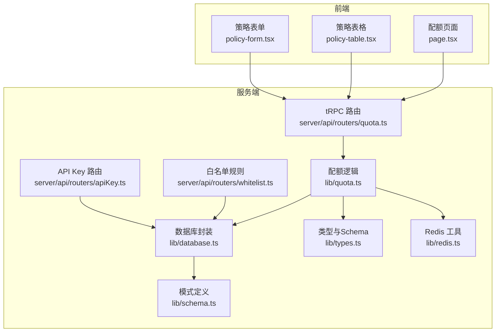
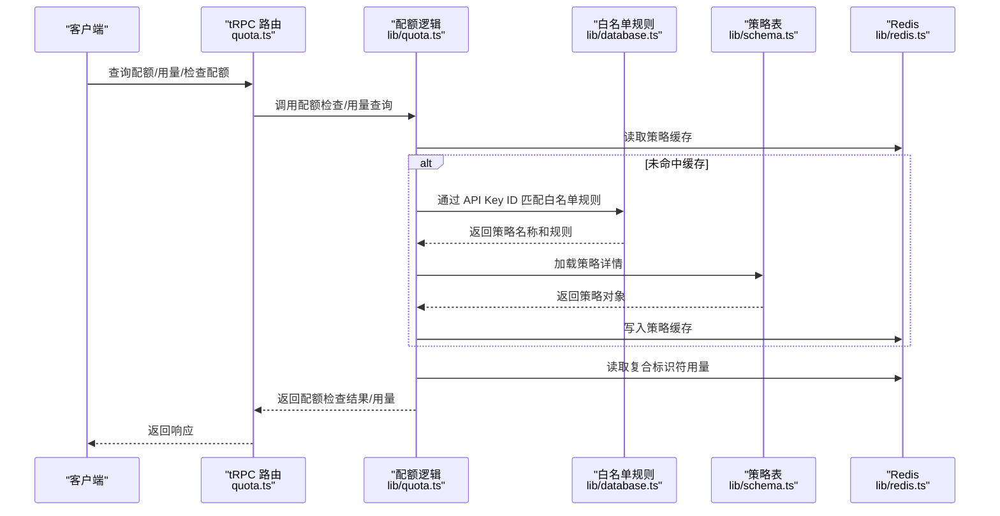
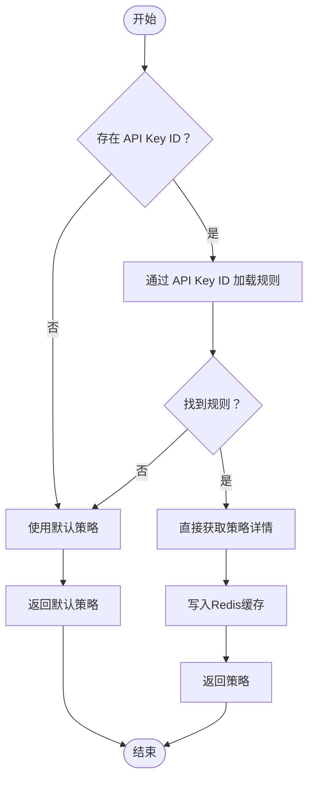
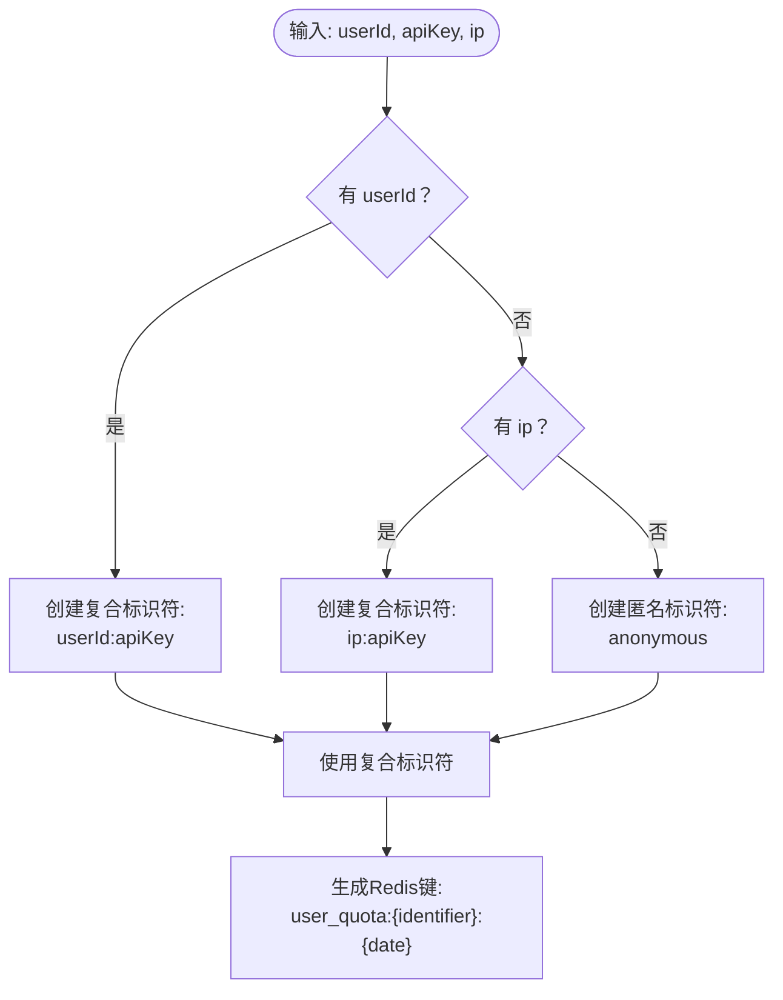
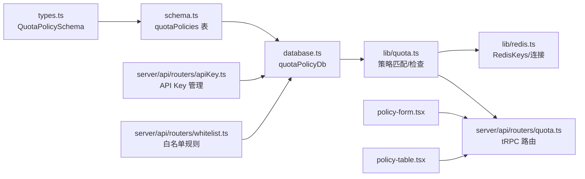

# 配额策略设计

<cite>
**本文引用的文件**
- [quota.ts](file://src/lib/quota.ts)
- [types.ts](file://src/lib/types.ts)
- [schema.ts](file://src/lib/schema.ts)
- [database.ts](file://src/lib/database.ts)
- [redis.ts](file://src/lib/redis.ts)
- [quota.ts](file://src/server/api/routers/quota.ts)
- [apiKey.ts](file://src/server/api/routers/apiKey.ts)
- [api-key.ts](file://src/types/api-key.ts)
- [whitelist.ts](file://src/server/api/routers/whitelist.ts)
- [stream.ts](file://src/pages/api/ai/chat/stream.ts)
- [policy-form.tsx](file://src/app/(dashboard)/quotas/components/policy-form.tsx)
- [policy-table.tsx](file://src/app/(dashboard)/quotas/components/policy-table.tsx)
- [page.tsx](file://src/app/(dashboard)/quotas/page.tsx)
- [0009_add_daily_request_limit.sql](file://drizzle/0009_add_daily_request_limit.sql)
- [0000_complete_zeigeist.sql](file://drizzle/0000_complete_zeigeist.sql)
</cite>

## 更新摘要
**所做更改**
- 新增 API Key ID 主要策略获取方式的详细说明
- 新增复合标识符系统的设计与实现
- 更新策略匹配算法以反映新的主要匹配方式
- 新增白名单规则与 API Key 绑定机制
- 更新 Redis 键命名规范以支持复合标识符
- 新增 API Key 验证与用户 ID 生成机制

## 目录
1. [简介](#简介)
2. [项目结构](#项目结构)
3. [核心组件](#核心组件)
4. [架构总览](#架构总览)
5. [详细组件分析](#详细组件分析)
6. [依赖关系分析](#依赖关系分析)
7. [性能考量](#性能考量)
8. [故障排查指南](#故障排查指南)
9. [结论](#结论)
10. [附录](#附录)

## 简介
本文件面向"配额策略设计"模块，系统化阐述配额策略的核心概念、数据结构、匹配与缓存机制、默认策略配置、策略继承与白名单规则、以及在系统中的集成与最佳实践。重点覆盖以下主题：
- 策略类型：token 模式与 request 模式
- 限制参数配置：每日 Token 限制、每月 Token 限制、每日请求限制、每分钟请求限制（RPM）
- 默认配额策略与策略继承（通过白名单规则与策略表）
- 策略匹配算法：基于 API Key ID 的主要匹配方式、复合标识符系统、策略缓存与动态加载
- 数据结构设计：QuotaPolicy 接口定义、字段约束与验证规则
- API Key 管理与白名单规则绑定机制
- 性能优化与最佳实践
- 具体配置示例与常见场景解决方案

## 项目结构
配额策略相关代码主要分布在以下位置：
- 库层：策略查询、检查、用量记录、Redis 键命名与工具
- 类型与模式：Zod Schema 定义与 Drizzle 表结构
- 数据访问层：数据库操作封装（Drizzle ORM）
- API 层：tRPC 路由，提供策略 CRUD、用量查询、配额检查等能力
- 前端管理界面：策略表单与表格展示
- API Key 管理：API Key 创建、验证与缓存
- 白名单规则：用户 ID 校验与生成机制

**图表来源**
- [quota.ts](file://src/server/api/routers/quota.ts#L1-L301)
- [apiKey.ts](file://src/server/api/routers/apiKey.ts#L1-L393)
- [whitelist.ts](file://src/server/api/routers/whitelist.ts#L1-L168)
- [quota.ts](file://src/lib/quota.ts#L1-L319)
- [database.ts](file://src/lib/database.ts#L1-L587)
- [redis.ts](file://src/lib/redis.ts#L1-L54)

**章节来源**
- [quota.ts](file://src/lib/quota.ts#L1-L319)
- [types.ts](file://src/lib/types.ts#L1-L118)
- [schema.ts](file://src/lib/schema.ts#L1-L159)
- [database.ts](file://src/lib/database.ts#L1-L587)
- [redis.ts](file://src/lib/redis.ts#L1-L54)
- [quota.ts](file://src/server/api/routers/quota.ts#L1-L301)
- [apiKey.ts](file://src/server/api/routers/apiKey.ts#L1-L393)
- [whitelist.ts](file://src/server/api/routers/whitelist.ts#L1-L168)
- [policy-form.tsx](file://src/app/(dashboard)/quotas/components/policy-form.tsx#L1-L219)
- [policy-table.tsx](file://src/app/(dashboard)/quotas/components/policy-table.tsx#L1-L181)
- [page.tsx](file://src/app/(dashboard)/quotas/page.tsx#L110-L140)

## 核心组件
- 配额策略模型与验证：QuotaPolicy 的 Zod Schema 定义，包含策略类型、Token/请求限制、RPM 等字段。
- API Key 策略匹配：基于 API Key ID 的主要匹配方式，通过白名单规则直接关联配额策略。
- 复合标识符系统：使用 `userId:apiKey` 组合作为标识符，确保不同 API Key 的配额独立计算。
- 配额检查：支持 token 模式与 request 模式，分别检查每日 Token/请求限制与每分钟请求限制（RPM）。
- 用量记录与统计：记录每日 Token/请求使用量，提供用量查询与重置功能。
- tRPC 路由：提供策略 CRUD、用量查询、配额检查、缓存清理等接口。
- 前端管理界面：策略表单与表格，支持策略编辑、删除与分页展示。
- API Key 管理：API Key 创建、验证、缓存与状态管理。
- 白名单规则：用户 ID 校验、生成与策略绑定机制。

**章节来源**
- [types.ts](file://src/lib/types.ts#L4-L15)
- [quota.ts](file://src/lib/quota.ts#L14-L67)
- [quota.ts](file://src/lib/quota.ts#L70-L189)
- [quota.ts](file://src/lib/quota.ts#L191-L250)
- [quota.ts](file://src/server/api/routers/quota.ts#L37-L146)
- [apiKey.ts](file://src/server/api/routers/apiKey.ts#L148-L200)
- [whitelist.ts](file://src/server/api/routers/whitelist.ts#L66-L147)
- [policy-form.tsx](file://src/app/(dashboard)/quotas/components/policy-form.tsx#L1-L219)
- [policy-table.tsx](file://src/app/(dashboard)/quotas/components/policy-table.tsx#L1-L181)

## 架构总览
配额策略的运行时交互流程如下：

**图表来源**
- [quota.ts](file://src/server/api/routers/quota.ts#L37-L63)
- [quota.ts](file://src/lib/quota.ts#L14-L67)
- [database.ts](file://src/lib/database.ts#L332-L351)
- [schema.ts](file://src/lib/schema.ts#L28-L40)
- [redis.ts](file://src/lib/redis.ts#L18-L37)

## 详细组件分析

### API Key ID 主要策略获取方式
- **主要匹配方式**：系统现在优先使用 API Key ID 作为策略获取的主要方式，绕过传统的用户邮箱匹配。
- **直接关联机制**：通过 `getByApiKeyIdWithPolicy` 方法直接获取白名单规则及其关联的配额策略，减少中间步骤。
- **缓存优化**：使用 `policy:apiKey:{apiKeyId}` 作为 Redis 缓存键，缓存时间为 1 小时。
- **降级处理**：当找不到对应的白名单规则时，系统自动回退到默认策略。

**图表来源**
- [quota.ts](file://src/lib/quota.ts#L14-L48)
- [database.ts](file://src/lib/database.ts#L332-L351)
- [redis.ts](file://src/lib/redis.ts#L37-L38)

**章节来源**
- [quota.ts](file://src/lib/quota.ts#L14-L48)
- [database.ts](file://src/lib/database.ts#L332-L351)
- [redis.ts](file://src/lib/redis.ts#L37-L38)

### 复合标识符系统
- **标识符设计**：使用 `userId:apiKey` 组合作为复合标识符，确保不同 API Key 的配额独立计算。
- **匿名用户处理**：当没有 userId 时，使用 `ip:apiKey` 或 `apiKey` 作为标识符。
- **用量隔离**：不同 API Key 即使使用相同 userId，也会有独立的用量统计。
- **Redis 键设计**：`user_quota:{userId}:{apiKey}:{date}` 和 `user_requests:{userId}:{date}:{apiKey}`。

**图表来源**
- [quota.ts](file://src/lib/quota.ts#L84-L87)
- [redis.ts](file://src/lib/redis.ts#L20-L26)

**章节来源**
- [quota.ts](file://src/lib/quota.ts#L84-L87)
- [redis.ts](file://src/lib/redis.ts#L20-L26)

### 策略类型与限制参数
- **策略类型**
  - token 模式：按每日 Token 用量进行限制，支持每日与每月 Token 上限。
  - request 模式：按每日请求次数进行限制，不按 Token 限制。
- **限制参数**
  - 每日 Token 上限（dailyTokenLimit）
  - 每月 Token 上限（monthlyTokenLimit）
  - 每日请求次数上限（dailyRequestLimit）
  - 每分钟请求次数上限（RPM，rpmLimit）

**章节来源**
- [types.ts](file://src/lib/types.ts#L4-L15)
- [schema.ts](file://src/lib/schema.ts#L28-L40)
- [quota.ts](file://src/lib/quota.ts#L70-L189)

### 默认配额策略
- **默认策略包含**：
  - 策略类型：token
  - 每日 Token 上限：5000
  - 每月 Token 上限：50000
  - RPM：10
- **回退机制**：当 API Key ID 匹配失败或异常时，系统回退到该默认策略。

**章节来源**
- [quota.ts](file://src/lib/quota.ts#L5-L12)

### 策略匹配算法与继承机制
- **匹配路径**
  - 优先使用 API Key ID 匹配白名单规则，直接获取关联的配额策略。
  - 如果 API Key ID 匹配失败，则使用默认策略。
- **继承与覆盖**
  - 白名单规则通过 `apiKeyId` 字段与 API Key 绑定，策略表提供具体数值与类型。
  - 策略名称与策略表关联，形成"规则 -> 策略"的继承链。
- **缓存策略**
  - Redis 缓存策略对象，键前缀为 `policy:apiKey:{apiKeyId}`，缓存时长为 1 小时。
  - tRPC 路由提供清理策略缓存的辅助方法，便于策略变更后及时生效。

**章节来源**
- [quota.ts](file://src/lib/quota.ts#L50-L67)
- [database.ts](file://src/lib/database.ts#L332-L351)
- [quota.ts](file://src/server/api/routers/quota.ts#L18-L35)

### 配额检查流程
- **支持两种模式**：
  - token 模式：检查每日 Token 用量与每日 Token 上限。
  - request 模式：检查每日请求次数与每日请求次数上限。
- **RPM 检查**：无论哪种模式，均检查每分钟请求次数上限。
- **复合标识符检查**：使用 `userId:apiKey` 组合作为标识符进行用量检查。
- **剩余配额计算**：根据当前用量计算剩余 Token 或剩余请求次数。

**章节来源**
- [quota.ts](file://src/lib/quota.ts#L70-L189)
- [redis.ts](file://src/lib/redis.ts#L18-L37)

### 用量记录与统计
- **记录用量**：在每次请求后，按复合标识符累加当日 Token/请求次数。
- **用量查询**：提供每日 Token 使用量与当日请求次数查询。
- **重置配额**：支持按复合标识符重置当日 Token 使用量。
- **Redis 键设计**：`user_quota:{identifier}:{date}` 和 `user_requests:{identifier}:{date}`。

**章节来源**
- [quota.ts](file://src/lib/quota.ts#L191-L250)
- [redis.ts](file://src/lib/redis.ts#L18-L37)

### tRPC 路由与管理界面
- **tRPC 路由**
  - 提供策略 CRUD、用量查询、配额检查、缓存清理等接口。
  - 在更新/删除策略后，清理相关 Redis 缓存键，保证一致性。
- **API Key 路由**
  - 提供 API Key 的创建、更新、删除和查询功能。
  - 自动更新 Redis 缓存，缓存时间为 1 小时。
- **白名单规则路由**
  - 提供白名单规则的创建、更新、删除和查询功能。
  - 验证 API Key 约束：每个 API Key 只能绑定一个白名单规则。
- **前端界面**
  - 策略表单：支持选择限制类型（token/request），输入相应上限，RPM 默认 60。
  - 策略表格：展示策略名称、描述、限制类型、每日/每月限额、RPM、创建时间等。

**章节来源**
- [quota.ts](file://src/server/api/routers/quota.ts#L37-L146)
- [apiKey.ts](file://src/server/api/routers/apiKey.ts#L148-L200)
- [whitelist.ts](file://src/server/api/routers/whitelist.ts#L66-L147)
- [policy-form.tsx](file://src/app/(dashboard)/quotas/components/policy-form.tsx#L1-L219)
- [policy-table.tsx](file://src/app/(dashboard)/quotas/components/policy-table.tsx#L1-L181)
- [page.tsx](file://src/app/(dashboard)/quotas/page.tsx#L110-L140)

### API Key 管理与白名单规则
- **API Key 管理**
  - 自动生成唯一 ID：`key_{timestamp}_{random}`
  - 支持创建、更新、删除和查询操作
  - 自动隐藏敏感信息，仅显示部分字符
  - 缓存 API Key 到 Redis，支持按提供商分类存储
- **白名单规则**
  - 支持用户 ID 格式校验和生成
  - 支持占位符替换：`@user_id`、`@ip`、`@any`
  - 验证 API Key 约束：每个 API Key 只能绑定一个白名单规则
  - 支持启用/禁用状态管理

**章节来源**
- [apiKey.ts](file://src/server/api/routers/apiKey.ts#L148-L200)
- [api-key.ts](file://src/types/api-key.ts#L1-L20)
- [whitelist.ts](file://src/server/api/routers/whitelist.ts#L66-L147)
- [database.ts](file://src/lib/database.ts#L455-L552)

### 数据结构设计与验证规则
- **QuotaPolicy Schema**
  - 字段：id、name、description、limitType、dailyTokenLimit、monthlyTokenLimit、dailyRequestLimit、rpmLimit、createdAt、updatedAt
  - 验证规则：
    - limitType 为枚举 token/request，默认 token
    - dailyTokenLimit、monthlyTokenLimit、dailyRequestLimit 为可选数字
    - rpmLimit 默认 60
- **API Key Schema**
  - 字段：id、name、provider、key、baseUrl、createdAt、lastUsed、originKey、status
  - 验证规则：provider 为指定枚举值，status 为 active/disabled
- **白名单规则 Schema**
  - 字段：id、policyName、description、priority、status、validationPattern、userIdPattern、validationEnabled、apiKeyId
  - 验证规则：priority 为数字，validationEnabled 为布尔值
- **Drizzle 表结构**
  - quota_policies 表包含上述字段，limit_type 与 daily_request_limit 字段在迁移脚本中新增。
  - whitelist_rules 表新增 apiKeyId 字段，支持 API Key 绑定。
  - 限制类型检查约束确保只允许 token 或 request。
- **类型与关系**
  - 通过 Drizzle relations 将 whitelist_rules 与 quota_policies 通过策略名称关联。
  - whitelist_rules 与 api_keys 通过 apiKeyId 字段关联。

**章节来源**
- [types.ts](file://src/lib/types.ts#L4-L15)
- [schema.ts](file://src/lib/schema.ts#L28-L40)
- [0009_add_daily_request_limit.sql](file://drizzle/0009_add_daily_request_limit.sql#L1-L8)
- [0000_complete_zeigeist.sql](file://drizzle/0000_complete_zeigeist.sql#L67-L130)

## 依赖关系分析

**图表来源**
- [types.ts](file://src/lib/types.ts#L4-L15)
- [schema.ts](file://src/lib/schema.ts#L28-L40)
- [database.ts](file://src/lib/database.ts#L82-L140)
- [quota.ts](file://src/lib/quota.ts#L1-L319)
- [redis.ts](file://src/lib/redis.ts#L1-L54)
- [quota.ts](file://src/server/api/routers/quota.ts#L1-L301)
- [apiKey.ts](file://src/server/api/routers/apiKey.ts#L1-L393)
- [whitelist.ts](file://src/server/api/routers/whitelist.ts#L1-L168)
- [policy-form.tsx](file://src/app/(dashboard)/quotas/components/policy-form.tsx#L1-L219)
- [policy-table.tsx](file://src/app/(dashboard)/quotas/components/policy-table.tsx#L1-L181)

**章节来源**
- [types.ts](file://src/lib/types.ts#L4-L15)
- [schema.ts](file://src/lib/schema.ts#L28-L40)
- [database.ts](file://src/lib/database.ts#L82-L140)
- [quota.ts](file://src/lib/quota.ts#L1-L319)
- [redis.ts](file://src/lib/redis.ts#L1-L54)
- [quota.ts](file://src/server/api/routers/quota.ts#L1-L301)
- [apiKey.ts](file://src/server/api/routers/apiKey.ts#L1-L393)
- [whitelist.ts](file://src/server/api/routers/whitelist.ts#L1-L168)
- [policy-form.tsx](file://src/app/(dashboard)/quotas/components/policy-form.tsx#L1-L219)
- [policy-table.tsx](file://src/app/(dashboard)/quotas/components/policy-table.tsx#L1-L181)

## 性能考量
- **Redis 缓存**
  - 策略缓存：`policy:apiKey:{apiKeyId}`，缓存 1 小时，显著降低数据库查询开销。
  - 用量缓存：`user_quota:{identifier}:{date}`、`user_requests:{identifier}:{date}`、`user_rpm:{identifier}:{minute}`，按天/分钟粒度计数。
  - API Key 缓存：`api_keys:{provider}`，缓存 1 小时，支持快速 API Key 查询。
- **复合标识符优化**
  - 使用 `userId:apiKey` 组合作为标识符，避免跨 API Key 的用量混淆。
  - Redis 键设计支持精确的用量隔离和快速查询。
- **扫描清理缓存**
  - tRPC 路由提供扫描清理策略相关缓存键的方法，避免策略变更后的陈旧缓存。
- **并发与原子性**
  - Redis incr/incrBy 等命令用于用量累加，具备原子性，适合高并发场景。
- **查询优化**
  - 策略加载采用一次性拉取全部策略并内存匹配，适合策略数量适中的场景；若策略规模扩大，可考虑索引与分页。

**章节来源**
- [quota.ts](file://src/lib/quota.ts#L14-L48)
- [quota.ts](file://src/server/api/routers/quota.ts#L18-L35)
- [redis.ts](file://src/lib/redis.ts#L18-L37)
- [redis.ts](file://src/lib/redis.ts#L37-L42)

## 故障排查指南
- **API Key 策略匹配失败**
  - 检查 API Key 是否正确创建并绑定到白名单规则。
  - 查看 Redis 中是否存在 `policy:apiKey:{apiKeyId}` 缓存，必要时调用清理缓存接口。
  - 确认白名单规则的状态为 active。
- **复合标识符用量异常**
  - 检查标识符生成逻辑：`userId:apiKey` 或 `ip:apiKey`。
  - 确认 Redis 中的用量键格式是否正确。
  - 验证不同 API Key 的用量是否被正确隔离。
- **白名单规则校验失败**
  - 检查 `validationPattern` 正则表达式是否有效。
  - 确认 `userIdPattern` 中的占位符替换逻辑。
  - 验证 API Key 约束：每个 API Key 只能绑定一个白名单规则。
- **tRPC 错误**
  - 更新/删除策略后未生效：调用清理缓存接口，或等待缓存过期。
  - 输入参数校验失败：检查前端表单字段与 tRPC 输入验证规则。

**章节来源**
- [quota.ts](file://src/server/api/routers/quota.ts#L18-L35)
- [quota.ts](file://src/lib/quota.ts#L70-L189)
- [quota.ts](file://src/lib/quota.ts#L191-L250)
- [database.ts](file://src/lib/database.ts#L455-L552)
- [whitelist.ts](file://src/server/api/routers/whitelist.ts#L72-L81)

## 结论
本配额策略设计通过"API Key ID -> 白名单规则 -> 策略表"的三层继承链实现灵活的策略管理，结合 Redis 缓存与复合标识符系统，提供了高效、可扩展的配额控制能力。新的主要匹配方式大大简化了策略获取流程，复合标识符确保了不同 API Key 间的用量隔离。token 与 request 两种模式满足不同业务需求，RPM 限制保障系统稳定性。建议在策略规模扩大时引入更细粒度的索引与缓存刷新策略，并持续监控 Redis 用量与命中率。

## 附录

### 默认配额策略配置项
- 策略类型：token
- 每日 Token 上限：5000
- 每月 Token 上限：50000
- RPM：10

**章节来源**
- [quota.ts](file://src/lib/quota.ts#L5-L12)

### 策略配置示例与常见场景
- **场景一：开发者个人额度**
  - 选择 token 模式，设置每日 Token 上限为 10000，RPM 为 30。
- **场景二：企业批量调用**
  - 选择 request 模式，设置每日请求次数上限为 5000，RPM 为 60。
- **场景三：临时促销活动**
  - 通过白名单规则为特定 API Key 绑定更高额度策略，策略名称与策略表对应。
- **场景四：多租户应用**
  - 为每个租户分配独立的 API Key，使用复合标识符确保用量隔离。

**章节来源**
- [policy-form.tsx](file://src/app/(dashboard)/quotas/components/policy-form.tsx#L108-L205)
- [database.ts](file://src/lib/database.ts#L332-L351)
- [whitelist.ts](file://src/server/api/routers/whitelist.ts#L72-L81)

### 数据库迁移与字段演进
- **新增字段**
  - `daily_request_limit` 与 `limit_type` 字段，支持 request 模式的配额策略。
  - `apiKeyId` 字段，支持 API Key 与白名单规则的绑定。
- **约束增强**
  - 限制类型检查约束确保只允许 token 或 request。
  - API Key 约束确保每个 API Key 只能绑定一个白名单规则。
- **初始版本**
  - 仅包含 daily_token_limit、monthly_token_limit、rpm_limit 等字段。

**章节来源**
- [0009_add_daily_request_limit.sql](file://drizzle/0009_add_daily_request_limit.sql#L1-L8)
- [0000_complete_zeigeist.sql](file://drizzle/0000_complete_zeigeist.sql#L67-L130)
- [database.ts](file://src/lib/database.ts#L332-L351)
- [whitelist.ts](file://src/server/api/routers/whitelist.ts#L72-L81)

### API Key 管理最佳实践
- **安全考虑**
  - 使用随机生成的唯一 ID，避免可预测的标识符。
  - 自动隐藏敏感信息，仅在必要时显示部分字符。
  - 定期轮换 API Key，建立生命周期管理。
- **性能优化**
  - 合理设置 Redis 缓存时间，平衡性能与实时性。
  - 使用提供商分类缓存，支持快速查询。
  - 定期清理过期的 API Key 缓存。
- **监控与审计**
  - 记录 API Key 的创建、更新、删除操作。
  - 监控 API Key 的使用频率和成功率。
  - 建立异常使用检测机制。

**章节来源**
- [apiKey.ts](file://src/server/api/routers/apiKey.ts#L148-L200)
- [redis.ts](file://src/lib/redis.ts#L34-L35)
- [api-key.ts](file://src/types/api-key.ts#L1-L20)