# 配额管理系统

<cite>
**本文引用的文件**
- [src/lib/quota.ts](file://src/lib/quota.ts)
- [src/lib/redis.ts](file://src/lib/redis.ts)
- [src/lib/date.ts](file://src/lib/date.ts)
- [src/lib/logger.ts](file://src/lib/logger.ts)
- [src/server/api/routers/quota.ts](file://src/server/api/routers/quota.ts)
- [src/server/api/routers/ai.ts](file://src/server/api/routers/ai.ts)
- [src/lib/types.ts](file://src/lib/types.ts)
- [src/lib/database.ts](file://src/lib/database.ts)
- [src/lib/schema.ts](file://src/lib/schema.ts)
- [src/pages/api/ai/chat/stream.ts](file://src/pages/api/ai/chat/stream.ts)
- [src/server/api/routers/apiKey.ts](file://src/server/api/routers/apiKey.ts)
- [package.json](file://package.json)
</cite>

## 更新摘要
**变更内容**
- 修复配额清除机制中的Redis键构造参数顺序问题
- 确保API Key特定的配额策略缓存能够正确清理
- 防止陈旧数据在Redis缓存中持久存在
- 保持现有配额系统架构和功能不变

## 目录
1. [简介](#简介)
2. [项目结构](#项目结构)
3. [核心组件](#核心组件)
4. [架构总览](#架构总览)
5. [详细组件分析](#详细组件分析)
6. [复合标识符系统](#复合标识符系统)
7. [API Key ID 主要策略获取方式](#api-key-id-主要策略获取方式)
8. [getDailyUsage 接口详解](#getdailyusage-接口详解)
9. [依赖关系分析](#依赖关系分析)
10. [性能考量](#性能考量)
11. [故障排除指南](#故障排除指南)
12. [结论](#结论)
13. [附录](#附录)

## 简介
本技术文档围绕 AIGate 的配额管理系统展开，系统通过 Redis 实现高并发的实时配额检查与用量统计，并以 PostgreSQL + Drizzle ORM 作为持久化层，支撑策略配置、白名单匹配、用量记录与历史数据分析。**最新版本**通过修复配额清除机制中的Redis键构造参数顺序问题，确保API Key特定的配额策略缓存能够正确清理，防止陈旧数据在Redis缓存中持久存在，同时保持了原有的配额系统架构和功能完整性。文档重点覆盖以下方面：
- 配额策略设计：Token 限制、请求频率控制（RPM）、用量统计
- **Redis键构造参数顺序修复**：确保API Key特定缓存键的正确清理
- **API Key ID主要策略获取方式**：通过API Key ID直接获取配额策略
- **复合标识符系统**：userId + apiKey组合标识符，精细化API Key跟踪
- 配额检查算法：实时计算、缓存策略、一致性保障
- 用量记录系统：数据采集、聚合计算、历史分析
- **增强的白名单规则验证**：支持基于API Key的用户校验
- Redis缓存：键空间设计、过期策略、更新与同步
- 策略配置：策略定义、生效规则、动态调整
- 告警与异常处理：错误路径、降级策略、可观测性
- 扩展性与高可用：水平扩展、缓存失效、多租户隔离

## 项目结构
配额管理相关代码主要分布在以下模块：
- 库层（lib）：配额逻辑、Redis客户端与键空间、数据库抽象层、类型定义、日期处理工具、日志记录
- 服务端路由（server/api/routers）：tRPC路由暴露策略CRUD、配额查询与重置
- 页面与API：聊天流式接口在请求链路中执行配额检查与用量记录
- 数据库迁移与模式：Drizzle模式定义与快照

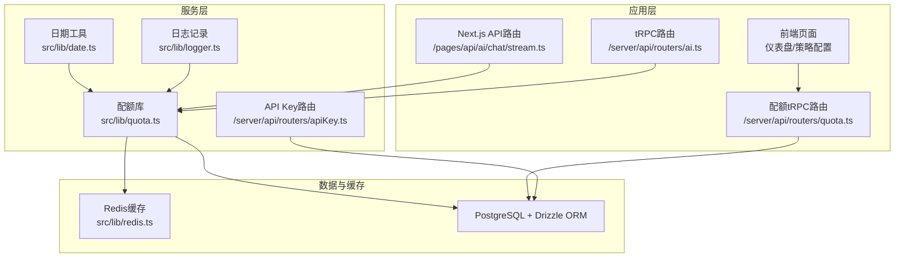

**图表来源**
- [src/pages/api/ai/chat/stream.ts](file://src/pages/api/ai/chat/stream.ts#L1-L184)
- [src/server/api/routers/ai.ts](file://src/server/api/routers/ai.ts#L1-L298)
- [src/server/api/routers/quota.ts](file://src/server/api/routers/quota.ts#L1-L322)
- [src/lib/quota.ts](file://src/lib/quota.ts#L1-L327)
- [src/lib/redis.ts](file://src/lib/redis.ts#L1-L43)
- [src/lib/date.ts](file://src/lib/date.ts#L1-L13)
- [src/lib/logger.ts](file://src/lib/logger.ts#L1-L183)
- [src/lib/database.ts](file://src/lib/database.ts#L1-L578)

**章节来源**
- [src/lib/quota.ts](file://src/lib/quota.ts#L1-L327)
- [src/lib/redis.ts](file://src/lib/redis.ts#L1-L43)
- [src/lib/date.ts](file://src/lib/date.ts#L1-L13)
- [src/lib/logger.ts](file://src/lib/logger.ts#L1-L183)
- [src/server/api/routers/quota.ts](file://src/server/api/routers/quota.ts#L1-L322)
- [src/lib/database.ts](file://src/lib/database.ts#L1-L578)
- [src/lib/schema.ts](file://src/lib/schema.ts#L1-L161)
- [src/pages/api/ai/chat/stream.ts](file://src/pages/api/ai/chat/stream.ts#L1-L184)
- [src/server/api/routers/ai.ts](file://src/server/api/routers/ai.ts#L1-L298)

## 核心组件
- 配额策略与检查
  - **API Key ID主要策略获取方式**：优先通过API Key ID获取配额策略
  - 策略来源：白名单规则匹配 + 策略表
  - 检查维度：每日Token限额、每日请求次数、每分钟请求（RPM）
  - 结果：允许/拒绝、剩余配额、原因
- **复合标识符系统**
  - 标识符格式：`${userId}:${apiKey}`或`${userId}:default`
  - 用途：区分同一用户下不同API Key的配额使用情况
  - 支持：所有配额检查、用量记录、统计查询
- **增强的白名单规则验证**
  - validateUserByApiKey：支持基于API Key的用户校验
  - 支持用户ID格式校验和生成
  - 返回匹配到的规则信息和校验结果
- **getDailyUsage接口**
  - 提供用户配额策略、使用统计和剩余配额信息
  - 支持按API Key查询特定配额使用情况
  - 返回格式：策略详情、今日使用量、剩余配额计算
- **日期处理工具函数**
  - getTodayString：获取今日日期字符串
  - getCurrentMinuteString：获取当前分钟字符串
  - 提供统一的日期格式化和时间戳生成
- **日志记录系统**
  - logQuotaOperation：配额操作日志
  - logAIRequest：AI请求日志
  - logError/logWarn/logInfo：通用错误和信息日志
  - 支持结构化日志记录和错误追踪
- Redis缓存
  - 策略缓存：按用户缓存策略，避免频繁读库
  - 用量缓存：每日Token/请求计数、每分钟计数、请求日志
  - 过期策略：日级计数7天、RPM2分钟、请求日志24小时
- 数据库与模式
  - 配额策略、用量记录、白名单规则、用户与API Key
  - 统计接口：总用户、今日请求/Token、活跃用户
- tRPC路由
  - 策略CRUD、策略缓存清理、配额查询与重置
  - **API Key集成**：支持按API Key查询配额使用情况

**章节来源**
- [src/lib/quota.ts](file://src/lib/quota.ts#L1-L327)
- [src/lib/date.ts](file://src/lib/date.ts#L1-L13)
- [src/lib/logger.ts](file://src/lib/logger.ts#L1-L183)
- [src/lib/database.ts](file://src/lib/database.ts#L330-L499)
- [src/server/api/routers/quota.ts](file://src/server/api/routers/quota.ts#L37-L81)

## 架构总览
下图展示从聊天流式接口到配额检查与用量记录的端到端流程，包括复合标识符的使用和getDailyUsage接口的集成。

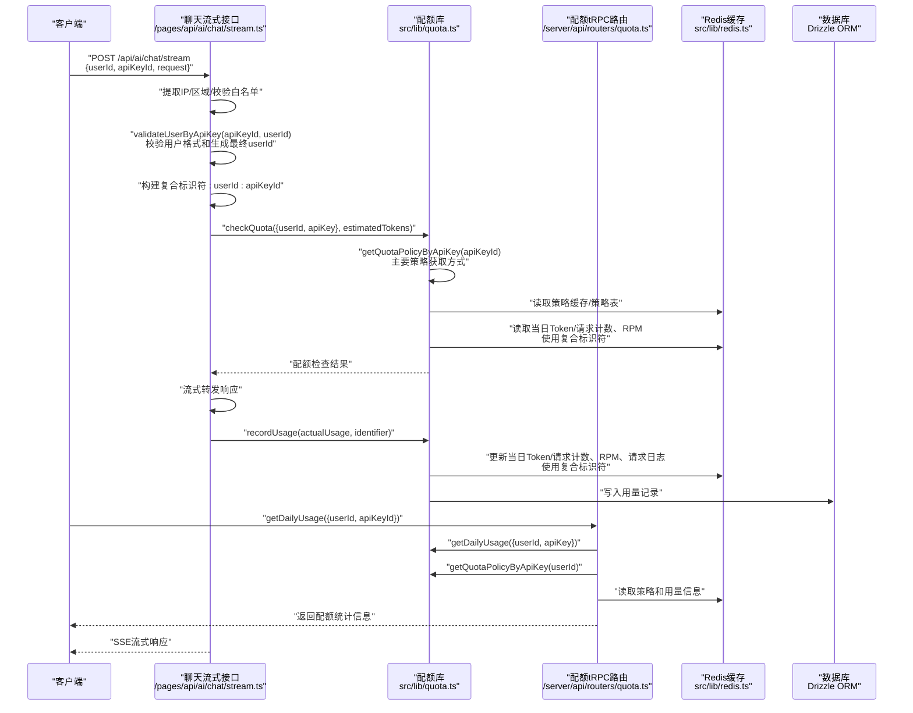

**图表来源**
- [src/pages/api/ai/chat/stream.ts](file://src/pages/api/ai/chat/stream.ts#L78-L86)
- [src/lib/quota.ts](file://src/lib/quota.ts#L18-L57)
- [src/lib/quota.ts](file://src/lib/quota.ts#L262-L296)
- [src/lib/quota.ts](file://src/lib/quota.ts#L315-L321)
- [src/server/api/routers/quota.ts](file://src/server/api/routers/quota.ts#L37-L81)

## 详细组件分析

### Redis键构造参数顺序修复

#### 设计原理
在重构过程中，修复了Redis键构造函数中参数顺序的问题，确保键名生成的一致性和正确性。新的参数顺序为：`(userId: string, apiKey: string, dateOrDateTime: string)`，这保证了键名的语义清晰和查询的一致性。

#### 实现细节
- **用户每日配额使用情况**：`user_quota:{userId}:{date}:{apiKey}`
- **用户每日请求次数**：`user_requests:{userId}:{date}:{apiKey}`
- **用户每分钟请求次数**：`user_rpm:{userId}:{apiKey}:{dateTime}`
- **API Key配置缓存**：`api_keys:{provider}`
- **根据API Key获取配额策略**：`policy:apiKey:{apiKeyId}`
- **请求日志**：`request_log:{userId}:{requestId}`

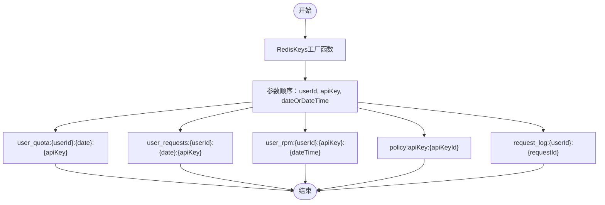

**图表来源**
- [src/lib/redis.ts](file://src/lib/redis.ts#L18-L42)

**章节来源**
- [src/lib/redis.ts](file://src/lib/redis.ts#L18-L42)

### 日期处理工具函数提取

#### 设计原理
将日期处理逻辑提取到独立的`date.ts`文件中，提供统一的日期格式化和时间戳生成工具。这种设计提高了代码的可维护性和复用性，减少了重复代码。

#### 实现细节
- **getTodayString**：获取今日日期字符串，格式为`YYYY-MM-DD`
- **getCurrentMinuteString**：获取当前分钟字符串，格式为`YYYY-MM-DD:HH:MM`
- **支持可选参数**：允许传入指定日期进行格式化
- **统一格式化**：确保所有日期处理使用一致的格式标准

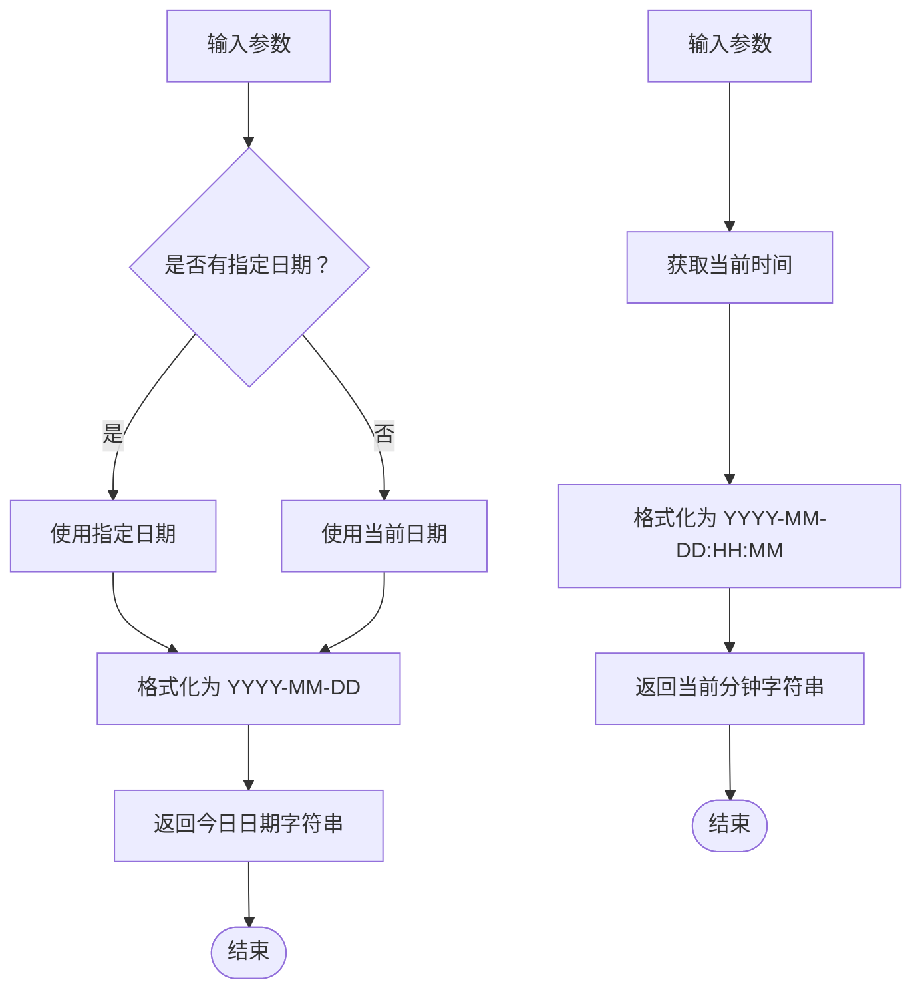

**图表来源**
- [src/lib/date.ts](file://src/lib/date.ts#L3-L12)

**章节来源**
- [src/lib/date.ts](file://src/lib/date.ts#L1-L13)

### 日志记录和错误处理增强

#### 设计原理
重构了日志记录系统，新增了专门的日志记录函数，提供结构化的日志记录和错误追踪能力。新的日志系统支持不同级别的日志记录和专门的操作日志。

#### 实现细节
- **logQuotaOperation**：配额操作日志，支持check、update、reset、exceeded等操作
- **logAIRequest**：AI请求日志，记录模型、提供商和Token使用情况
- **logError/logWarn/logInfo**：通用错误、警告和信息日志
- **logAuth**：认证相关操作日志
- **结构化日志**：所有日志都包含时间戳和元数据
- **级别化处理**：根据操作类型选择合适的日志级别

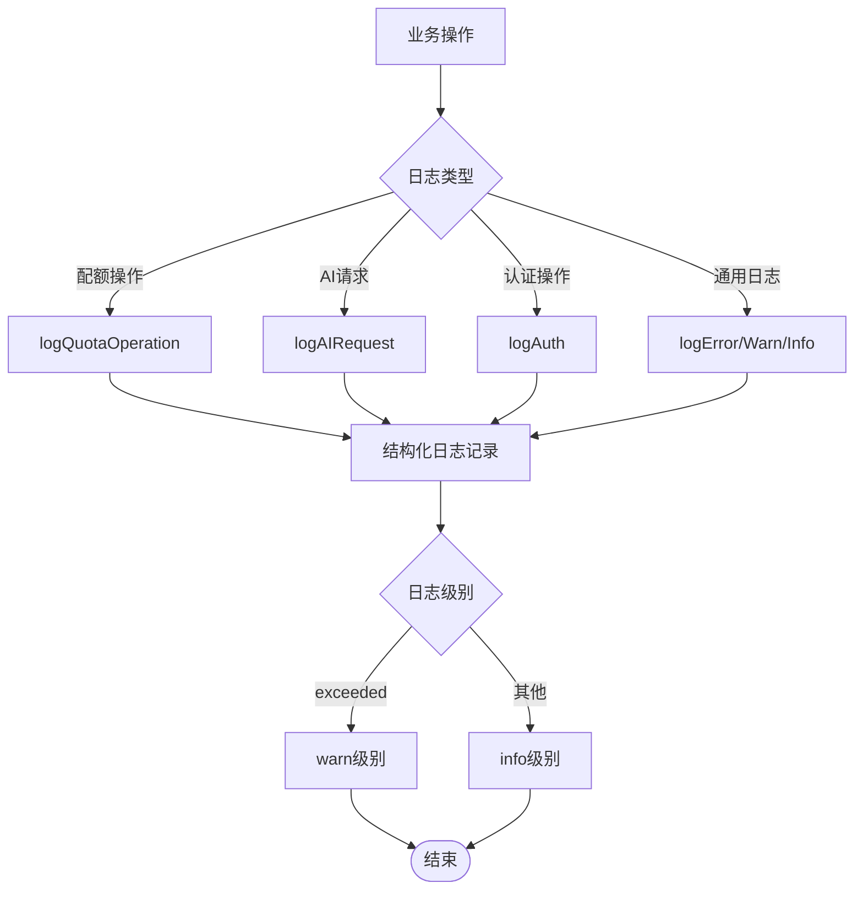

**图表来源**
- [src/lib/logger.ts](file://src/lib/logger.ts#L125-L183)

**章节来源**
- [src/lib/logger.ts](file://src/lib/logger.ts#L1-L183)

### API Key ID主要策略获取方式

#### 设计原理
新的getQuotaPolicyByApiKey函数作为主要的策略获取方式，通过API Key ID直接获取配额策略，提供更精确的策略匹配和更高的性能。这种设计确保了：

- **直接映射**：API Key ID直接对应白名单规则，避免中间转换步骤
- **高性能**：减少数据库查询次数，提高策略获取速度
- **精确性**：基于API Key的策略匹配更加准确
- **向后兼容**：保留原有的getQuotaPolicyByEmail兼容方式

#### 实现细节
- **缓存策略**：使用`policy:apiKey:{apiKeyId}`作为Redis缓存键
- **白名单规则查找**：通过whitelistRuleDb.getByApiKeyIdWithPolicy(apiKeyId)直接获取规则和策略
- **策略匹配**：直接使用JOIN查询返回的策略对象
- **默认回退**：找不到规则时回退到默认策略

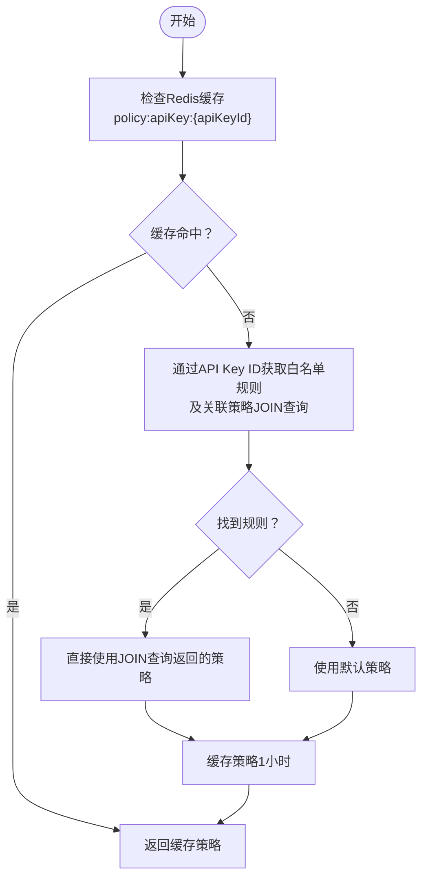

**图表来源**
- [src/lib/quota.ts](file://src/lib/quota.ts#L18-L57)

**章节来源**
- [src/lib/quota.ts](file://src/lib/quota.ts#L18-L57)

### 配额策略与匹配
- **API Key ID主要策略获取方式**
  - 优先使用getQuotaPolicyByApiKey(apiKey)直接获取策略
  - 兼容旧方式：getQuotaPolicyByEmail(userId)作为备用
  - 支持多种匹配方式：API Key ID、用户ID、IP地址等
- 策略来源
  - 白名单规则匹配：根据用户ID与规则的校验模式进行匹配，确定策略名称
  - 策略表：按名称加载具体策略（每日Token/请求上限、RPM等）
  - 默认策略：当无法匹配或异常时回退至默认策略
- 策略缓存
  - 按用户ID缓存策略，有效期1小时，降低数据库压力
  - 按API Key ID缓存策略，有效期1小时，提高API Key直接访问性能
- 策略变更一致性
  - 更新/删除策略后主动扫描并清理相关Redis缓存键，确保新策略尽快生效

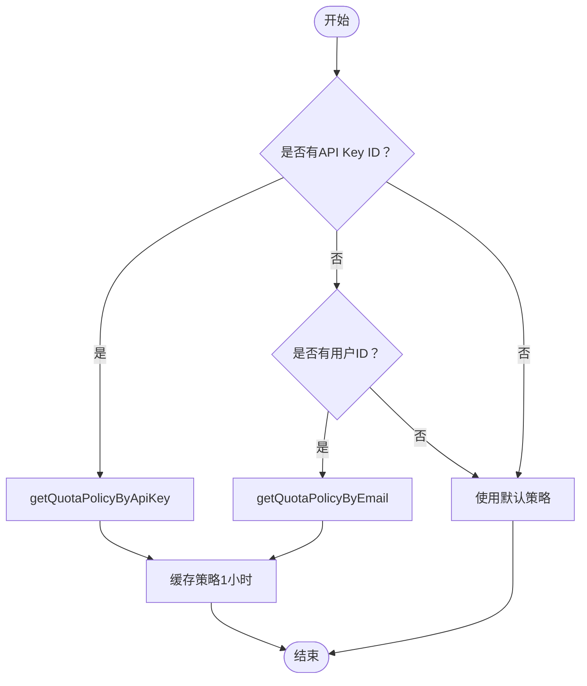

**图表来源**
- [src/lib/quota.ts](file://src/lib/quota.ts#L59-L76)

**章节来源**
- [src/lib/quota.ts](file://src/lib/quota.ts#L59-L76)
- [src/lib/database.ts](file://src/lib/database.ts#L419-L447)
- [src/server/api/routers/quota.ts](file://src/server/api/routers/quota.ts#L18-L35)

### 配额检查算法
- 检查顺序
  - Token模式：先检查当日Token使用量是否超限
  - Request模式：先检查当日请求次数是否达上限
  - RPM检查：无论哪种模式均需检查每分钟请求次数
- **复合标识符使用**
  - 标识符格式：`${userId}:${apiKey || 'default'}`
  - 确保不同API Key的配额分开计算
- 实时计算
  - 从Redis读取当前值，结合策略阈值判断
- 结果封装
  - 允许/拒绝、剩余配额、策略详情、原因

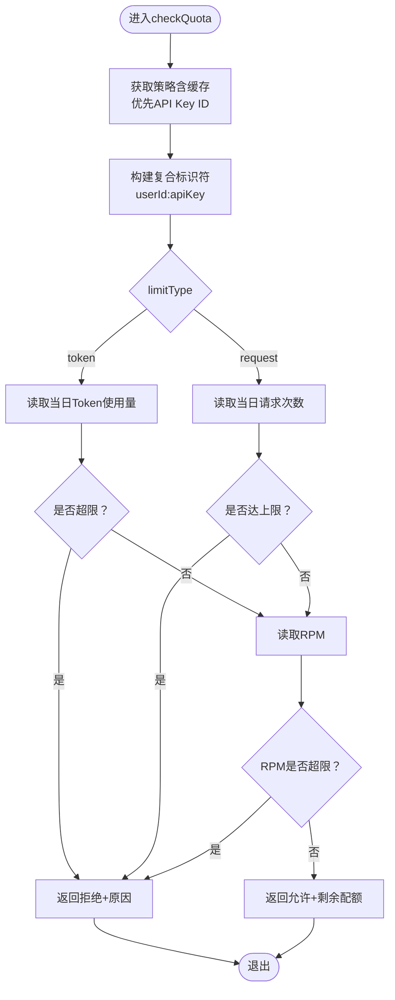

**图表来源**
- [src/lib/quota.ts](file://src/lib/quota.ts#L79-L200)
- [src/lib/quota.ts](file://src/lib/quota.ts#L92-L93)

**章节来源**
- [src/lib/quota.ts](file://src/lib/quota.ts#L79-L200)

### 用量记录系统
- 记录时机
  - 流式响应结束后，基于实际输出统计完成Token并记录
- **复合标识符使用**
  - 使用`${userId}:${apiKey}`作为标识符
  - 确保不同API Key的用量分别记录
- 记录内容
  - 日级Token/请求计数（按日期）
  - 每分钟请求计数（RPM）
  - 请求日志（24小时）
  - 数据库存储用量记录（含模型、提供商、地区、客户端IP等）
- 聚合与统计
  - 提供按用户、按日期范围查询
  - 提供平台级统计：总用户、今日请求/Token、总请求、活跃用户（近7天）

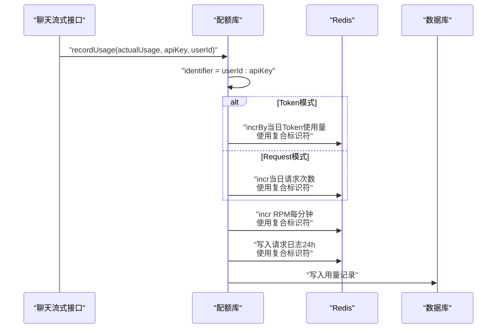

**图表来源**
- [src/lib/quota.ts](file://src/lib/quota.ts#L203-L260)
- [src/lib/database.ts](file://src/lib/database.ts#L232-L245)
- [src/pages/api/ai/chat/stream.ts](file://src/pages/api/ai/chat/stream.ts#L148-L168)

**章节来源**
- [src/lib/quota.ts](file://src/lib/quota.ts#L203-L260)
- [src/lib/database.ts](file://src/lib/database.ts#L142-L277)

### Redis缓存设计与一致性
- 键空间
  - user_quota:{identifier}:{YYYY-MM-DD}：当日Token使用量
  - user_requests:{identifier}:{YYYY-MM-DD}：当日请求次数
  - user_rpm:{identifier}:{YYYY-MM-DD}:HH:MM：每分钟请求次数
  - user_policy:{userId}：用户策略缓存
  - **policy:apiKey:{apiKeyId}：API Key策略缓存**
  - request_log:{identifier}:{requestId}：请求日志
- **复合标识符键空间**
  - identifier格式：`userId:apiKey`或`userId:default`
  - 确保不同API Key的配额完全隔离
- 过期策略
  - 日级计数：7天
  - RPM：2分钟
  - 请求日志：24小时
  - **策略缓存：1小时**
- 一致性保障
  - 策略更新/删除后扫描并清理相关缓存键，避免脏读

**章节来源**
- [src/lib/redis.ts](file://src/lib/redis.ts#L18-L42)
- [src/server/api/routers/quota.ts](file://src/server/api/routers/quota.ts#L18-L35)

### 配额清除机制修复

#### 设计原理
修复了配额清除机制中的Redis键构造参数顺序问题，确保API Key特定的配额策略缓存能够正确清理，防止陈旧数据在Redis缓存中持久存在。该修复确保了clearTodayPolicy函数能够正确识别和清理所有相关的缓存键。

#### 实现细节
- **Redis键构造参数顺序**：确保(userDailyQuota, userDailyRequests, userRPM)方法的参数顺序为(userId, apiKey, dateOrDateTime)
- **API Key特定缓存清理**：使用`policy:apiKey:{apiKeyId}`作为API Key策略缓存键
- **模式匹配清理**：使用通配符`*`匹配所有API Key的缓存键
- **扫描清理机制**：通过Redis SCAN命令遍历并删除匹配的缓存键

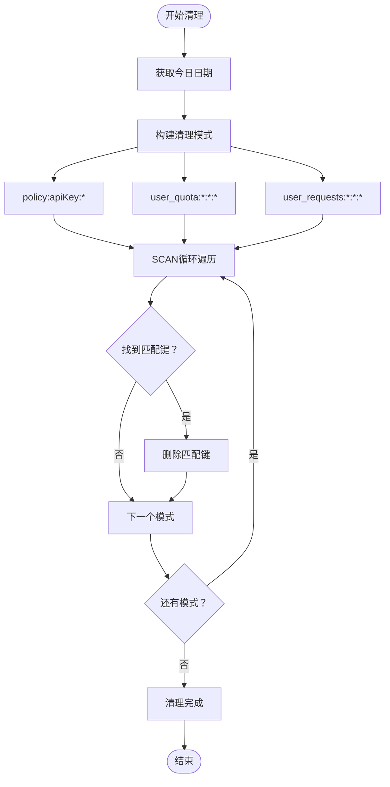

**图表来源**
- [src/server/api/routers/quota.ts](file://src/server/api/routers/quota.ts#L15-L37)

**章节来源**
- [src/server/api/routers/quota.ts](file://src/server/api/routers/quota.ts#L15-L37)
- [src/lib/redis.ts](file://src/lib/redis.ts#L18-L42)

### 增强的白名单规则验证

#### 设计原理
validateUserByApiKey函数提供了基于API Key的用户校验能力，支持更精细的用户身份验证和管理：

- **API Key专用校验**：针对特定API Key的用户校验
- **用户ID格式校验**：支持正则表达式验证用户ID格式
- **用户ID生成**：支持基于模板的用户ID生成
- **规则匹配**：首先根据API Key ID找到对应的白名单规则

#### 实现细节
- **规则查找**：通过whitelistRuleDb.getByApiKeyId(apiKeyId)获取规则
- **格式校验**：使用validationPattern验证用户ID格式
- **ID生成**：支持@user_id、@ip、@any等占位符替换
- **返回信息**：返回匹配状态、策略名称、校验结果和生成的用户ID

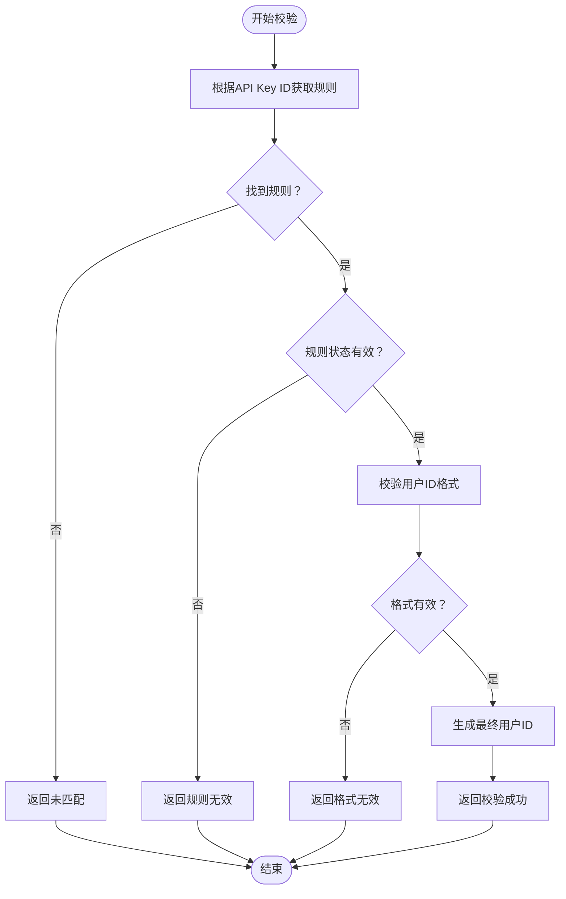

**图表来源**
- [src/lib/database.ts](file://src/lib/database.ts#L454-L499)

**章节来源**
- [src/lib/database.ts](file://src/lib/database.ts#L454-L499)

### 策略配置与生效规则
- 策略定义
  - 支持Token与Request两种模式
  - Token模式需设置每日Token上限；Request模式需设置每日请求次数上限
  - RPM上限默认60
- 生效规则
  - 白名单规则匹配用户，决定策略名称
  - 若无匹配，使用默认策略
  - **API Key ID直接映射**：通过API Key ID直接获取策略
- 动态调整
  - tRPC提供创建/更新/删除策略接口
  - 更新/删除后清理策略缓存，确保新策略立即生效

**章节来源**
- [src/server/api/routers/quota.ts](file://src/server/api/routers/quota.ts#L152-L271)
- [src/lib/types.ts](file://src/lib/types.ts#L4-L15)
- [src/lib/quota.ts](file://src/lib/quota.ts#L59-L76)

### 异常处理与性能监控
- 异常处理
  - 配额检查与用量记录均包含try/catch，失败时返回兜底结果或记录错误日志
  - tRPC层对业务错误进行包装，便于前端识别
  - **API Key校验异常**：提供详细的校验失败原因
- 性能监控
  - Redis键过期时间合理设置，避免内存膨胀
  - 策略缓存减少数据库压力
  - 统一的RedisKeys工具类提升可维护性
  - **API Key缓存优化**：专门的API Key策略缓存提升性能
- **日志监控**
  - 结构化日志记录，支持错误追踪和性能分析
  - 专门的配额操作日志，便于审计和监控

**章节来源**
- [src/lib/quota.ts](file://src/lib/quota.ts#L189-L200)
- [src/lib/quota.ts](file://src/lib/quota.ts#L252-L260)
- [src/lib/logger.ts](file://src/lib/logger.ts#L125-L183)
- [src/server/api/routers/quota.ts](file://src/server/api/routers/quota.ts#L62-L68)

## 复合标识符系统

### 设计原理
复合标识符系统通过将`userId`和`apiKey`组合为`${userId}:${apiKey}`的形式，实现了对同一用户下不同API Key的精细化配额控制。这种设计确保了：

- **API Key隔离**：每个API Key拥有独立的配额使用记录
- **用户维度**：同一用户的不同API Key可以共享策略配置
- **灵活性**：支持动态切换API Key而不影响其他Key的配额
- **向后兼容**：保留default标识符作为兼容选项

### 实现细节
- **标识符构建**：`const identifier = `${userId}:${apiKey || 'default'}`
- **Redis键命名**：所有Redis操作都使用复合标识符作为键的一部分
- **tRPC集成**：配额查询接口支持传入`apiKeyId`参数
- **兼容性**：保留向后兼容，支持只使用`userId`的场景

### 使用场景
- **多项目管理**：同一用户拥有多个项目，每个项目使用不同的API Key
- **多租户隔离**：不同租户使用相同的用户ID，但有不同的API Key
- **开发/生产分离**：同一用户在开发和生产环境使用不同的API Key

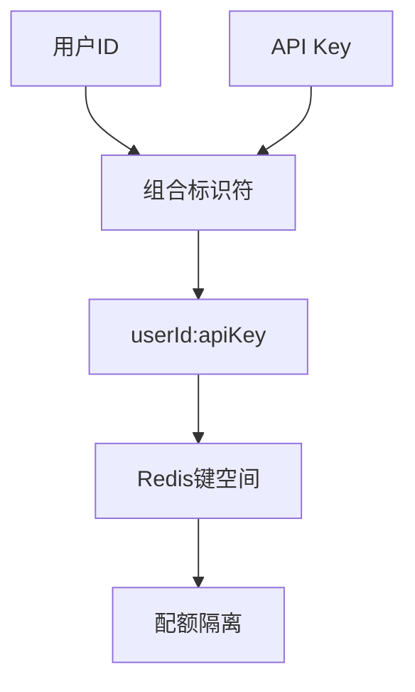

**图表来源**
- [src/lib/quota.ts](file://src/lib/quota.ts#L92-L93)
- [src/pages/api/ai/chat/stream.ts](file://src/pages/api/ai/chat/stream.ts#L79-L81)

**章节来源**
- [src/lib/quota.ts](file://src/lib/quota.ts#L92-L93)
- [src/lib/quota.ts](file://src/lib/quota.ts#L315-L321)
- [src/pages/api/ai/chat/stream.ts](file://src/pages/api/ai/chat/stream.ts#L79-L81)
- [src/server/api/routers/quota.ts](file://src/server/api/routers/quota.ts#L44-L47)

## API Key ID主要策略获取方式

### 设计原理
新的getQuotaPolicyByApiKey函数作为主要的策略获取方式，通过API Key ID直接获取配额策略，提供更精确的策略匹配和更高的性能。这种设计确保了：

- **直接映射**：API Key ID直接对应白名单规则，避免中间转换步骤
- **高性能**：减少数据库查询次数，提高策略获取速度
- **精确性**：基于API Key的策略匹配更加准确
- **向后兼容**：保留原有的getQuotaPolicyByEmail兼容方式

### 实现细节
- **缓存策略**：使用`policy:apiKey:{apiKeyId}`作为Redis缓存键
- **白名单规则查找**：通过whitelistRuleDb.getByApiKeyIdWithPolicy(apiKeyId)直接获取规则和策略
- **策略匹配**：直接使用JOIN查询返回的策略对象
- **默认回退**：找不到规则时回退到默认策略

### 使用场景
- **直接API Key访问**：客户端直接使用API Key进行访问
- **多租户场景**：不同租户使用不同的API Key，但可能共享用户ID
- **策略隔离**：需要为不同API Key设置不同的配额策略

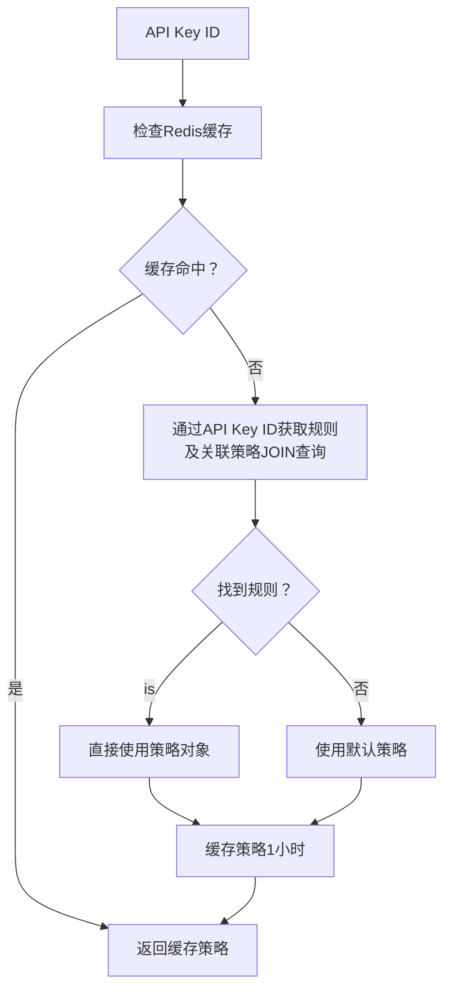

**图表来源**
- [src/lib/quota.ts](file://src/lib/quota.ts#L18-L57)

**章节来源**
- [src/lib/quota.ts](file://src/lib/quota.ts#L18-L57)

## getDailyUsage接口详解

### 接口概述
getDailyUsage接口是配额管理系统的核心查询接口，提供用户详细的配额使用统计信息。系统中存在两个版本的getDailyUsage接口，分别服务于不同的使用场景：

- **受保护的tRPC路由接口**：位于`/server/api/routers/quota.ts`，用于后台管理和监控
- **公开的mutation接口**：位于`/server/api/routers/ai.ts`，用于前端直接调用

### 接口功能特性
- **复合标识符支持**：支持按`userId`和`apiKey`组合查询特定API Key的配额使用情况
- **完整统计信息**：返回策略详情、今日使用量、剩余配额计算
- **双模式支持**：支持Token限制模式和请求次数限制模式
- **错误处理**：完善的异常捕获和错误信息返回
- **API Key ID支持**：优先通过API Key ID获取配额策略

### 接口实现细节
- **输入参数**：
  - `userId`：必需，用户标识符
  - `apiKey`：可选，API Key标识符，不提供时使用默认值
- **查询流程**：
  1. 获取用户配额策略（优先通过API Key ID）
  2. 查询用户今日使用情况
  3. 计算剩余配额
  4. 返回完整统计信息

### 返回数据结构
接口返回标准化的数据结构，包含以下关键信息：
- **tokensUsed**：今日使用的Token数量
- **requestsToday**：今日的请求次数
- **policy**：用户当前的配额策略详情

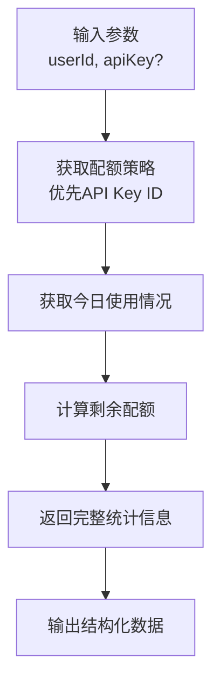

**图表来源**
- [src/server/api/routers/quota.ts](file://src/server/api/routers/quota.ts#L37-L81)
- [src/server/api/routers/ai.ts](file://src/server/api/routers/ai.ts#L242-L298)

**章节来源**
- [src/server/api/routers/quota.ts](file://src/server/api/routers/quota.ts#L37-L81)
- [src/server/api/routers/ai.ts](file://src/server/api/routers/ai.ts#L242-L298)
- [src/lib/quota.ts](file://src/lib/quota.ts#L262-L296)

## 依赖关系分析
- 外部依赖
  - Redis：高吞吐计数与短期缓存
  - PostgreSQL + Drizzle ORM：持久化策略、用量与统计
  - UUID：请求ID生成
  - Zod：输入校验
- 内部模块耦合
  - 配额库依赖Redis与数据库抽象层
  - tRPC路由依赖配额库与数据库抽象层
  - 聊天流式接口依赖配额库与数据库抽象层
  - **API Key路由**：新增API Key管理功能，与配额系统紧密集成
  - **getDailyUsage接口**：两个版本分别服务于不同层级的应用
  - **白名单规则验证**：validateUserByApiKey提供增强的用户校验能力
  - **日期处理工具**：独立的date.ts模块提供统一的日期格式化
  - **日志记录系统**：独立的logger.ts模块提供结构化的日志记录

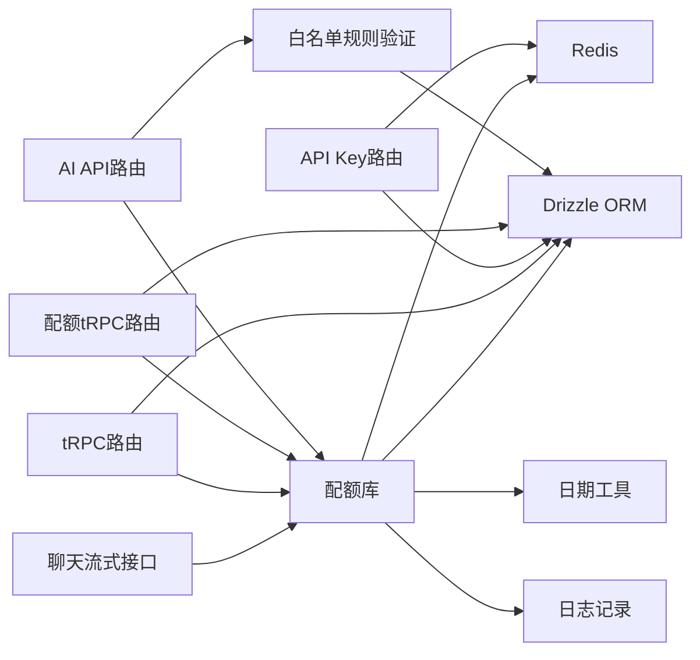

**图表来源**
- [src/pages/api/ai/chat/stream.ts](file://src/pages/api/ai/chat/stream.ts#L1-L184)
- [src/lib/quota.ts](file://src/lib/quota.ts#L1-L327)
- [src/server/api/routers/quota.ts](file://src/server/api/routers/quota.ts#L1-L322)
- [src/server/api/routers/ai.ts](file://src/server/api/routers/ai.ts#L1-L298)
- [src/server/api/routers/apiKey.ts](file://src/server/api/routers/apiKey.ts#L1-L393)

**章节来源**
- [package.json](file://package.json#L18-L56)
- [src/lib/quota.ts](file://src/lib/quota.ts#L1-L327)
- [src/server/api/routers/quota.ts](file://src/server/api/routers/quota.ts#L1-L322)

## 性能考量
- Redis优势
  - 原子自增（incr/incrBy）满足高并发计数需求
  - 合理过期时间避免长期占用内存
- **复合标识符影响**
  - 增加Redis键数量，但提供更好的隔离性
  - 复合标识符长度适中，不影响性能
- **API Key缓存优化**
  - 专门的`policy:apiKey:{apiKeyId}`缓存键提升API Key直接访问性能
  - 缓存有效期1小时，平衡性能与一致性
- **getDailyUsage接口优化**
  - 支持缓存策略，减少重复查询
  - 复合标识符查询支持精确匹配
- **日期处理优化**
  - 独立的日期工具模块减少重复计算
  - 统一的日期格式化避免格式不一致
- **日志记录优化**
  - 结构化日志减少日志解析开销
  - 分级日志记录避免不必要的日志输出
- **配额清除机制优化**
  - **修复后的参数顺序**：确保Redis键构造的正确性
  - **批量清理**：通过SCAN命令高效清理匹配的缓存键
  - **一致性保障**：策略更新后能够正确清理所有相关缓存
- 写放大与一致性
  - 每次用量记录同时更新日级计数、RPM与日志，建议在高并发场景下评估批量写入或异步落库策略
- 查询路径优化
  - 策略与用量均走Redis，数据库仅承担持久化与统计
  - **API Key直接映射**：减少中间转换步骤，提高查询效率
- 扩展性
  - 可横向扩展tRPC与聊天接口实例
  - Redis单实例满足当前规模，若需要可引入哨兵/集群

## 故障排除指南
- 配额检查总是失败
  - 检查Redis连接状态与可用性
  - 确认策略缓存是否被清理（更新/删除策略后会清理）
  - 查看配额检查日志定位阈值与当前用量
  - **复合标识符问题**：确认`userId`和`apiKey`参数是否正确传递
  - **API Key缓存问题**：检查`policy:apiKey:{apiKeyId}`缓存键是否存在
- 用量未计入
  - 确认recordUsage是否在流式结束后调用
  - 检查Redis键是否存在且未过期
  - 核对数据库写入是否成功
  - **复合标识符问题**：确认Redis键格式为`userId:apiKey`
- 策略未生效
  - 确认白名单规则是否匹配
  - 检查策略缓存是否清理
  - 核对策略表字段（Token/Request/RPM）是否正确
  - **API Key策略问题**：确认API Key是否正确绑定白名单规则
- tRPC报错
  - 检查输入参数校验（Zod）
  - 查看TRPCError的错误码与消息
- **getDailyUsage接口问题**
  - 确认接口调用权限（受保护接口需要认证）
  - 检查输入参数格式（userId必需，apiKey可选）
  - 验证复合标识符构建逻辑
  - 查看接口返回的错误信息
- **API Key相关问题**
  - 确认API Key是否存在且状态为ACTIVE
  - 检查API Key与用户的关系是否正确
  - 验证API Key的提供商配置
  - **白名单规则问题**：确认API Key是否绑定有效的白名单规则
  - **用户校验失败**：检查validateUserByApiKey的返回结果和错误原因
- **缓存一致性问题**
  - 策略更新后检查缓存是否正确清理
  - 验证Redis缓存键格式是否正确
  - 确认缓存过期时间设置是否合理
  - **配额清除问题**：检查clearTodayPolicy函数是否正确清理所有相关缓存键
- **Redis键构造问题**
  - 确认RedisKeys方法的参数顺序正确
  - 检查userDailyQuota、userDailyRequests、userRPM方法的参数顺序
  - 验证policy:apiKey:{apiKeyId}缓存键的构造逻辑
- **日期格式问题**
  - 确认getTodayString和getCurrentMinuteString的返回格式
  - 检查日期字符串的解析和比较逻辑
- **日志记录问题**
  - 确认日志级别设置是否正确
  - 检查日志文件的写入权限和磁盘空间
  - 验证结构化日志的数据格式

**章节来源**
- [src/lib/quota.ts](file://src/lib/quota.ts#L189-L200)
- [src/lib/quota.ts](file://src/lib/quota.ts#L252-L260)
- [src/lib/logger.ts](file://src/lib/logger.ts#L125-L183)
- [src/server/api/routers/quota.ts](file://src/server/api/routers/quota.ts#L62-L68)
- [src/server/api/routers/ai.ts](file://src/server/api/routers/ai.ts#L290-L296)
- [src/lib/database.ts](file://src/lib/database.ts#L454-L499)

## 结论
AIGate的配额管理系统以Redis为核心实现高并发实时检查与用量统计，配合PostgreSQL的持久化与统计能力，形成"缓存热数据、数据库冷数据"的清晰分层。**最新版本**通过修复配额清除机制中的Redis键构造参数顺序问题，确保API Key特定的配额策略缓存能够正确清理，防止陈旧数据在Redis缓存中持久存在，同时保持了原有的配额系统架构和功能完整性。该系统通过重构配额系统架构，修复了Redis键构造参数顺序问题，提取了日期处理工具函数，并增强了日志记录和错误处理机制，实现了以API Key ID为主要策略获取方式的改进，提供了更精细的API Key使用跟踪能力和更强大的白名单规则验证功能。该系统通过白名单规则与策略表实现灵活的配额策略管理，并提供完善的tRPC接口支持策略的动态调整与缓存一致性。整体架构具备良好的扩展性与可运维性，适合在高并发场景下稳定运行。

## 附录

### 数据模型图
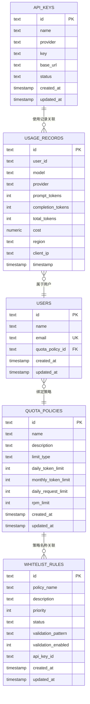

**图表来源**
- [src/lib/schema.ts](file://src/lib/schema.ts#L28-L97)
- [src/lib/schema.ts](file://src/lib/schema.ts#L139-L144)

### 配置示例（步骤说明）
- 设置Redis连接
  - 在环境变量中配置REDIS_URL，默认本地连接
- 创建配额策略
  - Token模式：设置每日Token上限
  - Request模式：设置每日请求次数上限
  - 设置RPM上限
- 应用策略
  - 通过白名单规则匹配用户与策略名称
  - 更新策略后触发缓存清理，新策略立即生效
- **使用API Key ID主要策略获取方式**
  - 在白名单规则中绑定API Key ID
  - 系统自动通过API Key ID获取配额策略
  - 支持直接通过API Key ID进行策略查询
- **使用复合标识符**
  - 在聊天接口中传入`userId`和`apiKey`
  - 系统自动构建`${userId}:${apiKey}`标识符
  - 不同API Key拥有独立的配额使用记录
- **使用getDailyUsage接口**
  - 受保护接口：需要认证，适用于后台管理
  - 公开接口：无需认证，适用于前端直接调用
  - 支持按API Key查询特定配额使用情况
- **使用日期处理工具**
  - 通过getTodayString获取今日日期字符串
  - 通过getCurrentMinuteString获取当前分钟字符串
  - 统一的日期格式化确保数据一致性
- **使用日志记录系统**
  - 通过logQuotaOperation记录配额操作
  - 通过logAIRequest记录AI请求
  - 通过logError/logWarn/logInfo记录错误和信息
- 在聊天接口中使用
  - 传入userId与apiKey
  - 预估Token并执行配额检查
  - 成功后记录实际用量
- **配额清除机制**
  - 策略更新/删除后自动清理相关缓存键
  - 通过clearTodayPolicy函数清理API Key特定缓存
  - 确保Redis键构造参数顺序正确
  - 验证policy:apiKey:{apiKeyId}缓存键的清理效果

**章节来源**
- [src/lib/redis.ts](file://src/lib/redis.ts#L3-L5)
- [src/lib/date.ts](file://src/lib/date.ts#L1-L13)
- [src/lib/logger.ts](file://src/lib/logger.ts#L1-L183)
- [src/server/api/routers/quota.ts](file://src/server/api/routers/quota.ts#L152-L271)
- [src/pages/api/ai/chat/stream.ts](file://src/pages/api/ai/chat/stream.ts#L20-L86)
- [src/lib/quota.ts](file://src/lib/quota.ts#L18-L57)
- [src/server/api/routers/quota.ts](file://src/server/api/routers/quota.ts#L15-L37)
- [src/server/api/routers/quota.ts](file://src/server/api/routers/quota.ts#L37-L81)
- [src/server/api/routers/ai.ts](file://src/server/api/routers/ai.ts#L242-L298)