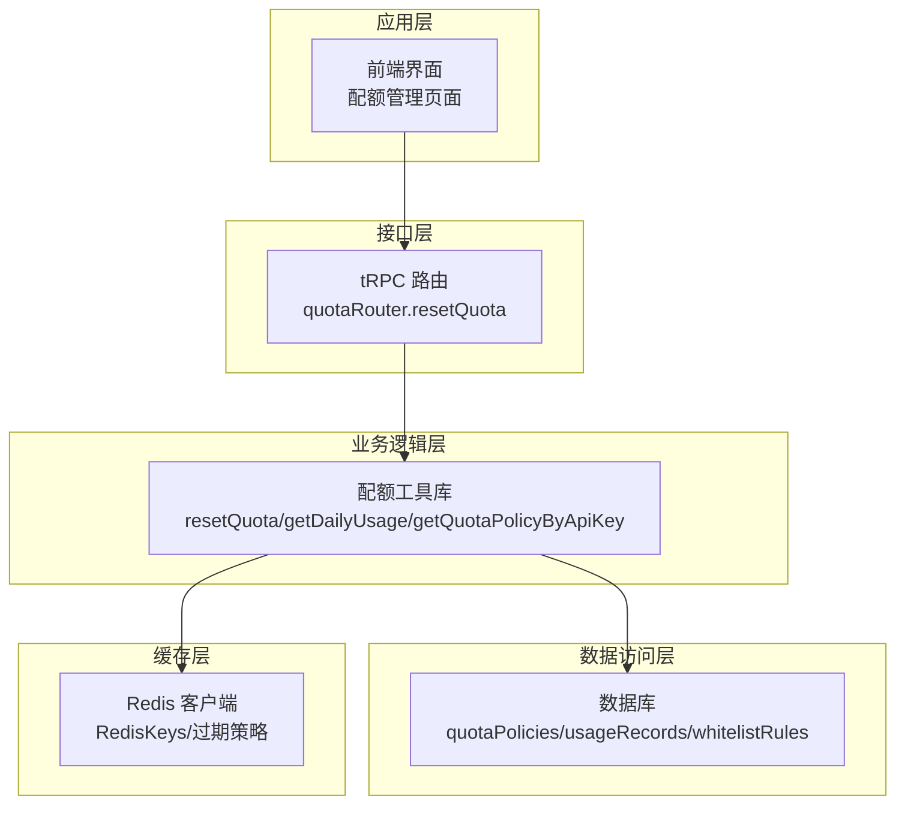
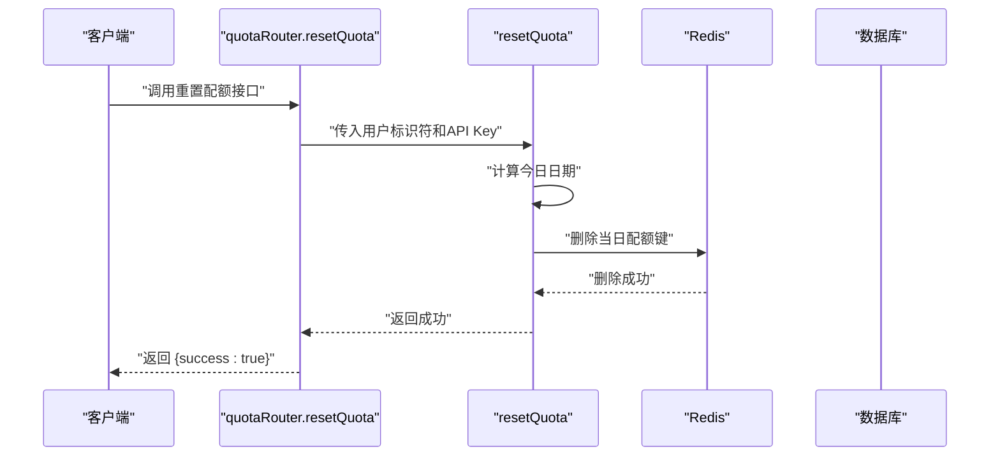
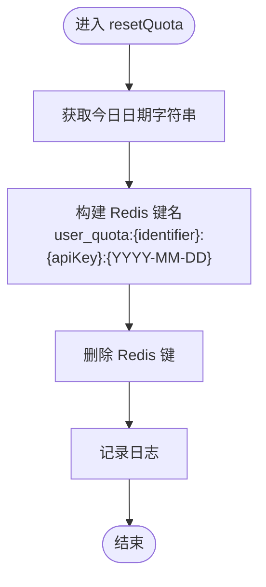
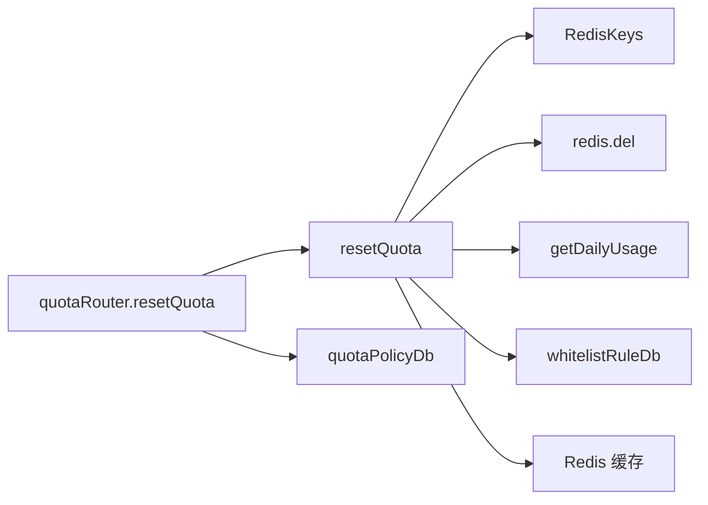

# 配额重置功能

<cite>
**本文档引用的文件**
- [src/lib/quota.ts](file://src/lib/quota.ts)
- [src/server/api/routers/quota.ts](file://src/server/api/routers/quota.ts)
- [src/lib/redis.ts](file://src/lib/redis.ts)
- [src/lib/database.ts](file://src/lib/database.ts)
- [src/server/api/routers/apiKey.ts](file://src/server/api/routers/apiKey.ts)
</cite>

## 更新摘要
**变更内容**
- 更新了 API Key 为中心的重置机制说明
- 新增了 resetQuota 函数的双参数使用方式
- 补充了缓存清理策略的详细说明
- 更新了 Redis 键命名规范和过期策略
- 增强了安全机制和监控建议

## 目录
1. [简介](#简介)
2. [项目结构](#项目结构)
3. [核心组件](#核心组件)
4. [架构概览](#架构概览)
5. [详细组件分析](#详细组件分析)
6. [依赖关系分析](#依赖关系分析)
7. [性能考量](#性能考量)
8. [故障排查指南](#故障排查指南)
9. [结论](#结论)
10. [附录](#附录)

## 简介
本文件针对配额重置功能进行深入技术说明，重点围绕 API Key 为中心的 resetQuota 函数实现原理展开，涵盖配额状态清理、Redis 键值删除与数据一致性维护；明确触发条件与使用场景（手动重置、定时任务、异常恢复）；阐述安全机制（权限验证、操作审计、回滚策略）；评估对系统的影响（用户影响、数据丢失风险、稳定性）；并提供批量操作能力（按用户、按策略、按时间范围）的实现思路与最佳实践，以及日志与监控建议。

## 项目结构
配额重置功能涉及以下关键模块：
- 业务逻辑层：位于 src/lib/quota.ts，包含配额策略查询、用量检查、用量记录与重置等核心逻辑
- 接口层：位于 src/server/api/routers/quota.ts，提供 tRPC 路由接口，暴露重置配额等能力
- 数据访问层：位于 src/lib/database.ts，封装数据库操作（策略 CRUD、用量记录等）
- 缓存层：位于 src/lib/redis.ts，提供 Redis 客户端与键命名规范
- API Key 管理：位于 src/server/api/routers/apiKey.ts，提供 API Key 的创建、更新、删除和状态管理

**图表来源**
- [src/server/api/routers/quota.ts](file://src/server/api/routers/quota.ts#L124-L137)
- [src/lib/quota.ts](file://src/lib/quota.ts#L288-L299)
- [src/lib/redis.ts](file://src/lib/redis.ts#L1-L54)
- [src/lib/database.ts](file://src/lib/database.ts#L1-L587)

**章节来源**
- [src/lib/quota.ts](file://src/lib/quota.ts#L1-L319)
- [src/server/api/routers/quota.ts](file://src/server/api/routers/quota.ts#L1-L271)
- [src/lib/redis.ts](file://src/lib/redis.ts#L1-L54)
- [src/lib/database.ts](file://src/lib/database.ts#L1-L587)
- [src/server/api/routers/apiKey.ts](file://src/server/api/routers/apiKey.ts#L1-L393)

## 核心组件
- resetQuota：重置指定标识符在特定 API Key 下的当日配额使用量的核心函数，删除对应 Redis 键，实现"清零"效果
- RedisKeys：统一管理 Redis 键命名规范，确保键空间清晰、可扫描、可清理
- quotaRouter.resetQuota：对外暴露的 tRPC 接口，负责参数校验与错误处理
- getDailyUsage：用于读取当前用户/标识符的当日使用情况，作为重置前后对比依据
- clearPolicyCacheKeys：策略缓存清理辅助函数，配合策略变更时的缓存一致性
- getQuotaPolicyByApiKey：基于 API Key ID 获取配额策略的新主要方式

**章节来源**
- [src/lib/quota.ts](file://src/lib/quota.ts#L288-L299)
- [src/lib/redis.ts](file://src/lib/redis.ts#L19-L42)
- [src/server/api/routers/quota.ts](file://src/server/api/routers/quota.ts#L124-L137)
- [src/lib/quota.ts](file://src/lib/quota.ts#L252-L286)
- [src/server/api/routers/quota.ts](file://src/server/api/routers/quota.ts#L14-L35)
- [src/lib/quota.ts](file://src/lib/quota.ts#L14-L48)

## 架构概览
下图展示重置配额的端到端调用链路与数据流：

**图表来源**
- [src/server/api/routers/quota.ts](file://src/server/api/routers/quota.ts#L124-L137)
- [src/lib/quota.ts](file://src/lib/quota.ts#L288-L299)
- [src/lib/redis.ts](file://src/lib/redis.ts#L19-L42)

## 详细组件分析

### resetQuota 实现原理
- 输入：用户标识符（identifier）和 API Key（apiKey）
- 关键步骤：
  1) 计算今日日期字符串
  2) 基于 RedisKeys 生成"当日配额使用量"键名，包含 API Key 参数
  3) 执行删除操作，使当日用量归零
- 依赖：
  - RedisKeys.userDailyQuota：键命名规范，包含 API Key 参数
  - redis.del：原子删除
- 异常处理：捕获并记录错误，避免中断流程

**图表来源**
- [src/lib/quota.ts](file://src/lib/quota.ts#L288-L299)
- [src/lib/redis.ts](file://src/lib/redis.ts#L19-L42)

**章节来源**
- [src/lib/quota.ts](file://src/lib/quota.ts#L288-L299)

### API Key 为中心的配额管理
- **新的策略获取方式**：getQuotaPolicyByApiKey 函数直接通过 API Key ID 获取配额策略
- **白名单规则集成**：通过 whitelistRuleDb.getByApiKeyIdWithPolicy 获取 API Key 关联的配额策略
- **缓存优化**：策略缓存键为 `policy:apiKey:{apiKeyId}`，缓存时间为 1 小时
- **兼容性处理**：如果找不到关联策略，回退到默认策略

**章节来源**
- [src/lib/quota.ts](file://src/lib/quota.ts#L14-L48)
- [src/lib/database.ts](file://src/lib/database.ts#L331-L351)

### 配额状态清理与数据一致性
- Redis 层面：删除当日用量键，使后续用量检查与记录重新从 0 开始
- 数据库层面：用量记录持久化在数据库中，重置不改变历史记录，仅影响当日统计
- 一致性保障：
  - 删除操作为单键原子操作，避免部分清理导致的状态不一致
  - 用量检查与记录均基于同一键空间，保证读写一致性
  - API Key 策略缓存与用量缓存分离，避免相互影响

**章节来源**
- [src/lib/quota.ts](file://src/lib/quota.ts#L192-L250)
- [src/lib/quota.ts](file://src/lib/quota.ts#L252-L286)

### Redis 键值删除与过期策略
- **键命名规范**：
  - 用量记录键：`user_quota:{identifier}:{apiKey}:{YYYY-MM-DD}`
  - 请求次数键：`user_requests:{identifier}:{YYYY-MM-DD}:{apiKey}`
  - 每分钟请求键：`user_rpm:{identifier}:{YYYY-MM-DD:HH:MM}`
  - API Key 策略缓存：`policy:apiKey:{apiKeyId}`
- **过期策略**：
  - 用量记录键在正常流程中设置 7 天过期，重置后删除键，无需等待过期
  - 每分钟请求键（user_rpm）设置 2 分钟过期，重置不影响该键生命周期
  - API Key 策略缓存设置 1 小时过期，重置后删除键，确保策略变更及时生效
- **清理策略**：提供 clearPolicyCacheKeys 扫描并删除策略相关缓存键，确保策略变更后的缓存一致性

**章节来源**
- [src/lib/redis.ts](file://src/lib/redis.ts#L19-L42)
- [src/lib/quota.ts](file://src/lib/quota.ts#L192-L250)
- [src/server/api/routers/quota.ts](file://src/server/api/routers/quota.ts#L14-L35)

### 触发条件与使用场景
- **手动重置**：管理员或运维人员通过前端或接口主动发起重置
- **定时任务**：在每日凌晨或特定时间点批量重置到期或需要清零的用量
- **异常恢复**：当发现用量统计异常或缓存状态异常时，通过重置恢复到预期状态
- **策略变更**：当配额策略发生变更时，通过 clearPolicyCacheKeys 清理缓存确保新策略生效

**章节来源**
- [src/server/api/routers/quota.ts](file://src/server/api/routers/quota.ts#L124-L137)
- [src/lib/quota.ts](file://src/lib/quota.ts#L288-L299)
- [src/server/api/routers/quota.ts](file://src/server/api/routers/quota.ts#L14-L35)

### 安全机制
- **权限验证**：接口层使用 protectedProcedure，确保只有认证用户可以访问
- **操作审计**：建议在重置前后记录审计日志（操作人、目标标识符、API Key、时间戳、结果），便于追踪
- **回滚策略**：当前实现为一次性删除，建议在高风险场景增加"软重置"或"备份键"，以便必要时回滚
- **API Key 验证**：通过 API Key ID 直接获取配额策略，避免了用户标识符的复杂性

**章节来源**
- [src/server/api/routers/quota.ts](file://src/server/api/routers/quota.ts#L124-L137)
- [src/lib/quota.ts](file://src/lib/quota.ts#L14-L48)

### 对系统的影响评估
- **用户影响**：重置后用户当日用量清零，可能短暂影响正在执行但尚未完成的请求统计，建议在低峰时段执行
- **数据丢失风险**：仅删除当日用量键，历史用量记录不受影响，风险较低
- **系统稳定性**：删除操作为轻量级原子操作，对 Redis 性能影响极小；建议在批量重置时控制并发与速率
- **缓存影响**：重置会清除相关的 Redis 缓存，可能导致短期内缓存命中率下降，但有利于数据一致性

**章节来源**
- [src/lib/quota.ts](file://src/lib/quota.ts#L288-L299)
- [src/lib/quota.ts](file://src/lib/quota.ts#L192-L250)

### 批量操作能力
- **按用户重置**：通过接口逐个用户发起重置，支持指定 API Key
- **按策略重置**：结合策略缓存清理函数，批量删除策略相关缓存键，确保策略生效
- **按时间范围重置**：当前实现聚焦"当日"重置，若需跨日重置，可在上层封装循环遍历日期范围的逻辑
- **按 API Key 重置**：新的 API Key 为中心的设计，可以直接针对特定 API Key 进行重置

**章节来源**
- [src/server/api/routers/quota.ts](file://src/server/api/routers/quota.ts#L14-L35)
- [src/lib/quota.ts](file://src/lib/quota.ts#L288-L299)

### 操作指南与最佳实践
- **操作前准备**
  - 明确目标标识符（用户、IP、API Key）
  - 确认当前时间是否为当日，避免跨日误操作
  - 评估业务影响，尽量在低峰时段执行
  - 备份重要数据，特别是历史用量记录
- **执行步骤**
  - 通过接口调用重置配额，传入用户标识符和 API Key
  - 校验 Redis 中对应键是否已删除
  - 对比 getDailyUsage 的返回值确认清零
  - 检查 API Key 策略缓存是否正确更新
- **验证方法**
  - 使用 getDailyUsage 获取当日用量
  - 观察用量趋势图表与实时统计
  - 结合日志与审计记录进行交叉验证
  - 验证 API Key 策略缓存是否正确

**章节来源**
- [src/server/api/routers/quota.ts](file://src/server/api/routers/quota.ts#L124-L137)
- [src/lib/quota.ts](file://src/lib/quota.ts#L252-L286)

### 日志记录与监控
- **日志记录**
  - 在 resetQuota 中输出重置成功的日志
  - 在接口层记录请求与响应，便于问题定位
  - 记录 API Key 相关的操作日志
- **监控指标**
  - 重置成功率与失败率
  - Redis 删除耗时与命中率
  - 用量统计偏差率与告警阈值
  - API Key 策略缓存命中率
  - 配额检查延迟分布

**章节来源**
- [src/lib/quota.ts](file://src/lib/quota.ts#L288-L299)
- [src/server/api/routers/quota.ts](file://src/server/api/routers/quota.ts#L124-L137)

## 依赖关系分析
- resetQuota 依赖 RedisKeys 生成键名，并依赖 redis.del 执行删除
- quotaRouter.resetQuota 作为入口，负责输入校验与错误包装
- getDailyUsage 与 resetQuota 共享相同的键命名规范，保证读写一致性
- clearPolicyCacheKeys 与策略缓存相关，确保策略变更后的缓存一致性
- getQuotaPolicyByApiKey 依赖 whitelistRuleDb 和 Redis 缓存

**图表来源**
- [src/lib/quota.ts](file://src/lib/quota.ts#L288-L299)
- [src/lib/redis.ts](file://src/lib/redis.ts#L19-L42)
- [src/server/api/routers/quota.ts](file://src/server/api/routers/quota.ts#L124-L137)
- [src/lib/quota.ts](file://src/lib/quota.ts#L252-L286)
- [src/lib/database.ts](file://src/lib/database.ts#L1-L587)

**章节来源**
- [src/lib/quota.ts](file://src/lib/quota.ts#L1-L319)
- [src/server/api/routers/quota.ts](file://src/server/api/routers/quota.ts#L1-L271)
- [src/lib/redis.ts](file://src/lib/redis.ts#L1-L54)
- [src/lib/database.ts](file://src/lib/database.ts#L1-L587)

## 性能考量
- Redis 删除操作为 O(1)，对性能影响极小
- 用量记录键设置 7 天过期，重置后立即删除，避免长期占用内存
- API Key 策略缓存设置 1 小时过期，平衡性能与一致性
- 批量重置时建议分批执行，避免瞬时压力
- RedisKeys 中的键命名优化了查找效率

## 故障排查指南
- **重置无效**
  - 检查 Redis 键是否存在（可通过 scan 命令或接口层日志）
  - 确认标识符与 API Key 与键命名一致
  - 验证 API Key 是否正确绑定配额策略
- **接口报错**
  - 查看 tRPC 层错误包装与日志
  - 核对输入参数与权限配置
  - 检查 API Key 状态是否为 ACTIVE
- **用量统计异常**
  - 使用 getDailyUsage 对比确认
  - 检查是否存在并发写入导致的瞬时差异
  - 验证 Redis 缓存是否正确清理
- **策略不生效**
  - 检查 clearPolicyCacheKeys 是否正确执行
  - 验证 API Key 策略缓存是否正确更新

**章节来源**
- [src/lib/quota.ts](file://src/lib/quota.ts#L252-L286)
- [src/server/api/routers/quota.ts](file://src/server/api/routers/quota.ts#L124-L137)
- [src/server/api/routers/apiKey.ts](file://src/server/api/routers/apiKey.ts#L243-L286)

## 结论
resetQuota 提供了简洁高效的配额重置能力，通过删除 Redis 当日用量键实现即时清零。新的 API Key 为中心的设计提供了更好的可扩展性和灵活性，支持更精细的配额控制。其设计遵循单一职责与幂等原则，具备良好的可维护性与扩展性。建议在生产环境中结合权限控制、审计日志与监控告警，完善安全与可观测性体系。

## 附录
- **API Key 管理**：提供完整的 API Key 生命周期管理，包括创建、更新、删除和状态切换
- **缓存策略**：合理的缓存过期策略确保了性能与一致性的平衡
- **白名单集成**：与白名单规则系统的深度集成，支持复杂的配额策略管理

**章节来源**
- [src/server/api/routers/apiKey.ts](file://src/server/api/routers/apiKey.ts#L1-L393)
- [src/lib/redis.ts](file://src/lib/redis.ts#L19-L42)
- [src/lib/database.ts](file://src/lib/database.ts#L291-L351)