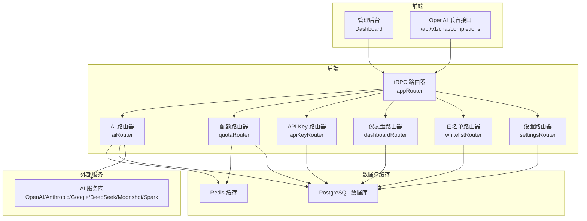
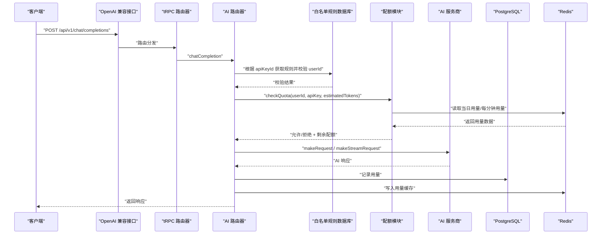
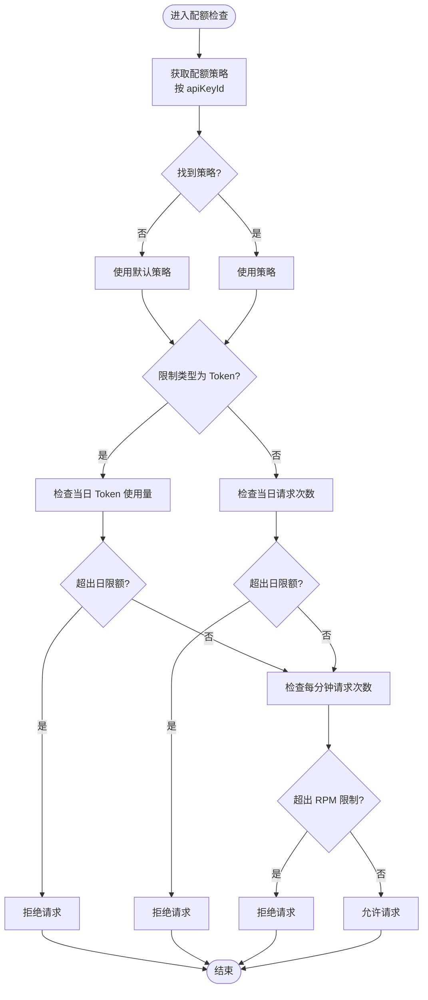
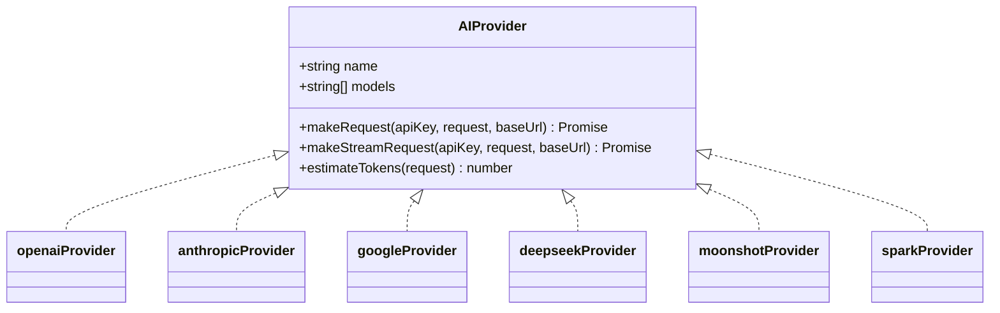
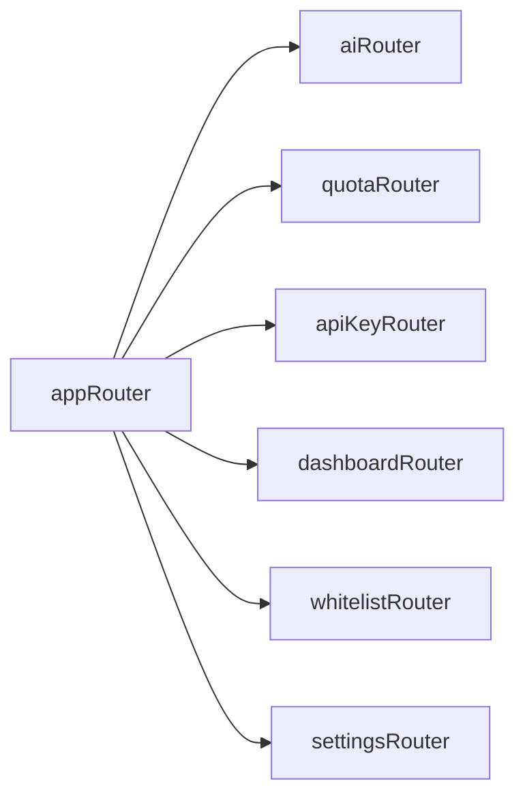
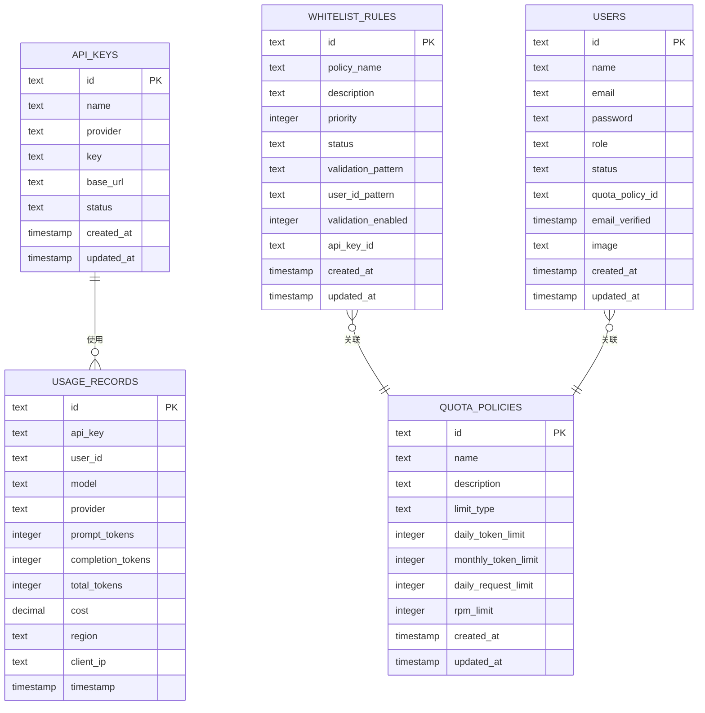
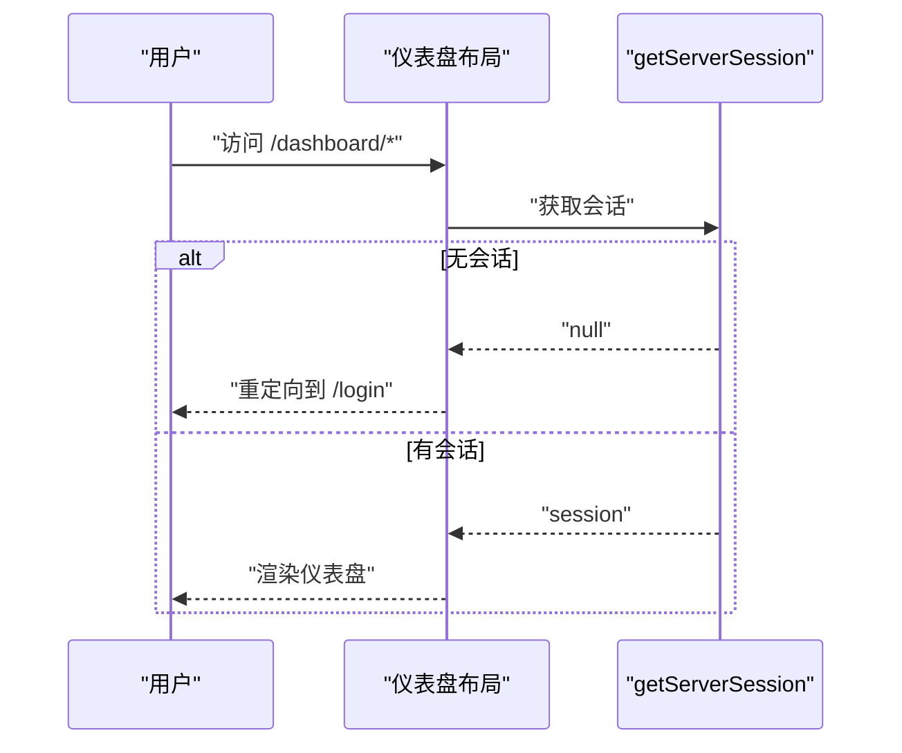
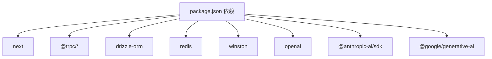

# 项目概述

<cite>
**本文档引用的文件**
- [README.md](file://README.md)
- [package.json](file://package.json)
- [src/lib/schema.ts](file://src/lib/schema.ts)
- [src/lib/quota.ts](file://src/lib/quota.ts)
- [src/lib/redis.ts](file://src/lib/redis.ts)
- [src/lib/database.ts](file://src/lib/database.ts)
- [src/lib/ai-providers.ts](file://src/lib/ai-providers.ts)
- [src/lib/types.ts](file://src/lib/types.ts)
- [src/lib/logger.ts](file://src/lib/logger.ts)
- [src/lib/provider-utils.ts](file://src/lib/provider-utils.ts)
- [src/server/api/root.ts](file://src/server/api/root.ts)
- [src/server/api/routers/ai.ts](file://src/server/api/routers/ai.ts)
- [src/pages/api/ai/chat/stream.ts](file://src/pages/api/ai/chat/stream.ts)
- [src/app/(dashboard)/layout.tsx](file://src/app/(dashboard)/layout.tsx)
- [readme/project-description.md](file://readme/project-description.md)
- [readme/tech.md](file://readme/tech.md)
</cite>

## 目录
1. [引言](#引言)
2. [项目结构](#项目结构)
3. [核心组件](#核心组件)
4. [架构总览](#架构总览)
5. [详细组件分析](#详细组件分析)
6. [依赖关系分析](#依赖关系分析)
7. [性能考量](#性能考量)
8. [故障排除指南](#故障排除指南)
9. [结论](#结论)

## 引言
AIGate 是一个基于 Next.js 14 + tRPC + Redis 的智能 AI 网关管理系统，专注于为多用户场景提供统一的 AI 模型代理与精细化配额控制。其核心价值主张在于：
- 以最小改造成本接入 OpenAI、Anthropic、Google、DeepSeek、Moonshot、Spark 等主流 AI 服务
- 基于 Redis 的实时配额检查，支持 Token 与请求次数双重限制，保障资源可控与成本可视
- 通过统一的 OpenAI 兼容接口对外提供服务，便于前端无缝集成
- 提供现代化的管理后台与实时监控，支持白名单规则、用量统计与超额拦截

目标用户群体包括：
- SaaS 创业者与 AI 应用开发者，需要对多租户用户进行用量隔离与成本控制
- 教育平台与企业内部工具团队，需要统一接入多模型并实施细粒度配额策略
- 需要安全可控、可私有化部署的 AI 中间层服务

与其他类似解决方案相比，AIGate 的差异化优势体现在：
- 高性能架构：tRPC 类型安全 API + Redis 缓存，毫秒级响应
- 灵活配额策略：支持按 Token 与请求次数双维度限制，结合 RPM 速率限制
- 多模型统一代理：统一的 OpenAI 兼容接口，屏蔽底层差异
- 完整可观测性：日志系统、用量统计、仪表盘与实时告警

## 项目结构
项目采用前后端分离与模块化组织相结合的方式：
- 前端：Next.js 14 App Router + TypeScript + Tailwind CSS + shadcn/ui
- 后端：tRPC 类型安全 RPC + Drizzle ORM + PostgreSQL + Redis
- 认证：NextAuth.js
- 日志：Winston + Daily Rotate
- 部署：Docker Compose + 一键脚本

**图表来源**
- [src/server/api/root.ts](file://src/server/api/root.ts#L14-L21)
- [src/server/api/routers/ai.ts](file://src/server/api/routers/ai.ts#L88-L300)
- [src/lib/redis.ts](file://src/lib/redis.ts#L1-L43)
- [src/lib/database.ts](file://src/lib/database.ts#L1-L692)

**章节来源**
- [README.md](file://README.md#L74-L83)
- [package.json](file://package.json#L1-L90)
- [readme/tech.md](file://readme/tech.md#L1-L2)

## 核心组件
- 智能配额管理：基于 Redis 的实时配额检查，支持 Token 与请求次数双重限制，结合 RPM 速率限制，提供用量记录与统计
- 多模型代理：统一接入 OpenAI、Anthropic、Google、DeepSeek、Moonshot、Spark 等主流 AI 服务商，提供 OpenAI 兼容接口
- 高性能架构：tRPC 类型安全 API + Redis 缓存，毫秒级响应；Drizzle ORM 管理 PostgreSQL
- 安全认证：NextAuth.js 身份验证，支持管理员账户动态配置
- 实时监控：仪表板展示请求趋势、地区分布、IP 记录等关键指标

**章节来源**
- [README.md](file://README.md#L5-L12)
- [src/lib/quota.ts](file://src/lib/quota.ts#L78-L200)
- [src/lib/ai-providers.ts](file://src/lib/ai-providers.ts#L12-L759)
- [src/lib/logger.ts](file://src/lib/logger.ts#L1-L184)

## 架构总览
AIGate 的整体架构围绕“请求接入 → 白名单校验 → 配额检查 → 代理转发 → 用量记录”的主链路展开。前端通过 OpenAI 兼容接口发起请求，后端 tRPC 路由器接收请求，AI 路由器负责白名单规则校验与配额检查，随后根据模型选择对应 AI 服务商进行请求转发，并将用量写入 Redis 与数据库。

**图表来源**
- [src/server/api/routers/ai.ts](file://src/server/api/routers/ai.ts#L98-L213)
- [src/pages/api/ai/chat/stream.ts](file://src/pages/api/ai/chat/stream.ts#L10-L183)
- [src/lib/quota.ts](file://src/lib/quota.ts#L78-L200)
- [src/lib/database.ts](file://src/lib/database.ts#L332-L352)
- [src/lib/ai-providers.ts](file://src/lib/ai-providers.ts#L34-L100)

## 详细组件分析

### 智能配额管理
智能配额管理通过 Redis 实现毫秒级的配额检查与用量统计，支持按 Token 与请求次数两种限制模式，并结合 RPM 速率限制防止突发流量冲击。

**图表来源**
- [src/lib/quota.ts](file://src/lib/quota.ts#L78-L200)
- [src/lib/redis.ts](file://src/lib/redis.ts#L18-L42)

**章节来源**
- [src/lib/quota.ts](file://src/lib/quota.ts#L1-L327)
- [src/lib/redis.ts](file://src/lib/redis.ts#L1-L43)
- [src/lib/types.ts](file://src/lib/types.ts#L82-L90)

### 多模型代理
多模型代理通过统一的 AI 服务商接口屏蔽底层差异，支持 OpenAI、Anthropic、Google、DeepSeek、Moonshot、Spark 等模型。AI 路由器根据模型前缀选择对应提供商，并支持流式与非流式响应。

**图表来源**
- [src/lib/ai-providers.ts](file://src/lib/ai-providers.ts#L12-L759)

**章节来源**
- [src/lib/ai-providers.ts](file://src/lib/ai-providers.ts#L1-L759)
- [src/server/api/routers/ai.ts](file://src/server/api/routers/ai.ts#L1-L301)

### tRPC 路由与控制器
tRPC 路由器集中管理各个业务模块，AI 路由器负责聊天完成接口、模型列表查询、Token 估算与配额信息查询；其余路由器分别处理 API Key、配额策略、白名单规则与仪表盘数据。

**图表来源**
- [src/server/api/root.ts](file://src/server/api/root.ts#L14-L21)

**章节来源**
- [src/server/api/root.ts](file://src/server/api/root.ts#L1-L25)
- [src/server/api/routers/ai.ts](file://src/server/api/routers/ai.ts#L88-L300)

### 数据模型与关系
系统采用 Drizzle ORM 管理 PostgreSQL 表结构，核心实体包括配额策略、API Key、用量记录、白名单规则与用户等，通过关系定义实现策略与规则的关联。

**图表来源**
- [src/lib/schema.ts](file://src/lib/schema.ts#L28-L98)

**章节来源**
- [src/lib/schema.ts](file://src/lib/schema.ts#L1-L162)
- [src/lib/database.ts](file://src/lib/database.ts#L1-L692)

### 认证与会话
系统采用 NextAuth.js 进行身份验证，仪表盘布局通过服务端会话校验确保只有已登录用户可访问后台页面。

**图表来源**
- [src/app/(dashboard)/layout.tsx](file://src/app/(dashboard)/layout.tsx#L10-L18)

**章节来源**
- [src/app/(dashboard)/layout.tsx](file://src/app/(dashboard)/layout.tsx#L1-L19)

## 依赖关系分析
- 前端依赖：Next.js 16、React 19、Tailwind CSS 4、shadcn/ui、tRPC 客户端
- 后端依赖：tRPC 服务器、Drizzle ORM、PostgreSQL、Redis、Winston 日志
- 外部依赖：OpenAI、Anthropic、Google、DeepSeek、Moonshot、Spark SDK 或原生 fetch

**图表来源**
- [package.json](file://package.json#L18-L68)

**章节来源**
- [package.json](file://package.json#L1-L90)

## 性能考量
- Redis 缓存：通过 RedisKeys 生成器统一管理键空间，减少数据库压力；配额策略与 API Key 缓存提升查询性能
- tRPC 类型安全：避免序列化开销，提升前后端通信效率
- 流式响应：支持 SSE 流式传输，降低首字节延迟
- 日志轮转：生产环境按日轮转，避免磁盘膨胀

[本节为通用性能指导，无需具体文件分析]

## 故障排除指南
- 配额检查失败：检查 Redis 连接与键空间命名，确认配额策略与白名单规则配置正确
- API Key 无效：确认数据库中 API Key 状态为 ACTIVE，且 baseUrl 配置正确
- 流式响应异常：确认提供商支持流式接口，检查网络与跨域配置
- 日志未输出：检查日志目录权限与轮转配置

**章节来源**
- [src/lib/logger.ts](file://src/lib/logger.ts#L1-L184)
- [src/lib/redis.ts](file://src/lib/redis.ts#L1-L43)
- [src/lib/database.ts](file://src/lib/database.ts#L1-L692)

## 结论
AIGate 通过“智能配额管理 + 多模型代理 + 高性能架构”的组合，为多用户 AI 应用提供了安全、可控、可观测的中间层解决方案。其基于 tRPC 与 Redis 的高性能设计，配合完善的日志与监控体系，能够满足从初创团队到企业级场景的多样化需求。未来可在路由规则、Webhook 通知与更丰富的仪表盘功能上进一步扩展，以适配更复杂的业务场景。