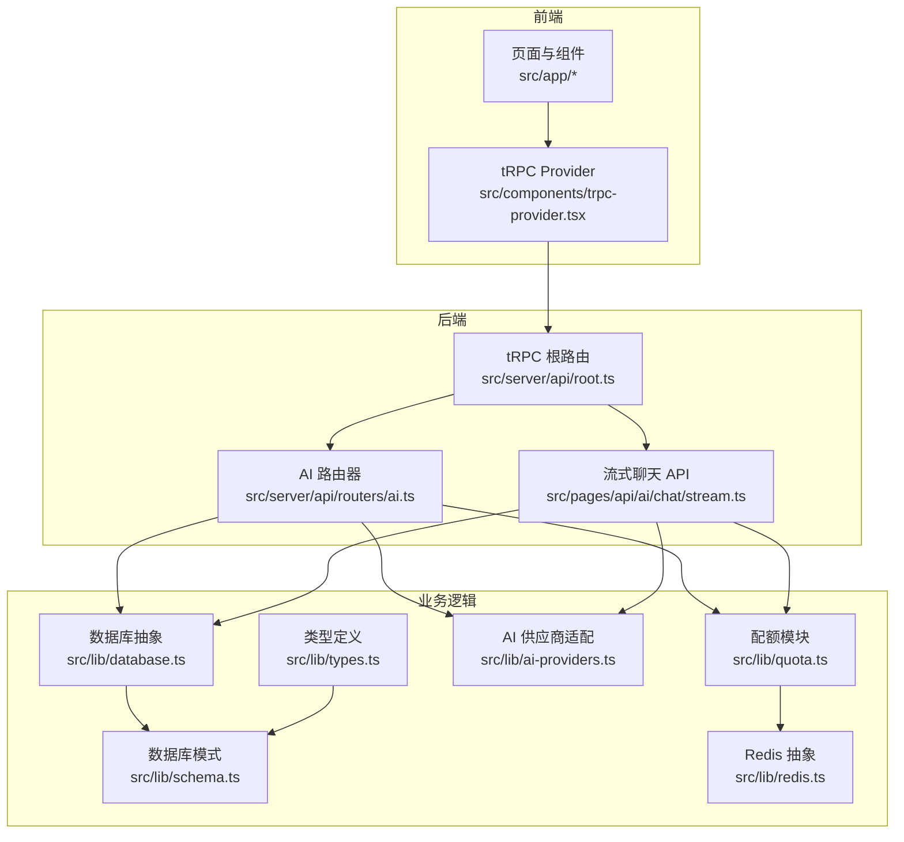
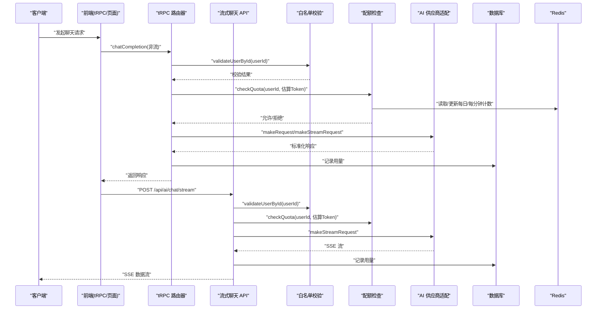
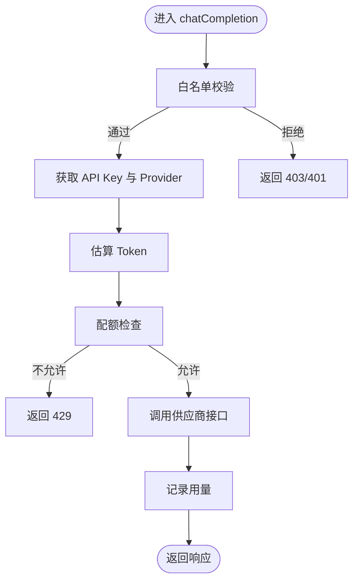
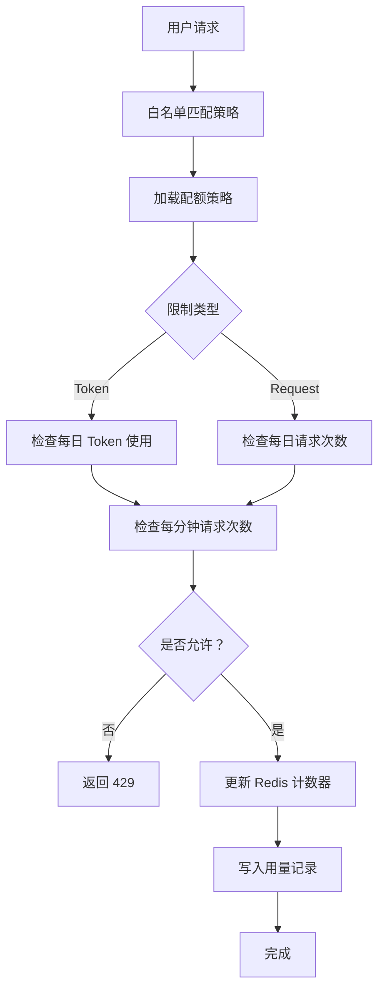
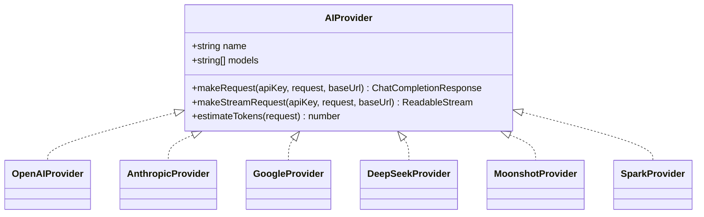
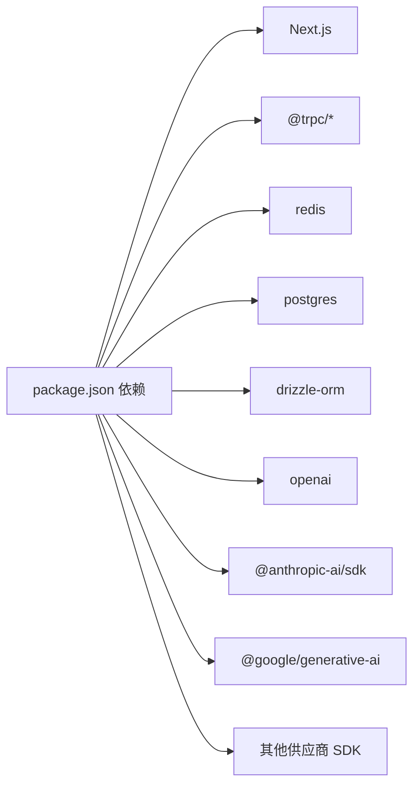

# 项目概述

<cite>
**本文引用的文件**
- [package.json](file://package.json)
- [src/lib/types.ts](file://src/lib/types.ts)
- [src/lib/schema.ts](file://src/lib/schema.ts)
- [src/lib/quota.ts](file://src/lib/quota.ts)
- [src/lib/ai-providers.ts](file://src/lib/ai-providers.ts)
- [src/lib/database.ts](file://src/lib/database.ts)
- [src/lib/redis.ts](file://src/lib/redis.ts)
- [src/server/api/root.ts](file://src/server/api/root.ts)
- [src/server/api/routers/ai.ts](file://src/server/api/routers/ai.ts)
- [src/pages/api/ai/chat/stream.ts](file://src/pages/api/ai/chat/stream.ts)
- [src/app/layout.tsx](file://src/app/layout.tsx)
- [src/app/page.tsx](file://src/app/page.tsx)
- [src/app/(dashboard)/page.tsx](file://src/app/(dashboard)/page.tsx)
- [readme/project-description.md](file://readme/project-description.md)
</cite>

## 目录
1. [引言](#引言)
2. [项目结构](#项目结构)
3. [核心组件](#核心组件)
4. [架构总览](#架构总览)
5. [详细组件分析](#详细组件分析)
6. [依赖关系分析](#依赖关系分析)
7. [性能考量](#性能考量)
8. [故障排查指南](#故障排查指南)
9. [结论](#结论)
10. [附录](#附录)

## 引言
AIGate 是一个面向企业级与多租户场景的 AI 网关与配额管理平台，核心价值在于：
- 以“自有 API Key + 用户级配额”实现安全可控的用量隔离
- 统一暴露 OpenAI 兼容接口，零改动接入现有应用
- 支持多模型供应商生态，按策略进行流量调度与用量统计
- 提供实时仪表盘与用量审计，便于运营与成本控制

本项目面向 SaaS 创业者、AI 应用开发者、教育平台与内部工具团队，解决“多用户共享模型但隔离用量”的关键痛点。

## 项目结构
项目采用 Next.js 应用与 tRPC 后端结合的前后端一体化架构，核心目录与职责如下：
- src/app：Next.js App Router 页面与布局
- src/components：UI 组件与 tRPC Provider
- src/lib：核心业务逻辑（类型、配额、AI 供应商适配、数据库与 Redis 抽象）
- src/server/api：tRPC 路由器与根路由
- src/pages/api：传统 API 路由（如流式聊天）
- drizzle：数据库迁移与模式定义
- readme：项目说明文档

图表来源
- [src/app/layout.tsx](file://src/app/layout.tsx#L1-L30)
- [src/server/api/root.ts](file://src/server/api/root.ts#L1-L23)
- [src/server/api/routers/ai.ts](file://src/server/api/routers/ai.ts#L1-L223)
- [src/pages/api/ai/chat/stream.ts](file://src/pages/api/ai/chat/stream.ts#L1-L167)
- [src/lib/quota.ts](file://src/lib/quota.ts#L1-L334)
- [src/lib/ai-providers.ts](file://src/lib/ai-providers.ts#L1-L759)
- [src/lib/database.ts](file://src/lib/database.ts#L1-L524)
- [src/lib/schema.ts](file://src/lib/schema.ts#L1-L159)
- [src/lib/types.ts](file://src/lib/types.ts#L1-L118)
- [src/lib/redis.ts](file://src/lib/redis.ts#L1-L49)

章节来源
- [src/app/layout.tsx](file://src/app/layout.tsx#L1-L30)
- [src/server/api/root.ts](file://src/server/api/root.ts#L1-L23)
- [src/lib/schema.ts](file://src/lib/schema.ts#L1-L159)
- [src/lib/types.ts](file://src/lib/types.ts#L1-L118)

## 核心组件
- 类型与模式：定义配额策略、API Key、用户、用量记录、聊天请求/响应等数据结构，并映射到 Postgres 表结构
- 配额与白名单：基于 Redis 的高性能配额检查与每日/每分钟限额，结合白名单规则匹配用户策略
- AI 供应商适配：统一 OpenAI 兼容接口，支持 OpenAI、Anthropic、Google、DeepSeek、Moonshot、Spark 等
- tRPC 路由器：封装聊天补全、模型列表查询、Token 估算等能力；流式请求走独立 API
- 数据库抽象：Drizzle ORM 封装 API Key、配额策略、用量记录、白名单规则等 CRUD
- Redis 抽象：集中管理配额键空间、策略缓存、API Key 缓存与请求日志

章节来源
- [src/lib/types.ts](file://src/lib/types.ts#L1-L118)
- [src/lib/schema.ts](file://src/lib/schema.ts#L1-L159)
- [src/lib/quota.ts](file://src/lib/quota.ts#L1-L334)
- [src/lib/ai-providers.ts](file://src/lib/ai-providers.ts#L1-L759)
- [src/server/api/routers/ai.ts](file://src/server/api/routers/ai.ts#L1-L223)
- [src/pages/api/ai/chat/stream.ts](file://src/pages/api/ai/chat/stream.ts#L1-L167)
- [src/lib/database.ts](file://src/lib/database.ts#L1-L524)
- [src/lib/redis.ts](file://src/lib/redis.ts#L1-L49)

## 架构总览
AIGate 的整体工作流如下：
- 前端通过 tRPC 或直接调用流式 API 发起聊天请求
- 网关侧进行白名单校验、配额检查与供应商选择
- 将请求转发至对应 AI 供应商，接收响应并进行用量统计
- 将用量写入 Redis 计数器与数据库记录，返回标准化响应

图表来源
- [src/server/api/routers/ai.ts](file://src/server/api/routers/ai.ts#L85-L193)
- [src/pages/api/ai/chat/stream.ts](file://src/pages/api/ai/chat/stream.ts#L9-L167)
- [src/lib/quota.ts](file://src/lib/quota.ts#L74-L190)
- [src/lib/ai-providers.ts](file://src/lib/ai-providers.ts#L1-L759)
- [src/lib/database.ts](file://src/lib/database.ts#L400-L489)

## 详细组件分析

### 组件 A：AI 网关代理服务
- 统一入口：tRPC 路由器提供 chatCompletion、getSupportedModels、estimateTokens 等能力
- 流式与非流式：非流式在 tRPC 路由器内处理；流式请求走独立 API，避免 SSR/SSG 场景限制
- 供应商适配：按模型前缀自动选择供应商，统一返回标准化响应结构
- 用量记录：在成功响应后异步记录用量，包含提示词/补全/总 Token 数与区域/IP

图表来源
- [src/server/api/routers/ai.ts](file://src/server/api/routers/ai.ts#L95-L193)
- [src/lib/ai-providers.ts](file://src/lib/ai-providers.ts#L697-L707)
- [src/lib/quota.ts](file://src/lib/quota.ts#L74-L190)
- [src/lib/database.ts](file://src/lib/database.ts#L217-L220)

章节来源
- [src/server/api/routers/ai.ts](file://src/server/api/routers/ai.ts#L85-L223)
- [src/pages/api/ai/chat/stream.ts](file://src/pages/api/ai/chat/stream.ts#L1-L167)
- [src/lib/ai-providers.ts](file://src/lib/ai-providers.ts#L1-L759)

### 组件 B：多用户配额管理机制
- 策略来源：通过白名单规则匹配用户，获取策略名称，再从策略集合中选择具体配额策略
- 限制类型：支持“按 Token 限额”和“按请求次数限额”两种模式
- 限额维度：每日 Token 限额、每日请求次数、每分钟请求次数（RPM）
- 缓存与持久化：策略与 API Key 缓存于 Redis；用量与日志写入数据库

图表来源
- [src/lib/quota.ts](file://src/lib/quota.ts#L14-L71)
- [src/lib/quota.ts](file://src/lib/quota.ts#L74-L190)
- [src/lib/quota.ts](file://src/lib/quota.ts#L192-L255)
- [src/lib/database.ts](file://src/lib/database.ts#L400-L428)

章节来源
- [src/lib/quota.ts](file://src/lib/quota.ts#L1-L334)
- [src/lib/database.ts](file://src/lib/database.ts#L400-L489)
- [src/lib/redis.ts](file://src/lib/redis.ts#L18-L49)

### 组件 C：支持的 AI 供应商生态系统
- 已支持：OpenAI、Anthropic、Google、DeepSeek、Moonshot、Spark
- 统一接口：makeRequest、makeStreamRequest、estimateTokens
- 自定义 Base URL：支持供应商自定义域名，便于私有化或代理
- 流式转换：将各供应商的 SSE/文本片段转换为 OpenAI 兼容格式

图表来源
- [src/lib/ai-providers.ts](file://src/lib/ai-providers.ts#L12-L27)
- [src/lib/ai-providers.ts](file://src/lib/ai-providers.ts#L34-L100)
- [src/lib/ai-providers.ts](file://src/lib/ai-providers.ts#L102-L282)
- [src/lib/ai-providers.ts](file://src/lib/ai-providers.ts#L284-L469)
- [src/lib/ai-providers.ts](file://src/lib/ai-providers.ts#L471-L613)
- [src/lib/ai-providers.ts](file://src/lib/ai-providers.ts#L615-L685)

章节来源
- [src/lib/ai-providers.ts](file://src/lib/ai-providers.ts#L1-L759)

### 组件 D：仪表盘与数据展示
- 统计数据：总用户数、今日请求、Token 消耗、活跃用户等
- 图表组件：使用趋势、模型分布、地区热力图、最近 IP 请求、最近活动
- tRPC 查询：dashboard 路由器提供 getStats/getUsageTrend/getModelDistribution/getRegionDistribution/getRecentIpRequests/getRecentActivity

章节来源
- [src/app/(dashboard)/page.tsx](file://src/app/(dashboard)/page.tsx#L1-L206)
- [src/lib/database.ts](file://src/lib/database.ts#L223-L277)

## 依赖关系分析
- 运行时依赖：Next.js、tRPC、React、Redis、PostgreSQL、Drizzle ORM、各类 AI SDK
- 开发与构建：TypeScript、ESLint、Prettier、TailwindCSS、Docker（容器化）

图表来源
- [package.json](file://package.json#L18-L56)

章节来源
- [package.json](file://package.json#L1-L75)

## 性能考量
- Redis 作为配额与缓存层，显著降低数据库压力，建议合理设置过期时间与键命名规范
- 流式响应采用 SSE，注意 Nginx/反向代理的缓冲与长连接配置
- 用量统计采用异步落库，避免阻塞主链路
- tRPC 查询聚合与并发控制，减少数据库查询次数

## 故障排查指南
- 配额不足：检查 Redis 中的每日/每分钟计数键，确认策略是否正确加载
- 供应商不可用：核对 API Key 与 Base URL，查看供应商接口状态
- 白名单不生效：确认规则优先级与正则表达式，检查数据库中规则状态
- 流式响应中断：检查网络与代理配置，确保 SSE 不被缓冲
- tRPC 错误：关注 TRPCError 的 code 与 message，定位权限、配额或参数问题

章节来源
- [src/lib/quota.ts](file://src/lib/quota.ts#L74-L190)
- [src/lib/ai-providers.ts](file://src/lib/ai-providers.ts#L709-L759)
- [src/lib/database.ts](file://src/lib/database.ts#L400-L489)
- [src/pages/api/ai/chat/stream.ts](file://src/pages/api/ai/chat/stream.ts#L78-L158)

## 结论
AIGate 通过“统一网关 + 多供应商适配 + 用户级配额控制 + 实时仪表盘”的组合，为企业级 AI 应用提供了即开即用的用量治理与成本控制能力。其模块化设计与开放的供应商适配接口，使其易于扩展与定制，适合在多租户与高并发场景下稳定运行。

## 附录
- 项目背景与定位：面向需要“多用户共享模型但隔离用量”的场景，强调安全、可控与可观测
- 目标用户：SaaS 创业者、AI 应用开发者、教育平台、内部工具团队
- 核心业务价值：降低用量风险、提升运营效率、增强成本透明度
- 技术创新点：统一 OpenAI 兼容接口、灵活配额策略、流式响应透传、白名单规则匹配
- 项目愿景与规划：持续扩展供应商生态、完善配额策略与路由规则、增强审计与告警能力、提供更丰富的运营分析

章节来源
- [readme/project-description.md](file://readme/project-description.md#L1-L160)
- [src/app/page.tsx](file://src/app/page.tsx#L1-L38)