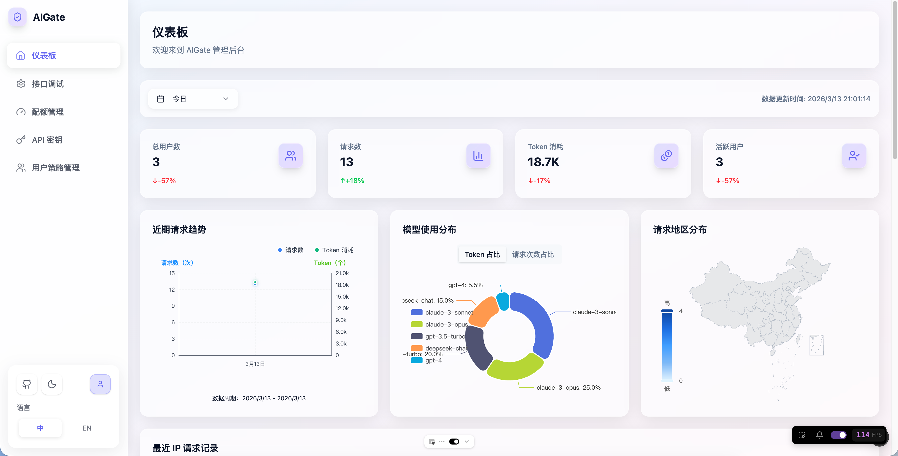
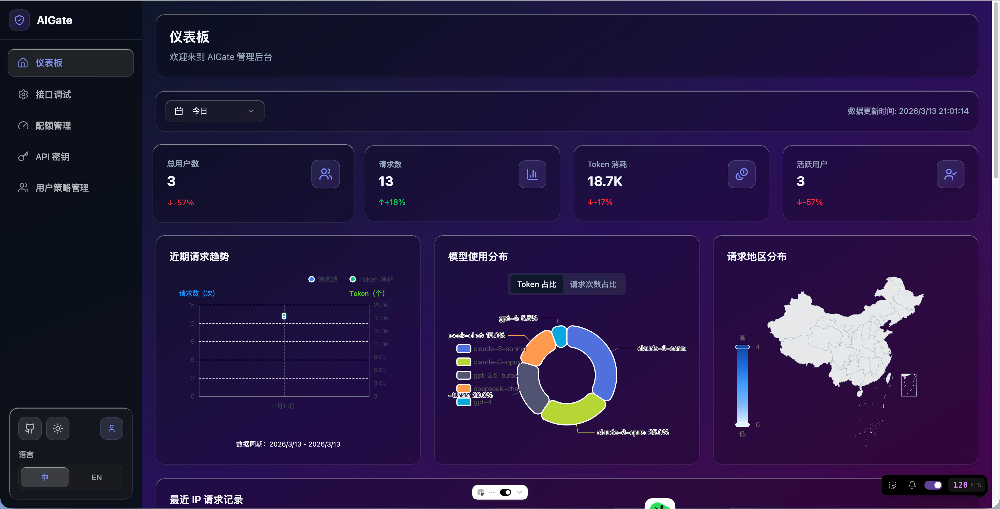

# AIGate - AI 网关管理系统

基于 Next.js 16 + tRPC + Redis 的智能 AI 网关管理系统，支持配额控制和多模型代理。

<p align="center">
  
  
</p>

## 核心功能

- 🛡️ **智能配额管理**：基于 Redis 的实时配额检查，支持 Token 和请求次数双重限制
- 🔌 **多模型代理**：统一接入 OpenAI、Anthropic、Google、DeepSeek 等主流 AI 服务商
- ⚡ **高性能架构**：tRPC 类型安全 API + Redis 缓存，毫秒级响应
- 🎨 **现代化界面**：Liquid Glass 设计语言，支持深色模式自动切换
- 🔐 **安全认证**：NextAuth.js 身份验证，支持管理员账户动态配置
- 📊 **实时监控**：仪表板展示请求趋势、地区分布、IP 记录等关键指标

## 一键部署

项目提供 `deploy.sh` 脚本，支持交互式配置和一键部署。

### 快速开始

```bash
# 1. 交互式配置环境变量
./deploy.sh config

# 2. 一键部署（自动拉取镜像、构建应用、启动服务）
./deploy.sh up
```

### 部署命令

| 命令                  | 说明                              |
| --------------------- | --------------------------------- |
| `./deploy.sh`         | 首次部署 / 全量启动（默认）       |
| `./deploy.sh config`  | 交互式配置环境变量                |
| `./deploy.sh update`  | 更新应用（重新构建 + 数据库迁移） |
| `./deploy.sh down`    | 停止并移除所有容器                |
| `./deploy.sh restart` | 重启应用容器                      |
| `./deploy.sh logs`    | 查看应用日志                      |
| `./deploy.sh status`  | 查看服务状态                      |

### 配置选项

运行 `./deploy.sh config` 可配置：

- **管理员账户**：邮箱和密码（支持运行时动态修改）
- **数据库连接**：PostgreSQL 连接地址
- **缓存配置**：Redis 连接地址
- **应用端口**：自定义服务端口
- **日志设置**：日志目录和级别配置

配置自动保存到 `.env` 文件，部署时自动加载。

## API 接口

### OpenAI 兼容接口

```bash
curl -X POST http://localhost:3000/api/v1/chat/completions \
  -H "Content-Type: application/json" \
  -H "X-User-ID: your-user-id" \
  -d '{
    "apiKeyId": "系统配置的策略id",
    "userId": "标识唯一用户的id",
    "model": "gpt-3.5-turbo",
    "messages": [
      {"role": "user", "content": "Hello!"}
    ]
  }'
```

### 管理后台 API

通过 `/settings` 页面可动态修改管理员账户信息，实时生效无需重启。

## 技术架构

- **前端框架**：Next.js 16 App Router + TypeScript
- **状态管理**：tRPC 类型安全 RPC
- **UI 组件**：Tailwind CSS 4 + shadcn/ui
- **数据存储**：PostgreSQL + Redis
- **认证系统**：NextAuth.js
- **日志系统**：Winston + Daily Rotate
- **部署方式**：Docker Compose + 一键脚本
